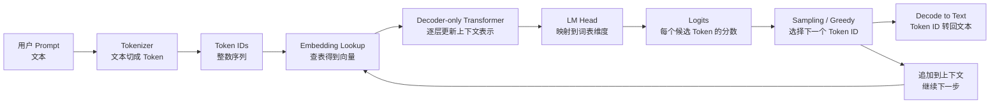

# 第 1 章：LLM 推理全景图

## 1. 本章目标

学完本章后，你应该能用自己的话回答：

- 一次 LLM 请求从 Prompt 到输出 Token，大体经过哪些步骤？
- Tokenizer、Embedding、Decoder-only Transformer、Logits、Sampling 分别处在链路的哪个位置？
- Prefill 和 Decode 在整条链路中分别负责什么，但为什么本章暂不深入性能细节？

## 2. 五分钟直觉

LLM（Large Language Model，大语言模型）：通过大量文本学习“给定上文后，下一个 Token 应该是什么”的神经网络模型。

一次对话请求不是“文本直接进模型”。模型只处理数字。用户输入的 Prompt（提示词）：用户给模型的输入文本，会先被 Tokenizer（分词器）：把文本切成模型词表中可识别单元的规则系统，转换成 Token（词元）：模型处理文本的最小离散单元，再转换成 Token ID（词元编号）：Token 在 Vocabulary 中的整数编号。

Token ID 进入模型前，会查 Embedding（嵌入表）：把离散编号映射成连续向量的参数表。之后，向量进入 Decoder-only Transformer（仅解码器 Transformer）：常见生成式 LLM 使用的、带因果约束的 Transformer 主体。模型最后输出 Logits（未归一化分数）：每个候选 Token 的原始分数。Sampling（采样）：根据 logits 变成的概率分布选择下一个 Token。

生成式模型一次只决定“下一个 Token”。选出新 Token 后，它会被接到原来的上下文后面，再重复同样过程。这叫 Autoregressive Generation（自回归生成）：每一步都依赖已经生成的历史 Token。

Prefill（预填充阶段）：一次性处理完整 Prompt，为后续生成准备上下文状态。Decode（解码阶段）：每一步基于已有上下文生成一个新 Token。本章只把它们放到全局链路中，具体性能差异留到第 7 章。

## 3. 完整计算或数据流



更口语化地看：

| 阶段 | 输入 | 输出 | 作用 |
| --- | --- | --- | --- |
| Tokenizer | 文本 | Token ID 序列 | 让文本变成模型能处理的整数 |
| Embedding | Token ID | 向量 | 让离散词元变成可计算表示 |
| Transformer 主体 | 向量序列 | 上下文向量序列 | 融合历史上下文信息 |
| LM Head | 最后位置的隐藏向量 | 词表大小的 logits | 给每个候选 Token 打分 |
| Sampling | logits | 下一个 Token ID | 决定实际输出哪个 Token |
| Detokenize | Token ID | 文本片段 | 把模型输出还原成人能读的文本 |

## 图示阅读建议

- 来源：Google Research Blog，`Transformer: A Novel Neural Network Architecture for Language Understanding`
- URL：https://research.google/blog/transformer-a-novel-neural-network-architecture-for-language-understanding/
- 建议查看：文中 “The Transformer” 小节的动画和自注意力示意图。
- 这张图表达：词先变成初始 embedding，然后每层通过 self-attention 汇聚上下文，逐步得到新的词表示。
- 阅读时重点观察：
  1. 每个词是不是先有自己的向量表示？
  2. self-attention 是不是让一个词能看见上下文中的其他词？
  3. decoder 生成输出时，为什么是一边已有输出一边继续生成？

补充图示：`Attention Is All You Need` 论文 Figure 1 展示原始 Transformer 的 encoder-decoder 架构。现代 Decoder-only LLM 可以理解为保留“带因果约束的解码器主体”，去掉机器翻译场景中的 encoder 和 cross-attention。

## 4. 关键术语

- Prompt（提示词）：用户给模型的输入文本，可以是问题、指令、上下文或对话历史。
- Tokenizer（分词器）：把文本切成模型词表中可识别单元，并映射成整数 ID 的规则系统。
- Token（词元）：模型处理文本的最小离散单元，可能是单词、子词、字符或字节片段。
- Vocabulary（词表）：模型可识别 Token 与整数 ID 的映射表。
- Token ID（词元编号）：Token 在词表中的整数编号，是进入模型前的离散输入。
- Embedding（嵌入表）：把 Token ID 映射成连续向量的参数表。
- Decoder-only Transformer（仅解码器 Transformer）：只使用带因果约束的 Transformer 解码器结构，常用于文本生成。
- Hidden State（隐藏状态）：模型每层为每个 Token 维护的向量表示。
- Logits（未归一化分数）：模型对词表中每个候选 Token 给出的原始分数。
- Sampling（采样）：从候选 Token 概率分布中选择输出 Token 的过程。
- Greedy Search（贪心搜索）：每一步直接选择分数最高的 Token。
- Autoregressive Generation（自回归生成）：每一步生成依赖此前所有输入和已生成 Token。
- Prefill（预填充阶段）：处理完整 Prompt，形成后续 Decode 可用的上下文状态。
- Decode（解码阶段）：每次生成一个新 Token，并把它追加到上下文。

## 5. Tensor Shape

本章只建立形状直觉，不深入矩阵计算。

```text
Token IDs: [B, S]
Hidden States: [B, S, H]
Last Hidden State: [B, H]
Logits: [B, V]
Next Token ID: [B, 1]
```

维度含义：

- `B`：Batch Size（批大小），一次处理多少条请求或序列。
- `S`：Sequence Length（序列长度），当前上下文里有多少个 Token。
- `H`：Hidden Size（隐藏维度），每个 Token 的向量长度。
- `V`：Vocabulary Size（词表大小），模型能选择多少种输出 Token。

整体关系：

1. Prompt 被 Tokenizer 转成 `[B, S]`。
2. Embedding 把每个 Token ID 查成向量，得到 `[B, S, H]`。
3. Transformer 更新每个位置的隐藏向量，仍然保持 `[B, S, H]`。
4. 生成下一个 Token 时，通常关注最后一个位置的隐藏向量 `[B, H]`。
5. LM Head 把 `[B, H]` 映射成 `[B, V]`，也就是每个候选 Token 的 logits。
6. Sampling 从 `[B, V]` 中选出 `[B, 1]`。

## 6. 核心公式

语言模型的核心目标可以写成：

```text
P(x_t | x_1, x_2, ..., x_{t-1})
```

含义：给定前面所有 Token，预测第 `t` 个 Token 的概率分布。

工程意义：LLM 不是一次性把完整答案“吐出来”，而是不断计算“下一个 Token 的分布”，再选择一个 Token。

logits 转概率的常见形式：

```text
probabilities = softmax(logits)
```

含义：把每个候选 Token 的原始分数变成概率分布。

贪心选择：

```text
next_token = argmax(probabilities)
```

含义：选择概率最高的 Token。真实服务中也可能使用 temperature、top-k、top-p 等采样策略，本章只建立位置概念。

## 7. 与推理 Runtime 的联系

在推理 Runtime 中，这条链路通常会拆成几个角色：

- API Server：接收用户请求和 Prompt。
- Request Processor：处理请求参数、聊天模板和输入文本。
- Tokenizer：把文本变成 Token ID。
- Model Runner：执行 Transformer 前向计算。
- KV Cache Manager：管理 Prefill 后留下的 Key/Value 状态，本章只知道它位于 Prefill 和 Decode 之间即可。
- Scheduler：决定多个请求如何排队、合批和生成。
- Streaming Output：把每次 Decode 得到的 Token 逐步返回给用户。

本章先记住：Runtime 不是只跑一个模型函数，而是在请求、Token、显存状态、调度和流式输出之间组织一条服务链路。

## 8. 易错点

| 易错说法 | 问题 | 正确认知 |
| --- | --- | --- |
| 文本直接输入模型 | 模型只处理数字 | 文本先经 Tokenizer 变成 Token ID |
| Token 一定等于一个汉字或英文单词 | 不同 tokenizer 规则不同 | Token 可能是子词、字节片段或标点 |
| Embedding 是运行时算出来的语义 | 它本质是参数查表 | Token ID 查表得到向量 |
| Logits 就是最终文本 | Logits 是词表分数 | 还要经过选择 Token 和反向解码 |
| LLM 一次生成完整答案 | 生成是逐 Token 进行 | 每一步依赖历史上下文 |
| Prefill 和 Decode 是两个模型 | 不是两个模型 | 是同一模型在请求不同阶段的计算形态 |

## 9. 面试回答模板

如果被问“一次 LLM 推理请求是怎么生成文本的”，可以按这个结构回答：

1. 先说输入侧：Prompt 先经过 Tokenizer，变成 Token ID。
2. 再说模型侧：Token ID 经 Embedding 变成 hidden states，进入 Decoder-only Transformer。
3. 再说输出侧：模型用最后位置的 hidden state 通过 LM Head 得到 logits，再用 greedy 或 sampling 选出下一个 Token。
4. 最后说循环：新 Token 追加到上下文，进入下一轮 Decode，因此生成是自回归的。
5. 如果追问性能：补一句 Prefill 处理完整 Prompt，Decode 每次生成一个 Token，后续会影响 TTFT 和 TPOT。

## 10. 真实面试问题

### 已出现问题（PARTIAL）：ReAct 过程中上下文很多，怎样管理？

- 来源编号：I007
- 来源：牛客网《中台研发实习生》，唯品会一面，中台研发实习生。
- 原帖发布时间：2026-05-07。
- 来源 URL：https://www.nowcoder.com/discuss/895391376861298688?sourceSSR=home
- 核验状态：`PARTIAL`。当前只核验到牛客首页/摘要级内容可见，完整正文未成功访问，因此不能写成 `VERIFIED`。
- 与本章关系：这不是纯粹的 Transformer 数学题，但它考的是一次 LLM/Agent 请求中 Prompt、历史上下文、工具调用记录、下一步输出之间的整体链路管理，适合作为第 1 章的工程化延伸题。

30 秒回答：

> 上下文管理不能只靠把所有历史消息无脑塞进 prompt。要先区分系统指令、用户目标、短期对话、工具调用结果和长期记忆；再根据模型上下文窗口、token 预算和任务阶段做裁剪、摘要、检索和状态结构化。ReAct 场景里尤其要保留当前任务目标、已执行 action、observation 和失败原因，同时对重复失败设置最大轮数或终止条件，避免无限循环。

可能追问：

1. 哪些上下文必须保留，哪些可以摘要？
2. 工具调用失败后如何避免重复调用？
3. 上下文太长时，截断、摘要、向量检索分别适合什么情况？

常见错误回答：

- “把所有历史都传给模型。”问题是会超上下文窗口，也会增加成本和噪声。
- “只保留最后一轮对话。”问题是会丢失任务目标、工具结果和约束条件。
- “让模型自己判断什么时候停。”问题是工程上还需要最大步数、失败计数和状态机兜底。

更多记录见 `面试题/已核实问题.md` 和 `面试题/来源登记.md`。

## 11. 我的回答

更新时间：2026-06-18

### 问题 1：为什么 Prompt 不能直接进入 Transformer？

用户回答：

> 将词元离散成数字，方便查找和查询与之前的相关性，通过 embedding 向量化去记录位置。

评价：方向基本正确，但有两处需要修正。

- 正确点：文本必须先变成 Token ID，再通过 Embedding 变成向量，模型才能计算。
- 需要修正：Tokenizer 不是“将词元离散成数字”，更准确是“把文本切成 Token，并映射成 Token ID”。Token 本身已经是离散单元。
- 需要修正：Embedding 主要记录 Token 的语义/统计表示，不是主要负责记录位置。位置信息通常由 Position Embedding（位置嵌入）或 RoPE（Rotary Position Embedding，旋转位置编码）等位置编码机制提供，后续章节再展开。

### 问题 2：Logits、Sampling、最终输出文本的关系？

用户回答：

> logits 是候选 token 的分数值，通过 samling 阶段对照分数值选择可能的 token id，最终文本是 token id 的组合。

评价：基本正确。

- Logits 是词表中每个候选 Token 的原始分数。
- Sampling 会根据 logits 转换出的概率分布选择下一个 Token ID。
- 最终文本不是简单把 Token ID 直接拼数字，而是通过 tokenizer 的反向解码，把一个或多个 Token ID 转回文本片段并拼接。

### 问题 3：为什么说 LLM 生成是自回归的？Prefill 和 Decode 在哪里？

用户回答：

> prefill 预填充，出现在训练阶段，decode 解码出现在训练后预测下一 token 阶段，再通过这下一 token 去接着预测，这就是我理解的自回归。

评价：自回归部分基本对，Prefill 的位置需要纠正。

- 正确点：每次生成一个新 Token，再把这个新 Token 接到上下文里继续预测下一个 Token，这就是自回归生成。
- 关键错误：Prefill 不属于训练阶段。Prefill 是推理阶段的一部分，发生在一次请求刚进入模型时，用来一次性处理完整 Prompt。
- Decode 也属于推理阶段。Decode 在 Prefill 之后，每一步生成一个新 Token。
- 更准确链路是：用户 Prompt -> Tokenizer -> Embedding -> Prefill 处理完整 Prompt -> Decode 逐 Token 生成 -> Detokenize 输出文本。

## 12. 纠错记录

2026-06-18：

- 将“Embedding 记录位置”纠正为：Embedding 主要把 Token ID 映射为可计算向量；位置信息由位置编码机制提供。
- 将“Prefill 出现在训练阶段”纠正为：Prefill 是推理阶段处理完整 Prompt 的第一段计算。
- 保留用户对自回归生成的核心理解：用新生成 Token 继续预测后续 Token。

## 13. 本章验收

请先用自己的话回答：

1. 为什么用户输入的 Prompt 不能直接进入 Transformer，而必须先经过 Tokenizer 和 Embedding？
2. Logits、Sampling、最终输出文本三者分别是什么关系？
3. 为什么说 LLM 生成是自回归的？Prefill 和 Decode 分别在这条链路的什么位置？

## 14. 参考资料

- 页面标题：Attention Is All You Need
  - 发布者或作者：Ashish Vaswani 等，arXiv
  - URL：https://arxiv.org/abs/1706.03762
  - 发布时间：2017-06-12
  - 访问日期：2026-06-18
  - 来源类型：论文
  - 本文使用内容：Transformer 原始架构和 Figure 1 图示来源。
- 页面标题：Transformer: A Novel Neural Network Architecture for Language Understanding
  - 发布者或作者：Jakob Uszkoreit，Google Research
  - URL：https://research.google/blog/transformer-a-novel-neural-network-architecture-for-language-understanding/
  - 发布时间：2017-08-31
  - 访问日期：2026-06-18
  - 来源类型：官方技术博客
  - 本文使用内容：图示阅读建议和 self-attention 直觉解释。
- 页面标题：Tokenizers
  - 发布者或作者：Hugging Face
  - URL：https://huggingface.co/learn/llm-course/chapter2/4
  - 发布时间：未确认
  - 访问日期：2026-06-18
  - 来源类型：官方课程文档
  - 本文使用内容：Tokenizer、Token、Token ID 与 Vocabulary 的说明。
- 页面标题：Text generation
  - 发布者或作者：Hugging Face
  - URL：https://huggingface.co/docs/transformers/en/llm_tutorial
  - 发布时间：未确认
  - 访问日期：2026-06-18
  - 来源类型：官方文档
  - 本文使用内容：LLM 文本生成流程说明。
- 页面标题：Generation strategies
  - 发布者或作者：Hugging Face
  - URL：https://huggingface.co/docs/transformers/en/generation_strategies
  - 发布时间：未确认
  - 访问日期：2026-06-18
  - 来源类型：官方文档
  - 本文使用内容：Greedy Search、Sampling 和 logits 到 next token 的关系。
- 页面标题：Language Models are Unsupervised Multitask Learners
  - 发布者或作者：Alec Radford 等，OpenAI
  - URL：https://cdn.openai.com/better-language-models/language_models_are_unsupervised_multitask_learners.pdf
  - 发布时间：2019
  - 访问日期：2026-06-18
  - 来源类型：技术报告
  - 本文使用内容：语言模型按条件概率逐 Token 建模的公式和 GPT-2 作为 Transformer 语言模型的来源。
