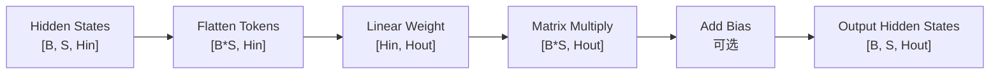

# 第 3 章：线性层与参数计算

## 1. 本章目标

学完本章后，你应该能回答：

- Linear Projection 为什么是 Transformer 里最常见的计算之一？
- Weight、Activation、Bias 分别是什么？
- GEMM 和 GEMV 有什么区别？
- 如何估算一个线性层的参数量、FLOPs 和权重显存？
- 为什么 Prefill 更像大矩阵乘法，Decode 更容易变成矩阵向量乘法？

## 2. 五分钟直觉

Linear Projection（Linear Projection，线性投影）：把输入向量从一个维度映射到另一个维度的线性层。Transformer 里大量使用线性层：Attention 里的 Q/K/V 投影、Attention 输出投影、FFN 里的升维和降维，都依赖它。

一个线性层可以写成：

```text
Y = X W + b
```

直觉上：

- `X` 是当前 Token 的隐藏向量，也叫 Activation（Activation，激活值）：模型运行时产生的中间张量。
- `W` 是 Weight（权重）：模型训练后保存下来的参数。
- `b` 是 Bias（偏置）：可选的加法参数，现代 LLM 中很多线性层会省略 bias。
- `Y` 是投影后的新向量。

在 LLM 推理里，线性层不是“小工具”，而是主要计算来源之一。每个 Token 进入每一层后，都会经过多个线性投影。模型越宽，`H` 越大；层数越多，线性层次数越多；权重显存和计算量都会上升。

## 3. 完整计算或数据流



把 `[B, S, H]` 看成一批 Token 向量：

```text
[B, S, Hin] -> [B*S, Hin]
[B*S, Hin] x [Hin, Hout] -> [B*S, Hout]
[B*S, Hout] -> [B, S, Hout]
```

## 4. 关键术语

- Linear Projection（Linear Projection，线性投影）：用权重矩阵把输入向量从 `Hin` 维映射到 `Hout` 维。
- Weight（权重）：模型训练后保存下来的参数矩阵，推理时通常只读。
- Activation（激活值）：模型运行时产生的中间张量，例如 hidden states。
- Bias（偏置）：线性层中可选的加法参数，Shape 通常是 `[Hout]`。
- GEMM（General Matrix-Matrix Multiplication，通用矩阵-矩阵乘法）：矩阵乘矩阵，通常形如 `[M, K] x [K, N] -> [M, N]`。
- GEMV（General Matrix-Vector Multiplication，通用矩阵-向量乘法）：矩阵乘向量，可以看成 `M` 或 `N` 很小的矩阵乘法。
- FLOPs（Floating Point Operations，浮点运算次数）：估算计算量的指标，矩阵乘法中一次乘加通常按 2 次操作计。
- Parameter Count（参数量）：模型中可学习参数的数量。
- Model Weight Memory（模型权重显存）：保存权重参数需要的显存或内存。
- Arithmetic Intensity（算术强度）：计算量与数据搬运量的比值，后续用于判断更偏计算受限还是内存带宽受限。

## 5. Tensor Shape

设：

```text
B = Batch Size
S = Sequence Length
Hin = 输入隐藏维度
Hout = 输出隐藏维度
```

线性层 Shape：

```text
Input X: [B, S, Hin]
Weight W: [Hin, Hout]
Bias b: [Hout]
Output Y: [B, S, Hout]
```

为了和 GEMM 对齐，常把前两维合并：

```text
X_flat: [B*S, Hin]
W:      [Hin, Hout]
Y_flat: [B*S, Hout]
```

对应 GEMM 符号：

```text
M = B * S
K = Hin
N = Hout

[M, K] x [K, N] -> [M, N]
```

### Prefill 与 Decode 的 Shape 差异

Prefill（预填充阶段）：处理完整 Prompt，`S` 通常大于 1。

```text
X_prefill: [B, S, H]
X_flat:    [B*S, H]
```

Decode（解码阶段）：每次通常只处理新生成的一个 Token，`S = 1`。

```text
X_decode: [B, 1, H]
X_flat:   [B, H]
```

因此：

- Prefill 更像 GEMM：`[B*S, H] x [H, Hout]`。
- Decode 更容易接近 GEMV 或小 GEMM：`[B, H] x [H, Hout]`，当 `B` 很小时尤其明显。

## 6. 核心公式

### 线性层公式

```text
Y = X W + b
```

变量：

- `X`：输入 activation。
- `W`：权重矩阵。
- `b`：偏置。
- `Y`：输出 activation。

### 参数量

不含 bias：

```text
params = Hin * Hout
```

含 bias：

```text
params = Hin * Hout + Hout
```

例子：

```text
Hin = 4096
Hout = 4096
params = 4096 * 4096 = 16,777,216
```

一个 4096 到 4096 的线性层大约有 1678 万个权重参数。

### 权重显存

```text
weight_memory_bytes = params * bytes_per_param
```

常见精度：

| 精度 | 每参数字节数 |
| --- | --- |
| FP32 | 4 bytes |
| FP16 | 2 bytes |
| BF16 | 2 bytes |
| INT8 | 1 byte |
| INT4 | 0.5 byte |

例子：

```text
params = 16,777,216
FP16 weight memory = 16,777,216 * 2 bytes = 33,554,432 bytes ≈ 32 MiB
```

### FLOPs

对于：

```text
[M, K] x [K, N] -> [M, N]
```

矩阵乘法 FLOPs 近似：

```text
FLOPs = 2 * M * K * N
```

带入线性层：

```text
M = B * S
K = Hin
N = Hout

FLOPs = 2 * B * S * Hin * Hout
```

工程意义：

- `S` 越长，Prefill 线性层计算量越大。
- `H` 越大，参数量和计算量通常近似按平方增长。
- Decode 每步的 `S=1`，但会重复很多步，所以总耗时不只看单步计算量。

## 7. 与推理 Runtime 的联系

线性层直接影响：

- 模型权重显存：权重矩阵越大，加载模型需要的显存越多。
- Prefill 计算量：Prompt Token 越多，`B*S` 越大，GEMM 越大。
- Decode 单步成本：每生成一个 Token 都要跑多层线性投影。
- Q/K/V Projection：Attention 的 Q、K、V 都来自线性投影。
- FFN：很多 Decoder Block 中，FFN 的线性层参数量和计算量通常很大。
- 量化收益：Weight-only Quantization 主要减少权重读取量，但不等于所有场景都会等比例加速。

Runtime 里常见现象：

| 阶段 | 典型矩阵形态 | 常见瓶颈直觉 |
| --- | --- | --- |
| Prefill | 较大 GEMM | 计算密度高，更容易吃满矩阵计算单元 |
| Decode | 小 GEMM 或 GEMV | 权重反复读取，容易受内存带宽和调度开销影响 |

这就是为什么第 7 章会专门区分 Prefill 和 Decode。

## 8. 易错点

| 易错说法 | 问题 | 正确认知 |
| --- | --- | --- |
| 线性层只是普通全连接，不重要 | 低估了它 | Transformer 大量计算来自线性投影 |
| Weight 和 Activation 都是模型参数 | 混淆概念 | Weight 是参数，Activation 是运行时中间值 |
| 参数量等于 FLOPs | 单位不同 | 参数量是存储规模，FLOPs 是计算量 |
| Decode 计算很少所以一定快 | 忽略反复执行和访存 | Decode 每步小，但步数多，且可能受权重读取影响 |
| GEMV 总是高效 | 不一定 | GEMV 数据复用少，常见算术强度低 |
| 模型变小就必然等比例变快 | 过度简化 | 还受带宽、并行度、kernel 形态和调度影响 |

## 9. 面试回答模板

如果被问“如何估算一个 Transformer 线性层的参数量和计算量”，可以这样答：

1. 先写 Shape：输入 `[B, S, Hin]`，权重 `[Hin, Hout]`，输出 `[B, S, Hout]`。
2. 参数量是不含 bias 的 `Hin * Hout`，含 bias 再加 `Hout`。
3. 计算时可把输入展平为 `[B*S, Hin]`，所以 GEMM 是 `[B*S, Hin] x [Hin, Hout]`。
4. FLOPs 约为 `2 * B * S * Hin * Hout`。
5. 推理里 Prefill 的 `S` 大，更像大 GEMM；Decode 每步 `S=1`，更像小 GEMM/GEMV。

## 10. 真实面试问题

本章暂未收录与线性层、参数量、FLOPs、GEMM/GEMV 直接相关的 `VERIFIED` 或 `PARTIAL` 面试问题。

### 未核实候选问题（UNVERIFIED）

以下问题来自本章知识点推导，已按牛客网、知乎、小红书、脉脉、CSDN、GitHub 和公开搜索结果做跨平台复核，但暂时没有可访问的一手面经正文支撑，只能用于自测，不能当作真实面经或高频题。完整候选池见 `面试题/未核实候选问题.md`，复核记录见 `面试题/来源登记.md` 的 I008。

1. 如何估算 Transformer 线性层参数量和 FLOPs？
   - 对应能力：从 Shape 推导参数量和计算量。
   - 30 秒回答：先写出输入 `[B, S, Hin]`，权重 `[Hin, Hout]`，输出 `[B, S, Hout]`。参数量不含 bias 是 `Hin * Hout`，含 bias 再加 `Hout`。计算时把前两维展平为 `[B*S, Hin]`，做 `[B*S, Hin] x [Hin, Hout]`，FLOPs 近似是 `2 * B * S * Hin * Hout`。
2. 为什么参数量、权重显存和 FLOPs 不是一回事？
   - 对应能力：区分存储规模和运行时计算量。
   - 30 秒回答：参数量是权重元素个数，权重显存是参数量乘以每个参数的字节数，比如 FP16 是 2 bytes。FLOPs 是一次前向计算需要多少浮点操作，除了权重大小，还和 batch size、sequence length、输入输出维度有关。参数量决定模型静态存储，FLOPs 描述运行时计算工作量，两者相关但不是同一个指标。

## 11. 我的回答

待用户后续复习本章时填写。

## 12. 纠错记录

暂无。

## 13. 本章验收

后续复习时回答：

1. 一个线性层输入 `[B, S, Hin]`，权重 `[Hin, Hout]`，输出 Shape 是什么？
2. 为什么参数量和 FLOPs 不是一回事？
3. 假设 `B=2, S=128, Hin=4096, Hout=4096`，这个线性层 FLOPs 约是多少？
4. 为什么 Decode 阶段更容易表现出小 GEMM/GEMV 的特征？

## 14. 参考资料

- 页面标题：Linear - PyTorch 2.12 documentation
  - 发布者或作者：PyTorch
  - URL：https://docs.pytorch.org/docs/2.12/generated/torch.nn.Linear.html
  - 发布时间：未确认
  - 访问日期：2026-06-18
  - 来源类型：官方文档
  - 本文使用内容：线性层公式、输入输出 Shape、weight 和 bias Shape。
- 页面标题：Matrix Multiplication Background User's Guide
  - 发布者或作者：NVIDIA
  - URL：https://docs.nvidia.com/deeplearning/performance/dl-performance-matrix-multiplication/index.html
  - 发布时间：未确认
  - 访问日期：2026-06-18
  - 来源类型：官方文档
  - 本文使用内容：GEMM、FLOPs、GEMV 和算术强度直觉。
- 页面标题：Attention Is All You Need
  - 发布者或作者：Ashish Vaswani 等，arXiv
  - URL：https://arxiv.org/abs/1706.03762
  - 发布时间：2017-06-12
  - 访问日期：2026-06-18
  - 来源类型：论文
  - 本文使用内容：Transformer 中 Q/K/V Projection、FFN 和线性变换的背景。
