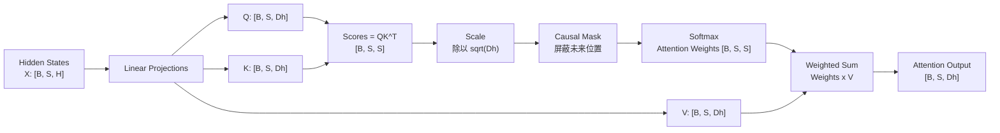

# 第 4 章：Self-Attention

## 1. 本章目标

学完本章后，你应该能回答：

- Self-Attention 为什么能让一个 Token 读取上下文信息？
- Query、Key、Value 分别是什么角色？
- `QK^T`、Scale、Softmax、Attention Weight、Value 加权求和分别在做什么？
- Causal Mask 为什么对 Decoder-only LLM 必不可少？
- 单头 Self-Attention 每一步 Tensor Shape 是什么？

## 2. 五分钟直觉

Self-Attention（Self-Attention，自注意力）：让同一段序列中的每个 Token，根据当前上下文决定“应该关注哪些其他 Token”的机制。

把一句话里的每个 Token 都看成一个人。每个人会提出一个 Query（Query，查询向量）：我现在想找什么信息；同时也拿着一个 Key（Key，键向量）：我能提供什么信息；还带着一个 Value（Value，值向量）：如果别人关注我，真正要拿走的信息是什么。

一个 Token 的 Query 会和所有 Token 的 Key 做相似度计算，得到一排分数。分数越高，说明当前 Token 越应该关注那个位置。然后通过 Softmax（Softmax，归一化指数函数）把分数变成权重，最后用这些权重对 Value 做加权求和，得到新的上下文表示。

Decoder-only LLM 还必须加 Causal Mask（Causal Mask，因果掩码）：生成第 `t` 个位置时不能看未来位置，只能看自己和过去 Token。否则训练和推理目标会错位，模型会偷看答案。

## 3. 完整计算或数据流



一句话版本：

```text
X -> Q/K/V -> QK^T -> scale -> mask -> softmax -> attention weights -> weighted sum of V -> output
```

## 图示阅读建议

- 来源：Attention Is All You Need
- URL：https://arxiv.org/abs/1706.03762
- 建议查看：论文 Figure 2，Scaled Dot-Product Attention。
- 这张图表达：Q 和 K 先做 MatMul 得到注意力分数，经过 Scale、Mask、Softmax 后，再和 V 做 MatMul 得到输出。
- 阅读时重点观察：
  1. 为什么 Q 和 K 的乘法输出是 `[S, S]` 这种“位置对位置”的矩阵？
  2. Mask 是在 Softmax 前还是后？
  3. 最终输出为什么回到每个位置一个向量？

补充来源：Google Research Blog 的 Transformer 文章中有自注意力示意动画，适合建立“每个词看上下文”的直觉。

## 4. 关键术语

- Self-Attention（Self-Attention，自注意力）：序列内部 Token 之间互相读取信息的机制。
- Query（Query，查询向量）：当前 Token 用来寻找相关信息的向量。
- Key（Key，键向量）：每个 Token 用来被匹配的向量。
- Value（Value，值向量）：每个 Token 被关注后贡献给输出的信息向量。
- Dot Product（Dot Product，点积）：两个向量逐元素相乘再求和，用于衡量相似度。
- Attention Score（Attention Score，注意力分数）：Query 和 Key 点积后的原始相关性分数。
- Scale（缩放）：通常除以 `sqrt(Dh)`，避免分数过大导致 Softmax 过于尖锐。
- Softmax（Softmax，归一化指数函数）：把一组分数变成和为 1 的概率式权重。
- Attention Weight（Attention Weight，注意力权重）：每个位置对其他位置的关注比例。
- Causal Mask（Causal Mask，因果掩码）：屏蔽未来 Token，保证生成只能依赖过去和当前位置。
- Context Vector（Context Vector，上下文向量）：按 attention weight 对 Value 加权求和后的输出。

## 5. Tensor Shape

为了先看清楚单头注意力，设：

```text
B = Batch Size
S = Sequence Length
H = Hidden Size
Dh = Head Dimension
```

输入：

```text
X: [B, S, H]
```

通过三个线性层得到：

```text
Q: [B, S, Dh]
K: [B, S, Dh]
V: [B, S, Dh]
```

注意力分数：

```text
K^T:    [B, Dh, S]
QK^T:   [B, S, S]
Scores: [B, S, S]
```

这里 `[S, S]` 的含义：

- 行：当前正在更新的 Query 位置。
- 列：它要关注的 Key/Value 位置。

Softmax 后：

```text
Attention Weights: [B, S, S]
```

对 Value 加权求和：

```text
Weights: [B, S, S]
V:       [B, S, Dh]
Output:  [B, S, Dh]
```

如果使用多头，后续会变成：

```text
Q: [B, Nhead, S, Dh]
K: [B, Nhead, S, Dh]
V: [B, Nhead, S, Dh]
```

但多头细节放到第 5 章。

## 6. 核心公式

Scaled Dot-Product Attention（Scaled Dot-Product Attention，缩放点积注意力）公式：

```text
Attention(Q, K, V) = softmax(QK^T / sqrt(Dh)) V
```

变量：

- `Q`：Query，当前 Token 想找什么。
- `K`：Key，每个 Token 提供匹配依据。
- `V`：Value，被关注后真正拿走的信息。
- `Dh`：每个 head 的维度。
- `QK^T`：每个位置对每个位置的注意力分数。
- `softmax(...)`：把分数转成权重。

加 Causal Mask 后：

```text
Scores = QK^T / sqrt(Dh)
Scores[future positions] = -infinity
Weights = softmax(Scores)
Output = Weights V
```

工程意义：

- Mask 用 `-infinity` 或极小值，让未来位置经过 Softmax 后权重接近 0。
- `[S, S]` 注意力矩阵随序列长度平方增长，这是后续 FlashAttention、PagedAttention、KV Cache 等优化的重要背景。

## 7. 与推理 Runtime 的联系

Self-Attention 直接连接后续多个推理主题：

- KV Cache：Decode 时历史 K/V 不需要反复计算，所以缓存 K 和 V。
- Prefill：Prompt 中所有 Token 的 Q/K/V 一次性计算，形成完整上下文。
- Decode：新 Token 生成时，只新增当前位置的 Q/K/V，并让新 Q 去看历史 K/V。
- FlashAttention：标准 Attention 会显式或隐式处理 `[S, S]` 分数矩阵，FlashAttention 主要优化这个过程中的显存 IO。
- PagedAttention：管理长上下文和并发请求的 KV Cache 分配。
- Scheduler：长 Prompt 的 Prefill 和逐 Token Decode 会争用计算资源，需要调度。

本章先记住：Attention 是“用 Q 找 K，再取 V”。后续所有推理优化，很多都围绕 K/V 怎么存、怎么读、怎么调度展开。

## 8. 易错点

| 易错说法 | 问题 | 正确认知 |
| --- | --- | --- |
| Q/K/V 是三个不同输入 | 错 | Self-Attention 中它们通常都由同一个 X 线性投影得到 |
| Attention Weight 就是输出 | 错 | Weight 还要乘 V 才得到输出 |
| Softmax 前后 Mask 都一样 | 不严谨 | 通常在 Softmax 前把未来位置设为极小值 |
| Causal Mask 只在训练用 | 错 | Decoder-only 推理同样不能看未来 |
| `[S, S]` 表示 hidden size | 错 | 它表示位置与位置之间的关注关系 |
| 缓存 Q/K/V 都一样重要 | 错 | Decode 中历史 Q 通常不再使用，后续重点缓存 K/V |

## 9. 面试回答模板

如果被问“Self-Attention 是怎么计算的”，可以这样答：

1. 输入 hidden states 先经过三个线性层得到 Q、K、V。
2. 用 Q 和 K 做点积，得到每个位置对每个位置的 attention score，Shape 是 `[B, S, S]`。
3. 分数除以 `sqrt(Dh)` 做 scale，避免数值过大。
4. Decoder-only 模型加 causal mask，屏蔽未来位置。
5. 对分数做 softmax 得到 attention weights。
6. 用 weights 对 V 加权求和，得到每个位置的新上下文向量。

如果追问推理优化，可以补充：Decode 阶段历史 K/V 可以缓存，这就是 KV Cache 的动机。

## 10. 真实面试问题

本章暂未收录与 Self-Attention、Q/K/V、Causal Mask 直接相关的 `VERIFIED` 或 `PARTIAL` 面试问题。

### 未核实候选问题（UNVERIFIED）

以下问题来自本章知识点推导，已按牛客网、知乎、小红书、脉脉、CSDN、GitHub 和公开搜索结果做跨平台复核，但暂时没有可访问的一手面经正文支撑，只能用于自测，不能当作真实面经或高频题。完整候选池见 `面试题/未核实候选问题.md`，复核记录见 `面试题/来源登记.md` 的 I008。

1. Self-Attention 中 Q、K、V 分别是什么？为什么要乘 V？
   - 对应能力：能解释 attention 不是只算相关性，还要取回信息。
   - 30 秒回答：Q 是当前位置发出的查询，K 是每个位置用于被匹配的键，Q 和 K 点积得到当前位置对其他位置的关注分数。Softmax 后得到 attention weights，但这些权重本身不是输出。最后要用权重对 V 做加权求和，因为 V 才是每个位置真正贡献给输出的内容向量。
2. 为什么 Decoder-only 模型需要 Causal Mask？
   - 对应能力：能解释生成式语言模型不能看未来 token。
   - 30 秒回答：Decoder-only LLM 的目标是根据过去和当前位置预测下一个 token，所以第 `t` 个位置不能读取未来位置的信息。Causal Mask 会在 softmax 前屏蔽未来位置，让未来 token 的 attention 权重接近 0。没有这个 mask，训练时模型会偷看答案，推理时也和训练目标不一致。

## 11. 我的回答

待用户后续复习本章时填写。

## 12. 纠错记录

暂无。

## 13. 本章验收

后续复习时回答：

1. Q、K、V 分别扮演什么角色？为什么最后要对 V 加权求和？
2. 为什么 `QK^T` 的 Shape 是 `[B, S, S]`？
3. Causal Mask 为什么要加在 Softmax 之前？
4. 为什么 Decode 阶段更关心缓存历史 K/V，而不是缓存历史 Q？

## 14. 参考资料

- 页面标题：Attention Is All You Need
  - 发布者或作者：Ashish Vaswani 等，arXiv
  - URL：https://arxiv.org/abs/1706.03762
  - 发布时间：2017-06-12
  - 访问日期：2026-06-18
  - 来源类型：论文
  - 本文使用内容：Scaled Dot-Product Attention 公式、mask 和 Figure 2。
- 页面标题：Transformer: A Novel Neural Network Architecture for Language Understanding
  - 发布者或作者：Jakob Uszkoreit，Google Research
  - URL：https://research.google/blog/transformer-a-novel-neural-network-architecture-for-language-understanding/
  - 发布时间：2017-08-31
  - 访问日期：2026-06-18
  - 来源类型：官方技术博客
  - 本文使用内容：Self-Attention 图示阅读和上下文聚合直觉。
- 页面标题：Softmax - PyTorch 2.12 documentation
  - 发布者或作者：PyTorch
  - URL：https://docs.pytorch.org/docs/2.12/generated/torch.nn.Softmax.html
  - 发布时间：未确认
  - 访问日期：2026-06-18
  - 来源类型：官方文档
  - 本文使用内容：Softmax 将分数归一化为分布的概念。
