# 第 5 章：Multi-Head Attention 与 Decoder Block

## 1. 本章目标

学完本章后，你应该能回答：

- Multi-Head Attention 为什么要把一个大向量拆成多个 head？
- Head 拆分、Attention、Concat、Output Projection 的 Shape 如何变化？
- Residual Connection、RMSNorm、FFN、SwiGLU 在 Decoder Block 中分别做什么？
- 一个现代 Decoder Block 的数据流是什么？
- 为什么推理 Runtime 会特别关注 Attention、FFN 和规范化层的实现？

## 2. 五分钟直觉

Multi-Head Attention（Multi-Head Attention，多头注意力）：把隐藏向量拆成多个较小的注意力头，让不同 head 从不同角度读取上下文信息。

单头 Attention 像一个人只用一种视角看上下文。多头 Attention 像多个观察员同时看同一句话：有的 head 可能更关注主谓关系，有的 head 可能更关注近邻词，有的 head 可能更关注长距离依赖。每个 head 得到一个输出后，再把这些输出拼起来，经过 Output Projection（Output Projection，输出投影）回到模型隐藏维度。

Decoder Block（Decoder Block，解码器块）：现代 LLM 中重复堆叠的基本模块。一个典型块大致是：

```text
RMSNorm -> Multi-Head Attention -> Residual
RMSNorm -> FFN/SwiGLU -> Residual
```

Residual Connection（Residual Connection，残差连接）：把子层输出加回原输入，避免深层网络难以训练，也让信息有直通路径。

RMSNorm（Root Mean Square Layer Normalization，均方根归一化）：按向量均方根缩放 hidden states，让数值更稳定。很多现代 LLM 使用 RMSNorm 替代传统 LayerNorm。

FFN（Feed-Forward Network，前馈网络）：对每个 Token 独立做非线性变换，通常先升维再降维，是 Transformer 参数量和计算量的重要来源。

SwiGLU（Swish-Gated Linear Unit，Swish 门控线性单元）：一种门控 FFN 结构，用一个分支生成内容，另一个分支生成门控，逐元素相乘后再投影回隐藏维度。

## 3. 完整计算或数据流

```mermaid
flowchart LR
    A["Input Hidden States<br/>X: [B, S, H]"] --> B["RMSNorm"]
    B --> C["Q/K/V Projection"]
    C --> D["Split Heads<br/>[B, Nh, S, Dh]"]
    D --> E["Scaled Dot-Product Attention<br/>per head"]
    E --> F["Concat Heads<br/>[B, S, H]"]
    F --> G["Output Projection<br/>[B, S, H]"]
    G --> H["Residual Add<br/>X + Attn"]
    H --> I["RMSNorm"]
    I --> J["FFN / SwiGLU<br/>[B, S, H] -> [B, S, Hff] -> [B, S, H]"]
    J --> K["Residual Add<br/>Block Output [B, S, H]"]
```



一个 Pre-Norm Decoder Block 的简化伪流程：

```text
x1 = x + MHA(RMSNorm(x))
x2 = x1 + FFN(RMSNorm(x1))
output = x2
```

这里是讲结构，不表示实际实现必须逐行如此；不同模型会在细节上变化。

## 图示阅读建议

- 来源：Attention Is All You Need
- URL：https://arxiv.org/abs/1706.03762
- 建议查看：Figure 2 中 Multi-Head Attention 图，以及 Figure 1 中 Decoder 结构。
- 这张图表达：多个 attention head 并行计算，拼接后经过线性层；Decoder Block 中 attention、feed-forward、残差和规范化反复堆叠。
- 阅读时重点观察：
  1. 多个 head 是并行还是串行？
  2. Concat 后为什么还需要一次 Linear？
  3. Attention 子层和 Feed Forward 子层外面为什么都有 Add & Norm？

## 4. 关键术语

- Multi-Head Attention（Multi-Head Attention，多头注意力）：多个 attention head 并行读取上下文，再合并结果。
- Head（注意力头）：一组独立的 Q/K/V 投影和注意力计算通道。
- Head Dimension（头维度）：每个 head 的向量维度，通常记作 `Dh`。
- Output Projection（输出投影）：把多个 head 拼接后的结果再映射回 hidden size。
- Residual Connection（残差连接）：把子层输入加到子层输出上，形成信息直通路径。
- RMSNorm（Root Mean Square Layer Normalization，均方根归一化）：用均方根缩放向量，稳定每层输入分布。
- FFN（Feed-Forward Network，前馈网络）：对每个 Token 位置独立应用的多层线性和非线性变换。
- SwiGLU（Swish-Gated Linear Unit，Swish 门控线性单元）：使用 Swish/SiLU 风格门控的 FFN 变体。
- Pre-Norm（Pre-Normalization，前置归一化）：先归一化再进入子层，现代 LLM 常见。
- Post-Norm（Post-Normalization，后置归一化）：子层和残差相加后再归一化，原始 Transformer 使用这类结构。

## 5. Tensor Shape

设：

```text
B = Batch Size
S = Sequence Length
H = Hidden Size
Nh = Number of Heads
Dh = Head Dimension
H = Nh * Dh
Hff = FFN Intermediate Size
```

### MHA 输入和 Q/K/V

```text
Input X: [B, S, H]
Q projection: [B, S, H]
K projection: [B, S, H]
V projection: [B, S, H]
```

拆 head：

```text
Q: [B, Nh, S, Dh]
K: [B, Nh, S, Dh]
V: [B, Nh, S, Dh]
```

每个 head 的注意力分数：

```text
Scores: [B, Nh, S, S]
Weights: [B, Nh, S, S]
Head Output: [B, Nh, S, Dh]
```

合并 head：

```text
Concat: [B, S, Nh * Dh] = [B, S, H]
Output Projection: [B, S, H]
```

### FFN / SwiGLU

普通 FFN 常见形态：

```text
X: [B, S, H]
Up Projection: [B, S, Hff]
Activation: [B, S, Hff]
Down Projection: [B, S, H]
```

SwiGLU 常见形态：

```text
Gate Projection: [B, S, Hff]
Up Projection:   [B, S, Hff]
Elementwise Product: [B, S, Hff]
Down Projection: [B, S, H]
```

## 6. 核心公式

### Multi-Head Attention

每个 head：

```text
head_i = Attention(Q_i, K_i, V_i)
```

拼接并输出投影：

```text
MHA(X) = Concat(head_1, ..., head_Nh) W_o
```

其中 `W_o` 是输出投影矩阵。

### Residual

```text
y = x + sublayer(x)
```

工程意义：让信息可以绕过子层直接向后传递，深层模型更稳定。

### RMSNorm

简化形式：

```text
RMS(x) = sqrt(mean(x^2) + epsilon)
RMSNorm(x) = x / RMS(x) * gamma
```

变量：

- `x`：某个 Token 的 hidden vector。
- `gamma`：可学习缩放参数。
- `epsilon`：防止除零的小常数。

### SwiGLU

简化形式：

```text
SwiGLU(x) = SiLU(x W_gate) * (x W_up)
FFN_output = SwiGLU(x) W_down
```

工程意义：门控分支决定哪些通道通过，内容分支提供要通过的信息。

## 7. 与推理 Runtime 的联系

Decoder Block 是推理 Runtime 最核心的重复单元。一个模型有多少层，基本就会重复执行多少次 Block。

Runtime 重点关注：

- MHA 的 Q/K/V Projection：产生当前层 attention 所需张量。
- KV Cache：每层每个 head 的 K/V 都可能要缓存。
- Output Projection：多头结果合并后再投影回 hidden size。
- FFN/SwiGLU：通常占据大量参数和计算。
- RMSNorm：单次计算小，但每层都会执行，kernel 融合时常会考虑它。
- Residual：看似只是加法，但会影响内存读写和算子融合。

推理性能里，Attention 和 FFN 往往是两大主干；规范化、残差和激活函数则是需要减少额外 kernel launch 和内存读写的地方。

## 8. 易错点

| 易错说法 | 问题 | 正确认知 |
| --- | --- | --- |
| 多头就是重复算同一个 Attention | 不准确 | 每个 head 有不同投影，学习不同子空间关系 |
| head 越多 hidden size 一定越大 | 不一定 | 常见设定是 `H = Nh * Dh`，总 H 固定时 head 多会让 Dh 变小 |
| Concat 后就结束了 | 漏了一步 | 通常还要 Output Projection |
| Residual 只是训练技巧 | 不止 | 推理时也真实存在，影响数据流和内存读写 |
| RMSNorm 和 LayerNorm 完全一样 | 不准确 | RMSNorm 不做均值中心化，只按均方根缩放 |
| FFN 只是一层小网络 | 低估 | FFN 往往贡献大量参数和计算 |

## 9. 面试回答模板

如果被问“一个 Decoder Block 里有什么”，可以这样答：

1. 输入 hidden states 先经过归一化，进入 Multi-Head Attention。
2. MHA 里 Q/K/V 被拆成多个 head，每个 head 做 scaled dot-product attention。
3. 多个 head 输出 concat 后经过 output projection，和原输入做 residual add。
4. 然后再次归一化，进入 FFN 或 SwiGLU。
5. FFN 输出再和前面的 hidden states 做 residual add，得到 block 输出。
6. 推理优化里重点关注 MHA 的 KV Cache、FFN 的大矩阵计算，以及 norm/residual/activation 的融合。

## 10. 真实面试问题

本章暂未收录与 Multi-Head Attention、RMSNorm、SwiGLU、Decoder Block 直接相关的 `VERIFIED` 或 `PARTIAL` 面试问题。

### 未核实候选问题（UNVERIFIED）

以下问题来自本章知识点推导，已按牛客网、知乎、小红书、脉脉、CSDN、GitHub 和公开搜索结果做跨平台复核，但暂时没有可访问的一手面经正文支撑，只能用于自测，不能当作真实面经或高频题。完整候选池见 `面试题/未核实候选问题.md`，复核记录见 `面试题/来源登记.md` 的 I008。

1. Multi-Head Attention 相比 Single-Head 多了什么？
   - 对应能力：能讲清楚 head 维度、并行 attention 和 concat。
   - 30 秒回答：Single-Head 只有一组 Q/K/V 和一次 attention。Multi-Head 会把 hidden size 拆成多个 head，每个 head 有自己的 Q/K/V 子空间，分别计算 attention，得到 `[B, Nh, S, Dh]` 的 head outputs。之后把多个 head concat 回 `[B, S, H]`，再经过 output projection 融合不同 head 的信息。
2. 一个现代 Decoder Block 通常包含哪些结构？
   - 对应能力：能按数据流解释 Pre-Norm、MHA、Residual、FFN/SwiGLU。
   - 30 秒回答：现代 Decoder Block 通常是 Pre-Norm 结构：先对输入做 RMSNorm，再进入 Multi-Head Attention，attention 输出和原输入做 residual add；然后再做一次 RMSNorm，进入 FFN 或 SwiGLU，输出再和前面的 hidden states 做 residual add。很多 LLM 使用 RMSNorm 和 SwiGLU，是为了数值稳定和更强的 FFN 表达能力。

## 11. 我的回答

待用户后续复习本章时填写。

## 12. 纠错记录

暂无。

## 13. 本章验收

后续复习时回答：

1. 多头 Attention 相比单头 Attention 多了哪些 Shape 变化？
2. 为什么 Concat 多个 head 后还需要 Output Projection？
3. RMSNorm、Residual、FFN/SwiGLU 分别在 Decoder Block 中解决什么问题？
4. 为什么推理 Runtime 会特别关注 FFN 和 KV Cache？

## 14. 参考资料

- 页面标题：Attention Is All You Need
  - 发布者或作者：Ashish Vaswani 等，arXiv
  - URL：https://arxiv.org/abs/1706.03762
  - 发布时间：2017-06-12
  - 访问日期：2026-06-18
  - 来源类型：论文
  - 本文使用内容：Multi-Head Attention、残差连接、归一化和 feed-forward 子层。
- 页面标题：Root Mean Square Layer Normalization
  - 发布者或作者：Biao Zhang、Rico Sennrich，arXiv
  - URL：https://arxiv.org/abs/1910.07467
  - 发布时间：2019-10-16
  - 访问日期：2026-06-18
  - 来源类型：论文
  - 本文使用内容：RMSNorm 的基本定义和设计动机。
- 页面标题：GLU Variants Improve Transformer
  - 发布者或作者：Noam Shazeer，arXiv
  - URL：https://arxiv.org/abs/2002.05202
  - 发布时间：2020-02-12
  - 访问日期：2026-06-18
  - 来源类型：论文
  - 本文使用内容：GLU/SwiGLU 用于 Transformer FFN 的来源。
- 页面标题：LLaMA: Open and Efficient Foundation Language Models
  - 发布者或作者：Hugo Touvron 等，arXiv
  - URL：https://arxiv.org/abs/2302.13971
  - 发布时间：2023-02-27
  - 访问日期：2026-06-18
  - 来源类型：论文
  - 本文使用内容：现代 decoder-only LLM 使用 RMSNorm、SwiGLU 等结构的参考来源。
