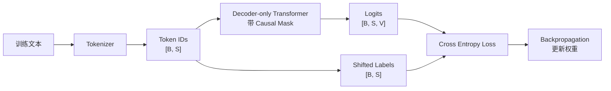
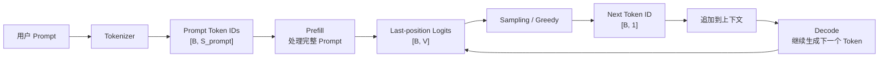

# 第 6 章：训练与推理的区别

## 1. 本章目标

学完本章后，你应该能回答：

- 训练阶段和推理阶段分别在做什么？
- Teacher Forcing 是什么，它为什么不等于“偷看未来答案”？
- 为什么训练时可以对一个序列的多个位置并行计算 loss？
- 为什么推理时不能一次生成完整答案，而必须逐 Token 自回归生成？
- Prefill、Decode 和训练阶段到底是什么关系？

## 2. 五分钟直觉

训练（Training）：用大量文本样本让模型学习“给定前文，预测下一个 Token”。训练时模型参数会被更新，核心目标是让模型输出的 logits 更接近真实下一个 token。

推理（Inference）：模型参数已经固定，不再更新。用户给一个 Prompt，模型根据当前上下文预测下一个 Token，再把这个 Token 接回上下文，继续预测后面的 Token。

两者最大的区别是：训练时完整答案已经在数据里，推理时未来答案还不存在。

训练阶段可以拿到整段真实文本，例如：

```text
今天天气很好
```

模型会学习：

```text
给定 今 -> 预测 天
给定 今天 -> 预测 天
给定 今天天 -> 预测 气
给定 今天天气 -> 预测 很
给定 今天天气很 -> 预测 好
```

由于这些真实 token 已经全部在训练样本里，训练可以把整段序列一次送入模型，用 Causal Mask 保证每个位置只能看自己和过去，再并行算出每个位置的 next-token loss。

推理阶段不一样。用户只给：

```text
今天天气
```

模型还不知道后面应该是“很好”“很差”还是“适合出门”。它必须先预测一个 token，比如“很”，再把“很”接回上下文，变成“今天天气很”，然后继续预测下一个 token。这个过程就是自回归推理。

## 3. 完整计算或数据流

### 训练数据流



概念上，位置 `t` 的 logits 用来预测位置 `t+1` 的真实 token：

```text
input:  x_1, x_2, x_3, ..., x_t
target: x_2, x_3, x_4, ..., x_{t+1}
```

### 推理数据流



推理时没有真实 target token 可以提前喂给模型。每一步生成出来的 token，都会成为下一步的输入条件。

## 4. 关键术语

- Training（训练）：用训练数据计算 loss，并通过反向传播更新模型参数的阶段。
- Inference（推理）：模型参数固定后，根据输入 Prompt 生成输出的阶段。
- Teacher Forcing（教师强制）：训练时使用真实历史 token 作为当前位置输入，而不是使用模型上一步自己预测出来的 token。
- Label（标签）：训练时希望模型预测出来的真实目标 token。
- Shifted Labels（错位标签）：把输入序列向后错一位，作为 next-token prediction 的监督目标。
- Cross Entropy Loss（交叉熵损失）：衡量模型预测分布和真实 token 之间差距的常见损失函数。
- Backpropagation（反向传播）：根据 loss 计算梯度并更新模型参数的过程。
- Autoregressive Inference（自回归推理）：推理时每一步生成一个新 token，并把它追加到上下文中继续生成。
- Causal Mask（因果掩码）：限制当前位置只能关注过去和当前 token，不能关注未来 token。
- Exposure Bias（暴露偏差）：训练时模型看到真实历史 token，推理时模型看到自己生成的历史 token，两者存在分布差异。

## 5. Tensor Shape

### 训练阶段

设：

```text
B = Batch Size
S = Sequence Length
H = Hidden Size
V = Vocabulary Size
```

训练输入：

```text
Input IDs: [B, S]
Hidden States: [B, S, H]
Logits: [B, S, V]
Labels: [B, S]
Loss: scalar
```

其中：

- `[B, S]` 表示一批训练样本，每条样本有 `S` 个 token。
- `[B, S, V]` 表示每个样本、每个位置，都输出一个词表大小的 logits 分布。
- `Labels` 通常是把输入序列错位后的真实下一个 token。

### 推理阶段

Prefill 输入：

```text
Prompt IDs: [B, S_prompt]
Prefill Logits: [B, S_prompt, V]
Next-token Logits: [B, V]
```

Decode 单步输入：

```text
New Token ID: [B, 1]
Decode Logits: [B, 1, V]
Next-token Logits: [B, V]
```

推理时虽然 Prefill 可能会计算整个 Prompt 每个位置的 logits，但生成下一个 token 时通常只关心最后一个位置的 logits。

## 6. 核心公式

### 训练目标

语言模型的训练目标可以写成：

```text
maximize P(x_t | x_1, x_2, ..., x_{t-1})
```

也就是让模型更擅长根据前面的 token 预测当前 token。

对整段序列，可以看成：

```text
P(x_1, x_2, ..., x_S) = product_t P(x_t | x_<t)
```

训练时通常最小化交叉熵损失：

```text
loss = CrossEntropy(logits_t, label_t)
```

其中：

- `logits_t` 是模型在位置 `t` 输出的词表分数。
- `label_t` 是真实的下一个 token。

### 推理目标

推理时每一步先得到分布：

```text
P(next_token | prompt, generated_tokens)
```

然后通过 greedy 或 sampling 选出一个实际 token：

```text
next_token = sample(softmax(logits))
```

再把它追加进上下文：

```text
context = context + next_token
```

重复这个过程，直到生成结束符、达到最大长度，或被服务端停止。

## 7. 与推理 Runtime 的联系

本项目后续关注的是推理 Runtime，不是训练系统。第 6 章的作用是把边界划清楚。

训练系统重点关注：

- 大规模数据读取和清洗。
- 前向传播和反向传播。
- 梯度、优化器状态和参数更新。
- 训练吞吐、显存占用和分布式训练。

推理 Runtime 重点关注：

- 请求进入服务后的排队、调度和批处理。
- Prefill 处理完整 Prompt。
- Decode 逐 Token 生成。
- KV Cache 的存储和复用。
- TTFT、TPOT、吞吐、延迟和 SLO。
- Streaming 输出。

最容易混淆的一点：

```text
Prefill 不是训练。
```

Prefill 是推理阶段的一部分。它只是把用户 Prompt 一次性送入模型，计算出后续 Decode 需要的上下文状态，尤其是每层的 K/V。它不计算训练 loss，也不更新模型参数。

训练阶段也会一次处理完整序列，但目的完全不同：训练是为了计算 loss 并更新权重；Prefill 是为了在一次推理请求里准备上下文状态。

## 8. 易错点

| 易错说法 | 问题 | 正确认知 |
| --- | --- | --- |
| Prefill 是训练阶段 | 混淆阶段 | Prefill 是推理阶段处理 Prompt 的计算 |
| 训练能并行，所以推理也能一次生成完整答案 | 混淆已知标签和未知输出 | 训练样本里未来 token 已知，推理时未来 token 还不存在 |
| Teacher Forcing 等于偷看答案 | 不准确 | 模型仍被 Causal Mask 限制，只是训练输入使用真实历史 token |
| 训练时不需要 Causal Mask | 错 | Decoder-only 训练也要防止当前位置看未来 |
| 推理会更新模型参数 | 错 | 常规推理只做前向计算，不做反向传播和参数更新 |
| 训练输出的 logits 就是最终文本 | 错 | 训练 logits 用来算 loss，推理 logits 才进入 sampling 生成 token |

## 9. 面试回答模板

如果被问“训练和推理有什么区别”，可以这样答：

1. 训练阶段有完整训练文本，目标是 next-token prediction，通过 logits 和真实标签计算交叉熵 loss，再反向传播更新模型参数。
2. 训练时使用 Teacher Forcing，也就是每个位置的输入来自真实历史 token，而不是模型自己上一步生成的 token。
3. 因为完整序列已知，训练可以在 Causal Mask 约束下并行计算多个位置的 logits 和 loss。
4. 推理阶段模型参数固定，用户只给 Prompt，未来 token 未知，所以必须先生成一个 token，再追加到上下文继续生成。
5. Prefill 和 Decode 都是推理阶段：Prefill 处理完整 Prompt，Decode 每步生成一个新 token。

如果追问“为什么推理不能一次生成所有 token”，可以补一句：

> 因为第 `t+1` 个生成 token 的条件里包含第 `t` 个已经生成出来的 token；而第 `t` 个 token 在 sampling 之前并不存在，所以后续 token 不能提前确定。

## 10. 真实面试问题

本章暂未收录与训练/推理区别、Teacher Forcing、自回归推理直接相关的 `VERIFIED` 或 `PARTIAL` 面试问题。

### 未核实候选问题（UNVERIFIED）

以下问题来自本章知识点推导，已按牛客网、知乎、小红书、脉脉、CSDN、GitHub 和公开搜索结果做跨平台复核，但暂时没有可访问的一手面经正文支撑，只能用于自测，不能当作真实面经或高频题。完整候选池见 `面试题/未核实候选问题.md`，复核记录见 `面试题/来源登记.md` 的 I008。

1. 为什么训练时可以并行计算多个位置的 loss，但推理时必须逐 Token 生成？
   - 对应能力：区分“训练样本未来 token 已知”和“推理未来 token 未知”。
   - 30 秒回答：训练时完整文本已经在数据里，模型可以在 Causal Mask 约束下一次计算所有位置的 logits，并用错位标签计算每个位置的 next-token loss。推理时未来 token 还没有生成，第 `t+1` 个 token 依赖第 `t` 个实际采样出来的 token，所以必须一步一步生成。
2. Teacher Forcing 是什么？为什么它不等于偷看未来？
   - 对应能力：能解释训练输入、标签和 Causal Mask 的关系。
   - 30 秒回答：Teacher Forcing 是训练时用真实历史 token 作为输入，而不是用模型自己上一步预测出来的 token。它不等于偷看未来，因为 Decoder-only 模型仍然使用 Causal Mask，当前位置只能看过去和当前输入，不能看未来标签。未来 token 只作为监督目标参与 loss，不作为当前位置可见的上下文。

## 11. 我的回答

待用户后续复习本章时填写。

## 12. 纠错记录

暂无。

## 13. 本章验收

后续复习时回答：

1. 为什么训练阶段可以一次处理完整序列，而推理阶段不能一次生成完整答案？
2. Teacher Forcing 是什么？它和 Causal Mask 是否冲突？
3. Prefill 为什么不是训练？它和训练时“一次处理完整序列”有什么相同点和不同点？
4. 训练阶段的 logits 和推理阶段的 logits 分别用来做什么？

## 14. 参考资料

- 页面标题：Attention Is All You Need
  - 发布者或作者：Ashish Vaswani 等，arXiv
  - URL：https://arxiv.org/abs/1706.03762
  - 发布时间：2017-06-12
  - 访问日期：2026-06-18
  - 来源类型：论文
  - 本文使用内容：Causal Mask 与自回归解码结构的基础来源。
- 页面标题：Language Models are Unsupervised Multitask Learners
  - 发布者或作者：Alec Radford 等，OpenAI
  - URL：https://cdn.openai.com/better-language-models/language_models_are_unsupervised_multitask_learners.pdf
  - 发布时间：2019
  - 访问日期：2026-06-18
  - 来源类型：技术报告
  - 本文使用内容：GPT 类语言模型按条件概率进行 next-token 建模的背景来源。
- 页面标题：Text generation
  - 发布者或作者：Hugging Face
  - URL：https://huggingface.co/docs/transformers/en/llm_tutorial
  - 发布时间：未确认
  - 访问日期：2026-06-18
  - 来源类型：官方文档
  - 本文使用内容：推理阶段文本生成流程、逐 token 生成和 generation API 的背景来源。
