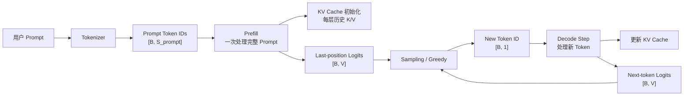

# 第 7 章：Prefill 与 Decode

## 1. 本章目标

学完本章后，你应该能回答：

- Prefill 和 Decode 分别在一次 LLM 推理请求的什么位置？
- 两个阶段的输入 Shape 有什么不同？
- 为什么 Prefill 更像大 GEMM，Decode 更像小 GEMM/GEMV？
- TTFT、TPOT、ITL 分别是什么，和 Prefill/Decode 有什么关系？
- 为什么 Decode 阶段会自然引出 KV Cache？

## 2. 五分钟直觉

一次 LLM 推理请求可以粗略拆成两个阶段：

```text
Prompt 处理阶段：Prefill
逐 Token 生成阶段：Decode
```

Prefill（预填充）：用户把完整 Prompt 发进来后，模型一次性处理所有 Prompt token，建立后续生成所需的上下文状态。它通常决定用户多久能看到第一个输出 token 的主要成本，也就是 TTFT 的重要组成部分。

Decode（解码）：Prefill 之后，模型每次只生成一个新 token。生成出来的新 token 会追加回上下文，再继续下一轮 Decode。这个阶段决定后续 token 一个接一个出来的速度，也就是 TPOT/ITL 关注的重点。

直觉上：

```text
Prefill：先读完整题目。
Decode：一个字一个字写答案。
```

Prefill 为什么通常更像大矩阵乘法？因为 Prompt 里有很多 token，输入 Shape 常见是 `[B, S_prompt, H]`，线性层可以把 `B*S_prompt` 展平成一个较大的矩阵维度来算。

Decode 为什么通常更像小矩阵乘法或矩阵向量乘法？因为每一步通常只处理新生成的一个 token，输入 Shape 常见是 `[B, 1, H]`。单步计算看起来小，但要重复很多次，而且每一步都需要访问大量模型权重和历史 K/V 状态。

## 3. 完整计算或数据流



一次请求的时间线可以写成：

```text
接收请求
-> Tokenize
-> Prefill(prompt tokens)
-> 采样第 1 个输出 token
-> Decode step 1
-> 采样第 2 个输出 token
-> Decode step 2
-> ...
-> 结束
```

如果是流式输出，用户通常在第一个输出 token 生成后就开始看到内容。

## 4. 关键术语

- Prefill（预填充）：推理阶段处理完整 Prompt 的计算，用于建立上下文状态，并产生第一个输出 token 所需的 logits。
- Decode（解码）：Prefill 之后逐 token 生成的阶段，每一步处理一个新 token，并产生下一个 token 的 logits。
- Prompt Length（提示词长度）：输入 Prompt 被 tokenizer 切分后的 token 数，通常记作 `S_prompt`。
- Generated Length（生成长度）：模型已经生成或计划生成的 token 数，通常记作 `S_gen`。
- TTFT（Time To First Token，首 token 延迟）：从请求进入服务到第一个输出 token 返回给用户的时间。
- TPOT（Time Per Output Token，每输出 token 时间）：生成阶段平均每个输出 token 花费的时间。
- ITL（Inter-Token Latency，token 间延迟）：流式输出中相邻两个 token 返回之间的时间间隔。
- Compute-bound（计算受限）：主要瓶颈在算力，例如矩阵乘法计算量大，计算单元忙。
- Memory-bound（内存带宽受限）：主要瓶颈在数据读取和搬运，例如反复读权重或 KV Cache。
- KV Cache（Key/Value 缓存）：Decode 时缓存历史 token 在每一层 attention 中的 K/V，避免重复计算历史上下文。

## 5. Tensor Shape

设：

```text
B = Batch Size
S_prompt = Prompt Token 数
S_gen = 已生成 Token 数
H = Hidden Size
V = Vocabulary Size
```

### Prefill Shape

Prompt token 一次进入模型：

```text
Prompt IDs: [B, S_prompt]
Hidden States: [B, S_prompt, H]
Logits: [B, S_prompt, V]
Next-token Logits: [B, V]
```

注意：

- 模型可能计算出每个 Prompt 位置的 logits。
- 但为了生成第一个输出 token，通常只取最后一个位置的 logits，也就是 `[B, V]`。

线性层视角：

```text
X_prefill: [B, S_prompt, H]
X_flat:    [B*S_prompt, H]
```

因此 Prefill 里的很多线性层更像：

```text
[B*S_prompt, H] x [H, Hout]
```

### Decode Shape

每一步 Decode 只处理新 token：

```text
New Token IDs: [B, 1]
Hidden States: [B, 1, H]
Logits: [B, 1, V]
Next-token Logits: [B, V]
```

线性层视角：

```text
X_decode: [B, 1, H]
X_flat:   [B, H]
```

因此 Decode 的单步线性层更像：

```text
[B, H] x [H, Hout]
```

当 `B` 很小，甚至 `B=1` 时，它会更接近矩阵向量乘法。

## 6. 核心公式

### Prefill 线性层 FLOPs

对一个线性层：

```text
FLOPs_prefill = 2 * B * S_prompt * Hin * Hout
```

Prompt 越长，`S_prompt` 越大，Prefill 计算量越大。

### Decode 单步线性层 FLOPs

Decode 每一步通常 `S = 1`：

```text
FLOPs_decode_step = 2 * B * 1 * Hin * Hout
```

如果生成 `S_gen` 个 token，则大致重复 `S_gen` 次：

```text
FLOPs_decode_total = S_gen * FLOPs_decode_step
```

### 延迟指标

TTFT：

```text
TTFT = request_queue_time + tokenize_time + prefill_time + first_sampling_time + first_streaming_overhead
```

实际系统里可能还包括网络、调度、批处理等待等开销。本章只看概念。

TPOT：

```text
TPOT = decode_total_time / number_of_output_tokens
```

ITL：

```text
ITL_i = time(token_i_returned) - time(token_{i-1}_returned)
```

简单理解：

- TTFT 看用户多久看到第一个 token。
- TPOT 看后续平均每个 token 多久生成一个。
- ITL 看流式输出是否稳定，token 间隔有没有抖动。

## 7. 与推理 Runtime 的联系

Prefill 和 Decode 是推理 Runtime 调度的核心边界。

Prefill 阶段的 Runtime 特征：

- 输入序列长，单个请求的 `S_prompt` 可能很大。
- 线性层和 attention 计算规模较大。
- 更容易形成大 GEMM，计算利用率相对更好。
- 长 Prompt 会拉高 TTFT。
- Prefill 结束后会产生后续 Decode 需要的历史 K/V 状态。

Decode 阶段的 Runtime 特征：

- 每步只处理新 token。
- 每个请求会重复执行很多步。
- 单步矩阵较小，计算利用率可能不如 Prefill。
- 每步都要读模型权重，还要读历史 KV Cache。
- 更容易受到内存带宽、KV Cache 访问、调度开销和 batch 形态影响。
- 直接影响 TPOT 和 ITL。

这也是为什么推理服务要做调度：

- 如果只跑长 Prompt Prefill，首 token 延迟可能很高。
- 如果只照顾 Decode，小请求可能快，但系统吞吐可能不高。
- 多请求并发时，Runtime 要决定 Prefill 和 Decode 如何混合执行。

后续第 12 章的 Continuous Batching 和 Scheduler，会继续展开这个问题。

## 8. 易错点

| 易错说法 | 问题 | 正确认知 |
| --- | --- | --- |
| Prefill 是训练 | 混淆阶段 | Prefill 是推理阶段处理完整 Prompt |
| Decode 是把完整答案一次解码成文本 | 错 | Decode 是逐 token 生成 |
| TTFT 只等于 Prefill 时间 | 过度简化 | TTFT 还可能包含排队、tokenize、调度、采样和网络开销 |
| TPOT 只看模型计算 | 不完整 | TPOT 还受 KV Cache 读写、调度、batch 形态和流式输出影响 |
| Prefill 一定 compute-bound，Decode 一定 memory-bound | 绝对化 | 这是常见倾向，实际还取决于模型、硬件、batch、上下文长度和实现 |
| Decode 单步 FLOPs 小，所以总成本可以忽略 | 错 | Decode 会重复很多步，且容易受访存和调度限制 |
| KV Cache 是 Prefill 的输出文本 | 错 | KV Cache 是 attention 中历史 K/V 张量状态，不是文本 |

## 9. 面试回答模板

如果被问“Prefill 和 Decode 有什么区别”，可以这样答：

1. Prefill 和 Decode 都是推理阶段，不是训练阶段。
2. Prefill 发生在请求刚进入模型时，一次处理完整 Prompt，输入 Shape 通常是 `[B, S_prompt]`，hidden states 是 `[B, S_prompt, H]`。
3. Prefill 会建立后续生成需要的上下文状态，尤其是每层 attention 的历史 K/V，并产生第一个输出 token 所需的 logits。
4. Decode 发生在 Prefill 之后，每一步只处理新生成的一个 token，Shape 通常是 `[B, 1, H]`，然后输出下一个 token 的 logits。
5. Prefill 更影响 TTFT，Decode 更影响 TPOT/ITL。Prefill 常见是较大的 GEMM，Decode 单步更小、更容易受权重读取、KV Cache 和调度影响。

如果追问“为什么 Decode 需要 KV Cache”，可以补一句：

> 因为每个新 token 都要关注历史上下文。如果每一步都重新计算所有历史 token 的 K/V，成本会随生成长度快速增长；缓存历史 K/V 可以让 Decode 只计算新 token 的 Q/K/V，并复用过去的 K/V。

## 10. 真实面试问题

本章暂未收录与 Prefill、Decode、TTFT、TPOT、ITL 直接相关的 `VERIFIED` 或 `PARTIAL` 面试问题。

### 未核实候选问题（UNVERIFIED）

以下问题来自本章知识点推导，已按牛客网、知乎、小红书、脉脉、CSDN、GitHub 和公开搜索结果做跨平台复核，但暂时没有可访问的一手面经正文支撑，只能用于自测，不能当作真实面经或高频题。完整候选池见 `面试题/未核实候选问题.md`，复核记录见 `面试题/来源登记.md` 的 I008。

1. Prefill 和 Decode 分别是什么？它们和 TTFT、TPOT 有什么关系？
   - 对应能力：能把推理请求拆成首 token 前和首 token 后两个阶段。
   - 30 秒回答：Prefill 是推理阶段一次处理完整 Prompt，建立上下文状态并产生第一个输出 token 所需的 logits，因此它是 TTFT 的重要组成部分。Decode 是 Prefill 之后逐 token 生成，每一步处理新 token 并输出下一个 token 的 logits，因此它主要影响 TPOT 和流式输出的 ITL。
2. 为什么 Prefill 更像大 GEMM，而 Decode 更容易表现成小 GEMM/GEMV？
   - 对应能力：能从 Shape 推出计算形态差异。
   - 30 秒回答：Prefill 输入是 `[B, S_prompt, H]`，可以展平成 `[B*S_prompt, H]` 去做线性层，矩阵规模较大，更像大 GEMM。Decode 每步通常只处理一个新 token，输入是 `[B, 1, H]`，展平后是 `[B, H]`；当 batch 小时更接近 GEMV 或小 GEMM，计算利用率更难打满，也更容易受权重读取和 KV Cache 访问影响。

## 11. 我的回答

待用户后续复习本章时填写。

## 12. 纠错记录

暂无。

## 13. 本章验收

后续复习时回答：

1. Prefill 和 Decode 分别发生在推理链路的哪里？
2. Prefill 的输入 Shape 和 Decode 单步输入 Shape 有什么区别？
3. TTFT、TPOT、ITL 分别衡量什么？
4. 为什么 Decode 阶段会自然需要 KV Cache？

## 14. 参考资料

- 页面标题：Text generation
  - 发布者或作者：Hugging Face
  - URL：https://huggingface.co/docs/transformers/en/llm_tutorial
  - 发布时间：未确认
  - 访问日期：2026-06-18
  - 来源类型：官方文档
  - 本文使用内容：推理阶段逐 token 文本生成流程。
- 页面标题：Matrix Multiplication Background User's Guide
  - 发布者或作者：NVIDIA
  - URL：https://docs.nvidia.com/deeplearning/performance/dl-performance-matrix-multiplication/index.html
  - 发布时间：未确认
  - 访问日期：2026-06-18
  - 来源类型：官方文档
  - 本文使用内容：GEMM、GEMV、矩阵乘法形态和算术强度直觉。
- 页面标题：vLLM Documentation
  - 发布者或作者：vLLM Project
  - URL：https://docs.vllm.ai/en/latest/
  - 发布时间：未确认
  - 访问日期：2026-06-18
  - 来源类型：官方文档
  - 本文使用内容：后续 Runtime、调度、KV Cache 与性能指标章节的官方文档入口。
