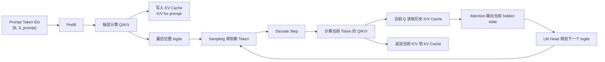

# 第 8 章：KV Cache

## 1. 本章目标

学完本章后，你应该能回答：

- KV Cache 是什么，保存在哪里一类张量？
- 为什么 Decode 阶段要缓存历史 K 和 V？
- 为什么通常不缓存历史 Q？
- KV Cache 的基本 Shape 是什么？
- 如何估算 KV Cache 显存？
- 上下文长度、并发数、层数、head 数和精度会怎样影响 KV Cache？

## 2. 五分钟直觉

KV Cache（Key-Value Cache，键值缓存）：在自回归推理中，把每一层 Attention 已经算过的历史 Key 和 Value 保存下来，后续 Decode 步骤直接复用，避免重复计算历史 token 的 K/V。

回忆第 4 章的 Attention：

```text
Attention(Q, K, V) = softmax(QK^T / sqrt(Dh)) V
```

在 Decode 第 `t` 步，模型只新增一个 token。这个新 token 会产生新的 `Q_t`、`K_t`、`V_t`。

当前 token 的 `Q_t` 要去看所有历史 token 的 `K_1 ... K_t`，再用 attention weight 对 `V_1 ... V_t` 加权求和。

如果没有 KV Cache，每生成一个新 token，都要把从 Prompt 到当前 token 的所有历史 token 重新跑一遍每层的 K/V Projection。这会浪费大量重复计算。

有 KV Cache 后：

```text
Prefill 阶段：算出 Prompt 所有 token 的 K/V，并写入缓存。
Decode 阶段：每步只算新 token 的 K/V，追加到缓存；历史 K/V 直接读取。
```

为什么不缓存历史 Q？

因为生成新 token 时，只需要“当前 token 的 Query”去查询“历史 Key/Value”。历史 token 的 Query 已经在它们自己那一步用完了，后续新 token 不需要拿历史 Q 来计算自己的输出。

一句话：

```text
Q 是当前问题；K/V 是历史资料库。
新问题来了，只需要新的 Q 去查旧的 K/V。
```

## 3. 完整计算或数据流



更细一点看单层 Decode：

```text
输入当前 token hidden state
-> 线性投影得到 q_t, k_t, v_t
-> 从 KV Cache 读取 K_1...K_{t-1}, V_1...V_{t-1}
-> 拼上当前 k_t, v_t
-> q_t 与所有 K 做 attention
-> attention weights 对所有 V 加权求和
-> 得到当前 token 的 attention 输出
-> 把 k_t, v_t 写回 KV Cache
```

KV Cache 是每层都有一份，不是整个模型只有一份。

## 4. 关键术语

- KV Cache（Key-Value Cache，键值缓存）：保存历史 token 在每一层 Attention 中的 Key 和 Value 张量，供后续 Decode 复用。
- Key（键向量）：Attention 中用于被 Query 匹配的向量。
- Value（值向量）：Attention 中被 attention weight 加权求和的内容向量。
- Query（查询向量）：当前 token 用来查询相关历史信息的向量。
- Cache Length（缓存长度）：当前请求已经保存在 KV Cache 中的 token 数，通常等于 Prompt token 数加已生成 token 数。
- KV Head（Key/Value Head，键值头）：K/V 使用的 head 数。MHA 中通常等于 query head 数；MQA/GQA 中会更少。
- Head Dimension（头维度）：每个 attention head 的向量维度，记作 `Dh`。
- Context Length（上下文长度）：模型当前可见的 token 总长度，会直接影响 KV Cache 大小。
- Prefix Cache（前缀缓存）：把共享 Prompt 的 K/V 缓存下来，让多个请求复用同一段前缀状态。
- PagedAttention（分页注意力）：把 KV Cache 拆成固定大小块管理，减少长上下文和并发请求下的显存碎片，后续第 11 章展开。

## 5. Tensor Shape

设：

```text
L = Number of Layers
B = Batch Size
S = Cache Length = Prompt Length + Generated Length
H = Hidden Size
Nq = Number of Query Heads
Nkv = Number of KV Heads
Dh = Head Dimension
bytes = 每个元素的字节数
```

### 单层 KV Cache Shape

概念上，某一层的 K Cache 和 V Cache 可以写成：

```text
K_cache_layer: [B, Nkv, S, Dh]
V_cache_layer: [B, Nkv, S, Dh]
```

如果把 K 和 V 合在一起看：

```text
KV_cache_layer: [2, B, Nkv, S, Dh]
```

这里的 `2` 表示 K 和 V 两份缓存。

### 全模型 KV Cache Shape

把所有层都算上：

```text
K_cache_all_layers: [L, B, Nkv, S, Dh]
V_cache_all_layers: [L, B, Nkv, S, Dh]
```

合在一起：

```text
KV_cache_all_layers: [L, 2, B, Nkv, S, Dh]
```

不同框架的真实内存布局可能不同。例如为了访存效率，某些系统会把 block、head、head dimension 的顺序重排；但概念维度基本离不开：

```text
层数 L、请求数 B、KV head 数 Nkv、缓存长度 S、头维度 Dh、K/V 两份
```

### Decode 单步 Shape

当前 token 的投影：

```text
q_t: [B, Nq, 1, Dh]
k_t: [B, Nkv, 1, Dh]
v_t: [B, Nkv, 1, Dh]
```

历史缓存：

```text
K_cache: [B, Nkv, S, Dh]
V_cache: [B, Nkv, S, Dh]
```

当前 attention：

```text
q_t attends to K_cache -> scores: [B, Nq, 1, S]
weights x V_cache -> output: [B, Nq, 1, Dh]
```

## 6. 核心公式

### KV Cache 元素数量

全模型 KV Cache 元素数量：

```text
num_elements = L * 2 * B * S * Nkv * Dh
```

其中：

- `L`：层数。
- `2`：K 和 V 两份。
- `B`：并发请求数或 batch size。
- `S`：每个请求缓存的 token 数。
- `Nkv`：KV head 数。
- `Dh`：每个 head 的维度。

### KV Cache 显存估算

```text
kv_cache_bytes = L * 2 * B * S * Nkv * Dh * bytes
```

如果是 FP16 或 BF16：

```text
bytes = 2
```

如果是 FP8：

```text
bytes = 1
```

如果是 MHA，通常：

```text
Nkv = Nq
H = Nq * Dh
```

因此可简化为：

```text
kv_cache_bytes_mha = L * 2 * B * S * H * bytes
```

### 示例估算

假设：

```text
L = 32
B = 1
S = 4096
H = 4096
bytes = 2  # FP16
```

MHA 下：

```text
kv_cache_bytes = 32 * 2 * 1 * 4096 * 4096 * 2
               = 2,147,483,648 bytes
               ≈ 2 GiB
```

这说明：即使 batch size 只有 1，长上下文下 KV Cache 也可能占用大量显存。

### GQA/MQA 对 KV Cache 的影响

如果使用 GQA（Grouped-Query Attention，分组查询注意力）或 MQA（Multi-Query Attention，多查询注意力），`Nkv` 会小于 `Nq`。

KV Cache 相对 MHA 的大小比例近似：

```text
ratio = Nkv / Nq
```

例如：

```text
Nq = 32
Nkv = 8
ratio = 8 / 32 = 1/4
```

KV Cache 大约降为 MHA 的四分之一。第 9 章会专门讲 MHA、MQA、GQA。

## 7. 与推理 Runtime 的联系

KV Cache 是推理 Runtime 的核心资源之一。

它直接影响：

- 最大上下文长度：`S` 越大，KV Cache 越大。
- 最大并发数：`B` 越大，KV Cache 越大。
- 长输出成本：生成越多 token，缓存长度继续增长。
- 调度策略：Runtime 要决定哪些请求能同时进 batch。
- 显存水位：权重显存之外，KV Cache 是服务端最重要的动态显存消耗。
- PagedAttention：为了管理动态增长的 KV Cache，后续会引入 block/page 式管理。
- Prefix Caching：多个请求共享相同前缀时，可以复用前缀 K/V，减少重复 Prefill。

### 没有 KV Cache 会怎样？

没有 KV Cache 时，每个 Decode step 都要重新处理完整上下文：

```text
step 1: 处理 S_prompt + 1 个 token
step 2: 处理 S_prompt + 2 个 token
step 3: 处理 S_prompt + 3 个 token
...
```

这样会重复计算大量历史 token 的 K/V。

有 KV Cache 后：

```text
Prefill: 计算 Prompt 的 K/V 一次
Decode step t: 只计算新 token 的 K/V，历史 K/V 直接读取
```

注意：KV Cache 不是让 attention 对历史长度的依赖消失。当前 Q 仍然要和历史 K 做 attention，读取历史 V。它主要省掉的是“历史 token 的 K/V 重新投影计算”。

## 8. 易错点

| 易错说法 | 问题 | 正确认知 |
| --- | --- | --- |
| KV Cache 缓存的是文本 | 错 | 缓存的是每层 attention 的 K/V 张量 |
| KV Cache 只有一份 | 不准确 | 每一层通常都有自己的 K/V cache |
| 缓存 Q/K/V 三者都一样重要 | 错 | Decode 当前步需要当前 Q，历史 Q 通常不再使用；历史 K/V 需要复用 |
| 有 KV Cache 后 attention 不再看历史 token | 错 | 当前 Q 仍要看历史 K/V，只是不重新计算历史 K/V |
| KV Cache 越大越好 | 不准确 | 更长上下文和更高并发会消耗更多显存，影响调度和吞吐 |
| KV Cache 显存只和模型参数量有关 | 错 | 它还和层数、上下文长度、batch、KV head 数、head 维度、精度有关 |
| KV Cache 和 Prompt 文本缓存是一回事 | 错 | Prompt 文本是原始输入；KV Cache 是模型内部张量状态 |

## 9. 面试回答模板

如果被问“KV Cache 是什么，为什么需要它”，可以这样答：

1. KV Cache 是推理阶段保存每一层历史 token 的 Key 和 Value 张量。
2. 在自回归 Decode 中，每一步只新增一个 token，但当前 token 需要关注所有历史 token。
3. 如果没有 KV Cache，每一步都要重新计算历史 token 的 K/V，重复成本很高。
4. 有 KV Cache 后，Prefill 先把 Prompt 的 K/V 写入缓存，Decode 每步只计算新 token 的 K/V，并读取历史 K/V 做 attention。
5. 通常不缓存历史 Q，因为新 token 只需要当前 Q 去查询历史 K/V，历史 Q 已经在过去步骤用完。
6. KV Cache 显存大致按 `L * 2 * B * S * Nkv * Dh * bytes` 增长，所以长上下文和高并发会很吃显存。

如果追问“KV Cache 会不会减少所有 attention 计算”，可以补一句：

> 不会。它主要减少历史 K/V 的重复投影计算；当前 Q 仍然要和历史 K 做匹配，并对历史 V 加权求和，所以长上下文仍然会带来 attention 读取和计算成本。

## 10. 真实面试问题

本章暂未收录与 KV Cache 直接相关的 `VERIFIED` 或 `PARTIAL` 面试问题。

### 未核实候选问题（UNVERIFIED）

以下问题来自本章知识点推导，已按牛客网、知乎、小红书、脉脉、CSDN、GitHub 和公开搜索结果做跨平台复核，但暂时没有可访问的一手面经正文支撑，只能用于自测，不能当作真实面经或高频题。完整候选池见 `面试题/未核实候选问题.md`，复核记录见 `面试题/来源登记.md` 的 I009。

1. 为什么 KV Cache 只缓存 K/V，而通常不缓存历史 Q？
   - 对应能力：理解 Decode 中当前 Q 与历史 K/V 的角色差异。
   - 30 秒回答：Decode 每一步只需要当前 token 的 Q 去查询所有历史 token 的 K/V。历史 token 的 Q 只在它们自己被计算输出时用过，后续新 token 不需要历史 Q 来生成当前输出。因此 KV Cache 重点缓存历史 K/V，当前步重新计算当前 Q/K/V，并把新的 K/V 追加进缓存。
2. KV Cache 显存如何估算？为什么长上下文和高并发会吃显存？
   - 对应能力：能从 Shape 推导动态显存。
   - 30 秒回答：KV Cache 每层有 K 和 V 两份，概念 Shape 可以看成 `[L, 2, B, Nkv, S, Dh]`。显存近似是 `L * 2 * B * S * Nkv * Dh * bytes`。因此层数越多、batch 越大、上下文越长、KV head 越多、head 维度越大、精度字节数越高，KV Cache 越大。

## 11. 我的回答

待用户后续复习本章时填写。

## 12. 纠错记录

暂无。

## 13. 本章验收

后续复习时回答：

1. KV Cache 缓存的到底是什么？为什么不是缓存文本？
2. 为什么 Decode 阶段要缓存历史 K/V？
3. 为什么通常不缓存历史 Q？
4. 写出 KV Cache 显存估算公式，并解释每个变量。

## 14. 参考资料

- 页面标题：Cache strategies
  - 发布者或作者：Hugging Face
  - URL：https://huggingface.co/docs/transformers/en/kv_cache
  - 发布时间：未确认
  - 访问日期：2026-06-18
  - 来源类型：官方文档
  - 本文使用内容：KV Cache 的用途、DynamicCache、StaticCache、offloading 和 quantized cache 的概念入口。
- 页面标题：Efficient Memory Management for Large Language Model Serving with PagedAttention
  - 发布者或作者：Woosuk Kwon 等，arXiv
  - URL：https://arxiv.org/abs/2309.06180
  - 发布时间：2023-09-12
  - 访问日期：2026-06-18
  - 来源类型：论文
  - 本文使用内容：KV Cache 随请求和序列动态增长、显存管理困难、PagedAttention 的背景来源。
- 页面标题：Paged Attention
  - 发布者或作者：vLLM Project
  - URL：https://docs.vllm.ai/en/latest/design/paged_attention/
  - 发布时间：未确认
  - 访问日期：2026-06-18
  - 来源类型：官方文档
  - 本文使用内容：vLLM paged KV cache 的高层说明，以及 `q`、`k_cache`、`v_cache` 的 Shape 示例。该页标注为历史设计文档，不能当作当前 vLLM 代码的完整实现说明。
