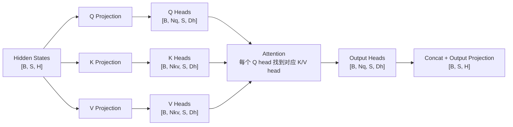

# 第 9 章：MHA、MQA、GQA

## 1. 本章目标

学完本章后，你应该能回答：

- MHA、MQA、GQA 分别是什么？
- Query Head 和 KV Head 有什么区别？
- 为什么 MQA/GQA 能减少 KV Cache？
- `Nq`、`Nkv`、`Dh`、`H` 之间是什么关系？
- MHA、MQA、GQA 在推理性能和模型质量之间有什么取舍？

## 2. 五分钟直觉

MHA（Multi-Head Attention，多头注意力）：每个 Query head 都有自己的一组 K/V head。也就是 `Nkv = Nq`。

MQA（Multi-Query Attention，多查询注意力）：多个 Query head 共享同一组 K/V。也就是 `Nkv = 1`。

GQA（Grouped-Query Attention，分组查询注意力）：把多个 Query head 分成若干组，每组共享一组 K/V。也就是 `1 < Nkv < Nq`。

直觉类比：

```text
MHA：每个问题小组都有自己的资料库。
MQA：所有问题小组共用一个资料库。
GQA：几个问题小组合用一个资料库。
```

第 8 章已经知道，KV Cache 的大小近似是：

```text
L * 2 * B * S * Nkv * Dh * bytes
```

所以核心点非常直接：

```text
Nkv 越小，KV Cache 越小。
```

MHA 的表达能力强，但 KV Cache 大。MQA 的 KV Cache 最小，Decode 读 K/V 的带宽压力小，但可能损失一些质量。GQA 介于两者之间，常用来在质量和推理效率之间折中。

## 3. 完整计算或数据流



三种结构的区别只看 `Nkv`：

| 结构 | Query Head 数 | KV Head 数 | 关系 |
| --- | --- | --- | --- |
| MHA | `Nq` | `Nq` | 每个 Q head 独享一组 K/V |
| GQA | `Nq` | `Nkv` | 多个 Q head 共享一组 K/V |
| MQA | `Nq` | `1` | 所有 Q head 共享一组 K/V |

注意：输出 head 数仍然跟 Query head 数一致。即使 MQA 只有 1 组 K/V，也仍然有多个 Query head 和多个输出 head。

## 4. 关键术语

- MHA（Multi-Head Attention，多头注意力）：多个 attention head 并行计算，每个 head 有独立的 Q/K/V 投影。
- MQA（Multi-Query Attention，多查询注意力）：保留多个 Query head，但所有 Query head 共享同一组 Key/Value head。
- GQA（Grouped-Query Attention，分组查询注意力）：把 Query head 分组，每组共享一组 Key/Value head，是 MHA 和 MQA 的中间形态。
- Query Head（查询头）：产生 Query 的 attention head，数量记作 `Nq`。
- KV Head（Key/Value Head，键值头）：产生 Key 和 Value 的 head，数量记作 `Nkv`。
- Head Dimension（头维度）：每个 head 的向量维度，记作 `Dh`。
- Head Group（头分组）：GQA 中若干个 Query head 共享同一组 K/V 的分组。
- KV Sharing（键值共享）：多个 Query head 共用 K/V head 的机制。
- Quality-Speed Trade-off（质量与速度取舍）：减少 KV head 可以提高 Decode 效率，但可能影响模型表达能力或质量。

## 5. Tensor Shape

设：

```text
B = Batch Size
S = Sequence Length 或 Cache Length
H = Hidden Size
Nq = Number of Query Heads
Nkv = Number of KV Heads
Dh = Head Dimension
H = Nq * Dh
```

### MHA Shape

MHA 中：

```text
Nkv = Nq
```

Q/K/V：

```text
Q: [B, Nq, S, Dh]
K: [B, Nq, S, Dh]
V: [B, Nq, S, Dh]
```

KV Cache：

```text
K_cache: [B, Nq, S, Dh]
V_cache: [B, Nq, S, Dh]
```

### MQA Shape

MQA 中：

```text
Nkv = 1
```

Q/K/V：

```text
Q: [B, Nq, S, Dh]
K: [B, 1, S, Dh]
V: [B, 1, S, Dh]
```

KV Cache：

```text
K_cache: [B, 1, S, Dh]
V_cache: [B, 1, S, Dh]
```

Attention 时，这一组 K/V 会被多个 Query head 共享。

### GQA Shape

GQA 中：

```text
1 < Nkv < Nq
```

通常要求：

```text
Nq % Nkv == 0
```

每组 Query head 数：

```text
group_size = Nq / Nkv
```

Q/K/V：

```text
Q: [B, Nq, S, Dh]
K: [B, Nkv, S, Dh]
V: [B, Nkv, S, Dh]
```

KV Cache：

```text
K_cache: [B, Nkv, S, Dh]
V_cache: [B, Nkv, S, Dh]
```

示例：

```text
Nq = 32
Nkv = 8
group_size = 32 / 8 = 4
```

含义：每 4 个 Query head 共享 1 组 K/V。

## 6. 核心公式

### KV Cache 显存公式

第 8 章公式：

```text
kv_cache_bytes = L * 2 * B * S * Nkv * Dh * bytes
```

在 MHA 中：

```text
Nkv = Nq
```

在 MQA 中：

```text
Nkv = 1
```

在 GQA 中：

```text
1 < Nkv < Nq
```

### 相对 MHA 的 KV Cache 比例

```text
ratio = Nkv / Nq
```

示例：

```text
Nq = 32
Dh = 128
H = 4096
```

三种结构：

| 结构 | `Nkv` | 相对 MHA 的 KV Cache |
| --- | ---: | ---: |
| MHA | 32 | `32 / 32 = 1` |
| GQA | 8 | `8 / 32 = 1/4` |
| MQA | 1 | `1 / 32 = 1/32` |

### 显存估算示例

假设：

```text
L = 32
B = 1
S = 4096
Nq = 32
Dh = 128
bytes = 2
```

MHA：

```text
kv_cache_bytes = 32 * 2 * 1 * 4096 * 32 * 128 * 2
               = 2,147,483,648 bytes
               ≈ 2 GiB
```

GQA，`Nkv = 8`：

```text
kv_cache_bytes = 32 * 2 * 1 * 4096 * 8 * 128 * 2
               = 536,870,912 bytes
               ≈ 512 MiB
```

MQA，`Nkv = 1`：

```text
kv_cache_bytes = 32 * 2 * 1 * 4096 * 1 * 128 * 2
               = 67,108,864 bytes
               ≈ 64 MiB
```

这个例子说明：降低 `Nkv` 对 KV Cache 的影响非常直接。

## 7. 与推理 Runtime 的联系

MHA、MQA、GQA 的差别，在训练时可能只是结构选择；在推理 Runtime 中，它们会直接影响 Decode 阶段的显存和带宽压力。

### MHA 的 Runtime 特征

- 每个 Query head 有自己的 K/V。
- KV Cache 最大。
- K/V 读取带宽压力最大。
- 表达能力强，是原始 Transformer 的标准结构。

### MQA 的 Runtime 特征

- 所有 Query head 共享一组 K/V。
- KV Cache 最小。
- Decode 读取历史 K/V 的带宽压力最低。
- 可能带来质量下降，需要模型设计或训练过程配合。

### GQA 的 Runtime 特征

- 多个 Query head 分组共享 K/V。
- KV Cache 比 MHA 小，但比 MQA 大。
- 常作为折中：希望接近 MHA 的质量，同时接近 MQA 的 Decode 效率。
- 对长上下文和高并发服务更友好。

Runtime 角度可以用一句话记：

```text
MHA 看重表达；MQA 看重省 KV；GQA 在两者之间折中。
```

第 10 章会进入 FlashAttention。FlashAttention 主要优化 Attention 计算过程中的内存 IO；而 MQA/GQA 是从模型结构上减少 K/V head 和 KV Cache 规模。两者解决的问题不同，但都服务于推理效率。

## 8. 易错点

| 易错说法 | 问题 | 正确认知 |
| --- | --- | --- |
| MQA 只有一个 attention head | 错 | MQA 仍有多个 Query head，只是共享一组 K/V |
| GQA 和 MQA 是一回事 | 不准确 | MQA 是 `Nkv=1`，GQA 是 `1<Nkv<Nq` |
| GQA 会减少 Query head 数 | 错 | GQA 通常保留 Query head 数，减少的是 KV head 数 |
| KV Cache 大小只看 hidden size | 不完整 | 还要看 `Nkv`、层数、上下文长度、batch 和精度 |
| MQA 一定比 MHA 好 | 绝对化 | MQA 更省缓存和带宽，但可能影响质量 |
| GQA 一定不损失质量 | 绝对化 | GQA 是折中，具体效果取决于模型、训练和任务 |
| MHA/MQA/GQA 只影响训练 | 错 | 它们对 Decode 阶段 KV Cache 和内存带宽很关键 |

## 9. 面试回答模板

如果被问“MHA、MQA、GQA 有什么区别”，可以这样答：

1. MHA 是标准多头注意力，Query、Key、Value 都有 `Nq` 个 head，所以 `Nkv=Nq`。
2. MQA 保留多个 Query head，但所有 Query head 共享一组 K/V，所以 `Nkv=1`。
3. GQA 是中间形态，把 Query head 分成若干组，每组共享一组 K/V，所以 `1<Nkv<Nq`。
4. KV Cache 大小大致按 `L * 2 * B * S * Nkv * Dh * bytes` 增长，因此减少 `Nkv` 能直接减少 KV Cache。
5. Runtime 上，MQA 最省 KV Cache，MHA 表达能力强但缓存大，GQA 在质量和推理效率之间折中。

如果追问“GQA 为什么能减少 KV Cache”，可以补一句：

> 因为 KV Cache 只保存 K/V，不保存 Q。GQA 不减少 Query head 数，而是减少 KV head 数 `Nkv`。公式里 KV Cache 与 `Nkv` 成正比，所以 `Nkv` 从 32 降到 8 时，KV Cache 近似降到四分之一。

## 10. 真实面试问题

本章暂未收录与 MHA、MQA、GQA 直接相关的 `VERIFIED` 或 `PARTIAL` 面试问题。

### 未核实候选问题（UNVERIFIED）

以下问题来自本章知识点推导，已按牛客网、知乎、小红书、脉脉、CSDN、GitHub 和公开搜索结果做跨平台复核，但暂时没有可访问的一手面经正文支撑，只能用于自测，不能当作真实面经或高频题。完整候选池见 `面试题/未核实候选问题.md`，复核记录见 `面试题/来源登记.md` 的 I010。

1. MHA、MQA、GQA 的区别是什么？
   - 对应能力：能从 `Nq` 和 `Nkv` 解释三者结构差异。
   - 30 秒回答：MHA 中每个 Query head 都有自己的 K/V head，所以 `Nkv=Nq`。MQA 中多个 Query head 共享一组 K/V，所以 `Nkv=1`。GQA 是中间形态，把 Query head 分组，每组共享一组 K/V，所以 `1<Nkv<Nq`。它们主要区别是 KV head 数不同，进而影响 KV Cache 和 Decode 访存压力。
2. 为什么 GQA 能减少 KV Cache？相比 MQA 和 MHA 有什么取舍？
   - 对应能力：能把结构差异和 KV Cache 显存公式联系起来。
   - 30 秒回答：KV Cache 显存近似是 `L * 2 * B * S * Nkv * Dh * bytes`，和 `Nkv` 成正比。GQA 减少 KV head 数，所以比 MHA 更省 KV Cache；但它不是像 MQA 那样所有 Query head 只共享一组 K/V，而是按组共享，因此通常在质量和推理效率之间折中。

## 11. 我的回答

待用户后续复习本章时填写。

## 12. 纠错记录

暂无。

## 13. 本章验收

后续复习时回答：

1. MHA、MQA、GQA 分别对应 `Nkv` 的什么取值？
2. 为什么 MQA 不是“只有一个 attention head”？
3. 如果 `Nq=32, Nkv=8`，GQA 的 KV Cache 大约是 MHA 的多少？
4. MQA/GQA 为什么能改善 Decode 阶段的内存带宽压力？

## 14. 参考资料

- 页面标题：Attention Is All You Need
  - 发布者或作者：Ashish Vaswani 等，arXiv
  - URL：https://arxiv.org/abs/1706.03762
  - 发布时间：2017-06-12
  - 访问日期：2026-06-18
  - 来源类型：论文
  - 本文使用内容：MHA 的原始 Transformer 背景。
- 页面标题：Fast Transformer Decoding: One Write-Head is All You Need
  - 发布者或作者：Noam Shazeer，arXiv
  - URL：https://arxiv.org/abs/1911.02150
  - 发布时间：2019-11-06
  - 访问日期：2026-06-18
  - 来源类型：论文
  - 本文使用内容：MQA 的来源；共享 K/V 以减少 incremental decoding 中 K/V 张量读取带宽。
- 页面标题：GQA: Training Generalized Multi-Query Transformer Models from Multi-Head Checkpoints
  - 发布者或作者：Joshua Ainslie 等，arXiv
  - URL：https://arxiv.org/abs/2305.13245
  - 发布时间：2023-05-22
  - 访问日期：2026-06-18
  - 来源类型：论文
  - 本文使用内容：GQA 的来源；GQA 作为 MHA 和 MQA 之间的中间 KV head 方案。
