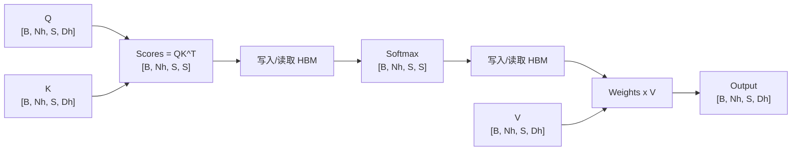
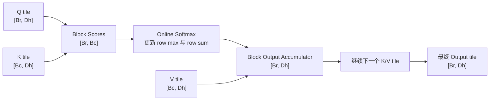

# 第 10 章：FlashAttention

## 1. 本章目标

学完本章后，你应该能回答：

- 标准 Attention 为什么会产生很大的中间矩阵？
- HBM 和 SRAM 分别是什么，为什么 IO 会成为瓶颈？
- FlashAttention 为什么说是精确算法，而不是近似 Attention？
- Tiling 和 Online Softmax 分别解决什么问题？
- FlashAttention 主要减少的是 IO 还是理论 FLOPs？
- FlashAttention 和 KV Cache、PagedAttention 分别解决什么问题？

## 2. 五分钟直觉

标准 Attention（Standard Attention，标准注意力）：直接计算 `QK^T`，得到 `[S, S]` 的注意力分数矩阵，再做 softmax，然后乘以 `V`。

公式是：

```text
O = softmax(QK^T / sqrt(Dh)) V
```

问题在于：当序列长度 `S` 很大时，`QK^T` 和 softmax 后的 attention weights 都是 `[S, S]`。这两个中间矩阵非常大，标准实现往往会把它们写入 HBM。

HBM（High Bandwidth Memory，高带宽显存）：GPU 上容量较大的显存，带宽高，但相对片上 SRAM 仍然慢。

SRAM（Static Random Access Memory，静态随机存储器）：GPU 芯片内部更小、更快的片上存储，例如 shared memory/register 这类高速存储资源。

FlashAttention（FlashAttention，IO 感知精确注意力）：一种不把完整 `[S, S]` 注意力矩阵写回 HBM 的 Attention 实现。它把 Q/K/V 分块搬进更快的片上 SRAM，在块内计算，并用 Online Softmax 维护正确的 softmax 归一化结果。

核心直觉：

```text
标准 Attention：先把整张 [S, S] 分数表算出来、存下来，再继续算。
FlashAttention：一块一块算，边算边更新结果，不把整张 [S, S] 表落到显存。
```

它不是把注意力变稀疏，也不是只看一部分 token。对于 dense attention，FlashAttention 计算的是同一个数学结果，只是改变了计算顺序和内存访问方式。

## 3. 完整计算或数据流

### 标准 Attention 数据流



标准实现的关键问题：

```text
Scores:  [B, Nh, S, S]
Weights: [B, Nh, S, S]
```

这些中间矩阵随 `S^2` 增长。

### FlashAttention 数据流



FlashAttention 不需要把完整 `Scores [S, S]` 和 `Weights [S, S]` 写到 HBM。它只保留当前 tile 和每行 softmax 所需的统计量。

一句话流程：

```text
分块读取 Q/K/V -> 块内算 QK^T -> 在线更新 softmax -> 块内乘 V -> 累积输出 -> 写回最终 O
```

## 图示阅读建议

- 来源：FlashAttention: Fast and Memory-Efficient Exact Attention with IO-Awareness
- URL：https://arxiv.org/abs/2205.14135
- 建议查看：论文中 FlashAttention 算法示意和 IO-aware attention 相关图示。
- 图中重点：Q/K/V 如何按 block 进入 SRAM，`S x S` 注意力矩阵为什么不需要完整写回 HBM。
- 阅读时重点回答：
  1. 哪些矩阵在标准 attention 中会被完整 materialize？
  2. FlashAttention 为什么要分块？
  3. Online Softmax 为什么能保证最终 softmax 仍然正确？

## 4. 关键术语

- FlashAttention（FlashAttention，IO 感知精确注意力）：通过分块和在线 softmax 减少 HBM 读写的精确 attention 算法。
- IO-aware（IO 感知）：设计计算时显式考虑不同存储层级之间的数据读写成本。
- HBM（High Bandwidth Memory，高带宽显存）：GPU 上容量较大的显存，保存模型权重、激活、中间结果等。
- SRAM（Static Random Access Memory，静态随机存储器）：GPU 片上更快但更小的存储资源，可理解为 shared memory/register 所代表的高速存储层。
- Tiling（分块）：把大矩阵切成小块，让小块能放进片上高速存储中计算。
- Online Softmax（在线 Softmax）：不一次性拿到完整一行分数，也能通过维护最大值和归一化和来得到正确 softmax 结果的计算方式。
- Materialize（物化）：把一个中间矩阵真实写入内存，而不是只在计算过程中临时使用。
- IO Complexity（IO 复杂度）：算法在不同存储层之间搬运数据的数量级。
- Exact Attention（精确注意力）：数学上等价于标准 dense attention，不通过近似或稀疏化改变注意力结果。
- Kernel Fusion（算子融合）：把多个计算步骤合并进一个 GPU kernel，减少中间结果读写和 kernel launch 开销。

## 5. Tensor Shape

设：

```text
B = Batch Size
Nh = Number of Heads
S = Sequence Length
Dh = Head Dimension
Br = Q tile 的行数
Bc = K/V tile 的行数
```

标准 Attention：

```text
Q: [B, Nh, S, Dh]
K: [B, Nh, S, Dh]
V: [B, Nh, S, Dh]

Scores = QK^T: [B, Nh, S, S]
Weights = softmax(Scores): [B, Nh, S, S]
Output = Weights V: [B, Nh, S, Dh]
```

FlashAttention 的 tile 视角：

```text
Q_tile: [Br, Dh]
K_tile: [Bc, Dh]
V_tile: [Bc, Dh]

Score_tile = Q_tile K_tile^T: [Br, Bc]
Output_tile_accumulator: [Br, Dh]
```

关键变化：

- 标准 Attention 会显式出现完整 `[S, S]` 中间矩阵。
- FlashAttention 只在片上处理 `[Br, Bc]` 小块，不把完整 `[S, S]` 写入 HBM。
- 最终输出 Shape 不变，仍然是 `[B, Nh, S, Dh]`。

## 6. 核心公式

### 标准 Attention

```text
O = softmax(QK^T / sqrt(Dh)) V
```

其中：

- `QK^T` 产生 attention scores。
- `softmax` 把 scores 变成每行和为 1 的权重。
- 权重乘以 `V` 得到输出。

### Online Softmax 的核心思想

普通 softmax 对一行分数 `x`：

```text
softmax(x_i) = exp(x_i - m) / sum_j exp(x_j - m)
m = max_j x_j
```

如果一行分数被分成多个 block，FlashAttention 可以逐块维护：

```text
m_old = 当前已看过分数的最大值
l_old = 当前已看过分数的 exp 归一化和
```

看到新 block 后：

```text
m_new = max(m_old, max(block_scores))
l_new = exp(m_old - m_new) * l_old
        + sum(exp(block_scores - m_new))
```

输出累积值也按同样的缩放关系更新。这样即使不一次性保存完整一行 `[S]` 分数，也能得到正确的 softmax 归一化结果。

### 复杂度直觉

理论计算量仍然是二次级别：

```text
Attention FLOPs ≈ O(S^2 * Dh)
```

FlashAttention 的关键收益不是把 dense attention 的理论 FLOPs 变成线性，而是减少 HBM 读写和中间矩阵存储。

中间矩阵显存：

```text
标准 Attention 中间矩阵: O(S^2)
FlashAttention 中间写回: 不写完整 [S, S]，主要写最终 O
```

所以更准确的说法是：

```text
FlashAttention 减少 IO 和峰值显存，不是通过近似来减少 dense attention 的数学计算量。
```

## 7. 与推理 Runtime 的联系

FlashAttention 和前几章的关系：

- 第 4 章 Self-Attention：FlashAttention 计算的仍然是同一个 attention 公式。
- 第 7 章 Prefill/Decode：FlashAttention 对长 Prompt 的 Prefill 特别重要，因为 Prefill 会处理较长序列。
- 第 8 章 KV Cache：Decode 阶段仍然需要读历史 K/V；FlashAttention 可以优化 attention kernel，但 KV Cache 管理问题仍然存在。
- 第 9 章 MQA/GQA：MQA/GQA 减少 KV head 数；FlashAttention 优化 attention 的 IO，两者可以配合。
- 第 11 章 PagedAttention：PagedAttention 主要解决 KV Cache 的动态内存管理；FlashAttention 主要解决 attention kernel 内部 IO。

### Prefill 中的作用

Prefill 处理完整 Prompt，序列长度 `S_prompt` 可能很长。标准 Attention 如果 materialize `[S_prompt, S_prompt]`，会带来很大显存和 IO 压力。

FlashAttention 通过 tile 计算降低中间结果写回，对长 Prompt 更友好。

### Decode 中的作用

Decode 每步 Query 长度通常很短，例如 `S_q=1`，但 Key/Value 长度是历史上下文长度 `S_kv`。

此时主要压力可能来自：

- 读取 KV Cache；
- 小 batch 下计算利用率不足；
- 调度和 kernel 开销；
- 长上下文下 K/V 读取量大。

FlashAttention 可以优化 attention kernel，但它不替代 KV Cache，也不替代 PagedAttention。

## 8. 易错点

| 易错说法 | 问题 | 正确认知 |
| --- | --- | --- |
| FlashAttention 是近似算法 | 错 | dense FlashAttention 是精确 attention，数学结果等价于标准 attention |
| FlashAttention 把复杂度从 `O(S^2)` 变成 `O(S)` | 不准确 | 理论 FLOPs 仍然随 `S^2` 增长，主要减少 IO 和中间显存 |
| FlashAttention 不需要 softmax | 错 | 它使用 Online Softmax，仍然计算正确 softmax |
| FlashAttention 就是 KV Cache | 错 | FlashAttention 是 attention kernel 算法；KV Cache 是历史 K/V 状态缓存 |
| FlashAttention 和 PagedAttention 是同一个东西 | 错 | 前者优化 attention 计算 IO，后者管理 KV Cache 显存分配 |
| 只要用了 FlashAttention，长上下文就没有成本 | 错 | 长上下文仍有二次 attention 计算和 KV 读取成本 |
| FlashAttention 只对训练有用 | 不完整 | 它对训练和推理都可能有用，具体收益取决于阶段、长度和实现 |

## 9. 面试回答模板

如果被问“FlashAttention 为什么快”，可以这样答：

1. 标准 Attention 会显式计算并保存 `[S, S]` 的 scores 和 attention weights，中间矩阵很大。
2. GPU 上 HBM 容量大但访问慢，片上 SRAM 更快但容量小；Attention 的瓶颈很多时候来自 HBM 读写。
3. FlashAttention 把 Q/K/V 分块，让块进入片上 SRAM 计算，并用 Online Softmax 边算边维护正确的 softmax 归一化。
4. 它不把完整 `[S, S]` 注意力矩阵写回 HBM，只写最终输出，因此减少 IO 和峰值显存。
5. 它是精确 dense attention，不是近似算法；理论 FLOPs 仍然是二次级别，主要优化的是内存访问和 kernel 融合。

如果追问“FlashAttention 和 PagedAttention 区别是什么”，可以补一句：

> FlashAttention 优化一个 attention kernel 内部如何计算，重点是减少 `QK^T`、softmax、乘 V 过程中的 HBM IO；PagedAttention 优化 KV Cache 如何在显存里分页管理，重点是服务端长上下文和并发请求的动态内存分配。

## 10. 真实面试问题

本章暂未收录与 FlashAttention 直接相关的 `VERIFIED` 或 `PARTIAL` 面试问题。

### 未核实候选问题（UNVERIFIED）

以下问题来自本章知识点推导，已按牛客网、知乎、小红书、脉脉、CSDN、GitHub 和公开搜索结果做跨平台复核，但暂时没有可访问的一手面经正文支撑，只能用于自测，不能当作真实面经或高频题。完整候选池见 `面试题/未核实候选问题.md`，复核记录见 `面试题/来源登记.md` 的 I011。

1. FlashAttention 为什么是精确算法？它主要优化什么？
   - 对应能力：区分精确 attention、近似 attention、IO 优化和 FLOPs 优化。
   - 30 秒回答：FlashAttention 对 dense attention 计算的是和标准 attention 等价的数学结果，不是只看部分 token，也不是稀疏近似。它通过 tiling 和 online softmax 改变计算顺序，不把完整 `[S, S]` scores/weights 写回 HBM，因此主要减少 HBM IO 和峰值显存，而不是把理论 FLOPs 从二次变成线性。
2. FlashAttention 和 PagedAttention 有什么区别？
   - 对应能力：能区分 attention kernel 优化和 KV Cache 管理优化。
   - 30 秒回答：FlashAttention 优化的是 attention kernel 内部的计算方式，重点是减少 `QK^T -> softmax -> V` 过程中的中间矩阵读写。PagedAttention 优化的是 KV Cache 的显存管理，把 KV Cache 分块分页，解决长上下文和并发请求下的显存碎片与动态分配问题。两者可以配合，但不是同一个层面的技术。

## 11. 我的回答

待用户后续复习本章时填写。

## 12. 纠错记录

暂无。

## 13. 本章验收

后续复习时回答：

1. 标准 Attention 中哪两个 `[S, S]` 中间矩阵最容易带来显存和 IO 压力？
2. FlashAttention 为什么不需要把完整 `[S, S]` attention 矩阵写回 HBM？
3. Online Softmax 解决了什么问题？
4. 为什么说 FlashAttention 主要减少 IO，而不是简单减少理论 FLOPs？

## 14. 参考资料

- 页面标题：FlashAttention: Fast and Memory-Efficient Exact Attention with IO-Awareness
  - 发布者或作者：Tri Dao、Daniel Y. Fu、Stefano Ermon、Atri Rudra、Christopher Ré，arXiv
  - URL：https://arxiv.org/abs/2205.14135
  - 发布时间：2022-05-27
  - 访问日期：2026-06-18
  - 来源类型：论文
  - 本文使用内容：FlashAttention 的核心来源；IO-aware、tiling、减少 HBM 读写、精确 attention。
- 页面标题：FlashAttention-2: Faster Attention with Better Parallelism and Work Partitioning
  - 发布者或作者：Tri Dao，arXiv
  - URL：https://arxiv.org/abs/2307.08691
  - 发布时间：2023-07-17
  - 访问日期：2026-06-18
  - 来源类型：论文
  - 本文使用内容：FlashAttention-2 对 FlashAttention 的并行度、work partitioning 和非 matmul FLOPs 优化背景。
- 页面标题：Dao-AILab/flash-attention
  - 发布者或作者：Dao-AILab，GitHub
  - URL：https://github.com/Dao-AILab/flash-attention
  - 发布时间：持续更新
  - 访问日期：2026-06-18
  - 来源类型：官方实现仓库
  - 本文使用内容：确认官方实现、FlashAttention/FlashAttention-2 论文入口、基础 API Shape，以及 MQA/GQA 支持说明。
