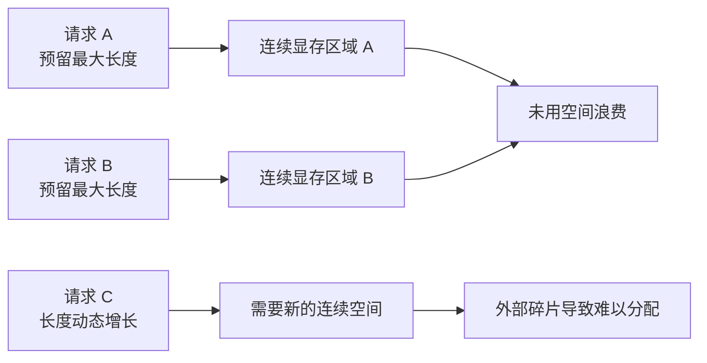
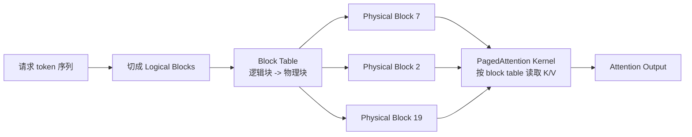

# 第 11 章：PagedAttention

## 1. 本章目标

学完本章后，你应该能回答：

- PagedAttention 解决的是什么问题？
- 为什么 KV Cache 连续分配会浪费显存？
- Logical Block、Physical Block、Block Table 分别是什么？
- 内部碎片和外部碎片有什么区别？
- PagedAttention 和 FlashAttention 有什么区别？
- Prefix Caching 和 Copy-on-Write 为什么能复用 KV Cache？

## 2. 五分钟直觉

PagedAttention（PagedAttention，分页注意力）：一种把 KV Cache 按固定大小 block 管理的注意力服务机制，让一个请求逻辑上连续的 KV Cache 可以映射到显存中不连续的物理块，从而减少显存碎片和重复缓存。

第 8 章已经知道，KV Cache 会随着上下文长度、生成长度和并发请求增长。服务端最大的问题不是“单个请求怎么算 attention”，而是：

```text
很多请求同时进来，每个请求长度不同，生成长度也不确定。
KV Cache 会动态增长和释放。
如果必须为每个请求预留一大段连续显存，就会浪费很多空间。
```

PagedAttention 借鉴操作系统里的分页思想：

```text
逻辑上：一个请求的 KV Cache 是连续 token 序列。
物理上：这些 token 的 K/V 可以放在多个不连续的固定大小 block 里。
```

核心类比：

```text
普通连续分配：每个请求都要一整段连续座位。
PagedAttention：请求拿到一张座位表，逻辑上坐在一起，物理上可以分散在不同区域。
```

它和 FlashAttention 不一样：

- FlashAttention 优化 attention kernel 内部怎么计算，重点减少 `[S, S]` 中间矩阵的 HBM IO。
- PagedAttention 优化 KV Cache 在显存里怎么分配、映射、共享和释放，重点减少显存浪费。

## 3. 完整计算或数据流

### 连续 KV Cache 分配的问题



如果为每个请求按最大长度预留 KV Cache，就会出现：

- 真实生成长度短，预留空间浪费。
- 请求释放后显存出现很多小空洞。
- 新请求可能找不到足够大的连续空间。

### PagedAttention 数据流



一次 Decode step 中：

```text
1. 当前请求新增 token。
2. Runtime 判断当前 logical block 是否还有空间。
3. 如果没有空间，从 free block pool 申请新的 physical block。
4. 更新 block table，把新的 logical block 映射到 physical block。
5. Attention kernel 根据 block table 读取历史 K/V。
6. 当前 token 的 K/V 写入对应 physical block。
```

## 图示阅读建议

- 来源：Efficient Memory Management for Large Language Model Serving with PagedAttention
- URL：https://arxiv.org/abs/2309.06180
- 建议查看：论文中展示 KV Cache block、block table、logical/physical block 映射的图。
- 图中重点：一个请求的 logical blocks 如何映射到不连续 physical blocks；多个序列如何共享部分 physical blocks。
- 阅读时重点回答：
  1. 为什么 logical block 可以连续，而 physical block 不必连续？
  2. block table 在 attention kernel 中起什么作用？
  3. Copy-on-Write 为什么能避免重复保存共享前缀？

## 4. 关键术语

- PagedAttention（PagedAttention，分页注意力）：把 KV Cache 分成固定大小 block，并通过 block table 映射逻辑块和物理块的注意力服务机制。
- Block（块）：KV Cache 管理的固定大小单位，通常包含若干个 token 的 K/V。
- Logical Block（逻辑块）：某个请求内部按 token 顺序划分出来的第 `0, 1, 2...` 个块。
- Physical Block（物理块）：显存中真实分配出来的 KV Cache block。
- Block Table（块表）：记录 logical block 到 physical block 映射关系的数据结构。
- Free Block Pool（空闲块池）：Runtime 维护的可分配 physical block 集合。
- Internal Fragmentation（内部碎片）：一个已分配 block 内部没有被 token 用满的空间。
- External Fragmentation（外部碎片）：空闲显存被切成很多小块，导致无法满足连续大块分配。
- Prefix Caching（前缀缓存）：多个请求共享相同 Prompt 前缀时，复用已经计算好的前缀 KV Cache。
- Copy-on-Write（写时复制）：多个请求共享同一个 physical block；当某个请求要修改共享块时，再复制出新块。
- Reference Count（引用计数）：记录一个 physical block 被多少请求或分支共享。

## 5. Tensor Shape

设：

```text
L = Number of Layers
B = Batch Size 或并发请求数
S = 每个请求的实际缓存长度
Nkv = Number of KV Heads
Dh = Head Dimension
block_size = 每个 block 容纳的 token 数
num_blocks = physical block 总数
```

### 普通 KV Cache 概念 Shape

第 8 章的概念形态：

```text
K_cache: [L, B, Nkv, S, Dh]
V_cache: [L, B, Nkv, S, Dh]
```

这看起来像每个请求都有一段连续的 `S`。

### Paged KV Cache 概念 Shape

PagedAttention 把 token 维度切成 block：

```text
K_blocks: [L, num_blocks, Nkv, block_size, Dh]
V_blocks: [L, num_blocks, Nkv, block_size, Dh]
```

一个请求不再直接持有连续的 `[S]` token 维度，而是持有：

```text
block_table_for_request: [num_logical_blocks]
```

其中：

```text
num_logical_blocks = ceil(S / block_size)
```

`block_table_for_request[i]` 表示第 `i` 个 logical block 对应哪个 physical block。

### 例子

假设：

```text
block_size = 16
S = 45
```

需要：

```text
num_logical_blocks = ceil(45 / 16) = 3
```

使用情况：

```text
block 0: 16 tokens
block 1: 16 tokens
block 2: 13 tokens
```

最后一个 block 剩余：

```text
16 - 13 = 3 token slots
```

这就是内部碎片。PagedAttention 把浪费限制在最后一个 block 附近，而不是为整个最大上下文长度预留空间。

## 6. 核心公式

### 请求需要的 block 数

```text
num_blocks_for_request = ceil(S / block_size)
```

### 最后一个 block 的内部碎片

如果 `S % block_size != 0`：

```text
internal_waste_tokens = block_size - (S % block_size)
```

如果刚好整除：

```text
internal_waste_tokens = 0
```

### Paged KV Cache 实际占用

单个请求按 block 占用的 token slot 数：

```text
allocated_token_slots = ceil(S / block_size) * block_size
```

显存近似：

```text
allocated_bytes =
    L * 2 * allocated_token_slots * Nkv * Dh * bytes
```

和第 8 章的区别：

- 第 8 章估算理想情况下真实 token 数需要多少 KV Cache。
- 第 11 章关注服务端实际分配时，block 对齐和动态分配带来的浪费与管理。

### 共享前缀的节省

如果两个请求共享长度为 `S_prefix` 的前缀，前缀需要：

```text
prefix_blocks = ceil(S_prefix / block_size)
```

没有共享时，两份请求各存一份前缀：

```text
2 * prefix_blocks
```

使用 Prefix Caching 或共享 physical blocks 时，前缀 physical blocks 可以只保存一份，并通过引用计数被多个请求使用。

## 7. 与推理 Runtime 的联系

PagedAttention 是推理 Runtime 里的 KV Cache 内存管理机制。

它直接影响：

- 并发能力：减少 KV Cache 浪费，让同样显存容纳更多请求。
- 长上下文：长 Prompt 和长输出需要更多 blocks，PagedAttention 能按需增长。
- 调度：Scheduler 需要知道还有多少 free blocks，决定请求能否进入 running。
- 抢占：当显存 block 不够时，Runtime 可能要暂停、换出或重算某些请求。
- Prefix Caching：共享前缀可以复用 physical blocks，减少重复 Prefill。
- Beam Search / Parallel Sampling：多个分支共享相同历史前缀，分叉后通过 Copy-on-Write 管理差异部分。

### PagedAttention 与 FlashAttention

| 技术 | 解决问题 | 主要位置 |
| --- | --- | --- |
| FlashAttention | 减少 attention kernel 中 `[S, S]` 中间矩阵的 HBM IO | 计算 kernel |
| PagedAttention | 减少 KV Cache 动态分配中的碎片和重复存储 | Runtime 内存管理 |

两者可以一起存在：

```text
PagedAttention 管 K/V 存在哪里。
FlashAttention 管 attention 怎么更少 IO 地算出来。
```

### PagedAttention 与第 12 章

第 12 章会讲 Continuous Batching 和 Scheduler。调度器要做很多决策：

- waiting 请求能不能进来；
- running 请求有没有足够 block 继续 decode；
- prefill 和 decode 如何混合；
- block 不够时是否抢占。

这些决策都离不开 KV Cache block 管理。

## 8. 易错点

| 易错说法 | 问题 | 正确认知 |
| --- | --- | --- |
| PagedAttention 改变了 attention 数学公式 | 不准确 | 它主要改变 KV Cache 的存储和访问方式，目标是保持输出等价 |
| PagedAttention 和 FlashAttention 是同一个东西 | 错 | 一个管 KV Cache 分页管理，一个管 attention kernel IO |
| Physical block 必须连续 | 错 | PagedAttention 的关键就是 logical blocks 可映射到不连续 physical blocks |
| Block table 是模型参数 | 错 | 它是 Runtime 管理 KV Cache 映射的数据结构 |
| PagedAttention 完全消除显存浪费 | 绝对化 | 它显著降低浪费，但最后一个 block 仍可能有内部碎片 |
| Prefix Caching 是把文本字符串缓存起来 | 不准确 | 它复用的是前缀对应的 KV Cache 状态 |
| Copy-on-Write 会立刻复制所有共享缓存 | 错 | 只有要写入共享 block 时才复制 |

## 9. 面试回答模板

如果被问“PagedAttention 解决什么问题”，可以这样答：

1. LLM 推理中 KV Cache 很大，而且随请求长度动态增长和释放。
2. 如果为每个请求分配连续 KV Cache，容易产生预留浪费、内部碎片和外部碎片，限制 batch size 和并发。
3. PagedAttention 把 KV Cache 切成固定大小 physical blocks，请求内部用 logical blocks 表示连续 token 序列。
4. Runtime 用 block table 把 logical blocks 映射到 physical blocks，所以物理显存不必连续。
5. 这样可以按需分配 block，减少显存碎片，还能通过引用计数、Prefix Caching 和 Copy-on-Write 复用共享前缀。

如果追问“PagedAttention 和 FlashAttention 有什么区别”，可以补一句：

> FlashAttention 优化 attention kernel 的计算和 IO，不物化完整 `[S, S]` 中间矩阵；PagedAttention 优化 KV Cache 的内存管理，用 block table 管理非连续的 K/V physical blocks。一个偏 kernel，一个偏 Runtime 内存管理。

## 10. 真实面试问题

本章暂未收录与 PagedAttention 直接相关的 `VERIFIED` 或 `PARTIAL` 面试问题。

### 未核实候选问题（UNVERIFIED）

以下问题来自本章知识点推导，已按牛客网、知乎、小红书、脉脉、CSDN、GitHub 和公开搜索结果做跨平台复核，但暂时没有可访问的一手面经正文支撑，只能用于自测，不能当作真实面经或高频题。完整候选池见 `面试题/未核实候选问题.md`，复核记录见 `面试题/来源登记.md` 的 I012。

1. PagedAttention 解决的核心问题是什么？
   - 对应能力：能把 KV Cache 动态分配、碎片和并发联系起来。
   - 30 秒回答：PagedAttention 主要解决 LLM serving 中 KV Cache 动态增长带来的显存浪费问题。它把 KV Cache 分成固定大小 physical blocks，请求用 logical blocks 表示连续上下文，再通过 block table 映射到不连续的物理块。这样可以按需分配，减少外部碎片和预留浪费，提高同样显存下的并发能力。
2. PagedAttention、FlashAttention、KV Cache 三者是什么关系？
   - 对应能力：能区分状态缓存、kernel 优化和内存管理。
   - 30 秒回答：KV Cache 是历史 K/V 张量状态；FlashAttention 是 attention kernel 的 IO 优化，减少 `[S, S]` 中间矩阵写回；PagedAttention 是 KV Cache 的分页式内存管理，用 block table 管理 logical blocks 到 physical blocks 的映射。它们可以配合，但解决的是不同层面的问题。

## 11. 我的回答

待用户后续复习本章时填写。

## 12. 纠错记录

暂无。

## 13. 本章验收

后续复习时回答：

1. Logical Block 和 Physical Block 有什么区别？
2. Block Table 为什么能让 KV Cache 物理上不连续？
3. 内部碎片和外部碎片分别是什么？
4. PagedAttention 和 FlashAttention 分别解决什么问题？

## 14. 参考资料

- 页面标题：Efficient Memory Management for Large Language Model Serving with PagedAttention
  - 发布者或作者：Woosuk Kwon 等，arXiv
  - URL：https://arxiv.org/abs/2309.06180
  - 发布时间：2023-09-12
  - 访问日期：2026-06-18
  - 来源类型：论文
  - 本文使用内容：PagedAttention 的核心来源；KV Cache 动态增长、碎片、block 管理、prefix sharing 和 Copy-on-Write。
- 页面标题：Paged Attention
  - 发布者或作者：vLLM Project
  - URL：https://docs.vllm.ai/en/latest/design/paged_attention/
  - 发布时间：未确认
  - 访问日期：2026-06-18
  - 来源类型：官方文档
  - 本文使用内容：vLLM Paged Attention 设计说明和 kernel 视角。该页位于 developer preview docs，且属于设计文档，具体实现以后续源码和稳定文档为准。
- 页面标题：Automatic Prefix Caching
  - 发布者或作者：vLLM Project
  - URL：https://docs.vllm.ai/en/latest/examples/features/automatic_prefix_caching/
  - 发布时间：未确认
  - 访问日期：2026-06-18
  - 来源类型：官方文档
  - 本文使用内容：Prefix Caching 的用法和“共享前缀复用 KV cache，减少重复计算”的官方示例。
