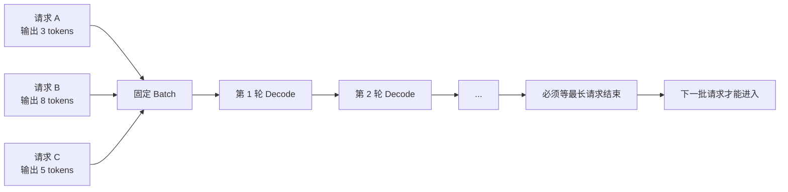
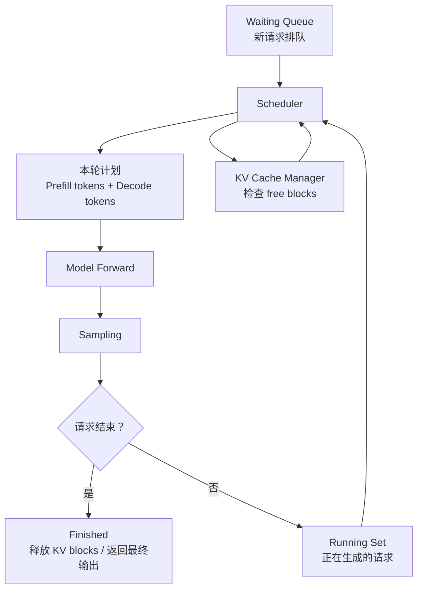

# 第 12 章：Continuous Batching 与 Scheduler

## 1. 本章目标

学完本章后，你应该能回答：

- Static Batching 和 Continuous Batching 的区别是什么？
- 为什么 LLM serving 不能只用传统固定 batch？
- Waiting、Running、Finished 请求分别处在什么状态？
- Scheduler 每一轮到底在调度什么？
- Prefill 和 Decode 混在一起调度时，为什么会影响 TTFT、TPOT 和吞吐？
- Chunked Prefill 解决什么问题？
- 抢占、watermark、KV blocks 和第 11 章 PagedAttention 有什么关系？

## 2. 五分钟直觉

第 7 章说过：LLM 推理分成 Prefill 和 Decode。

第 8 章说过：Decode 时每生成一个新 token，都要读历史 KV Cache。

第 11 章说过：PagedAttention 把 KV Cache 切成 block，让请求可以按需申请和释放显存。

第 12 章要回答的问题是：

```text
服务端同时收到很多请求时，下一轮 GPU forward 应该放哪些请求进去？
```

传统 Static Batching 像这样：

```text
先凑一批请求 -> 整批一起跑 -> 必须等这一批全部结束 -> 再换下一批
```

问题是 LLM 的输出长度不确定。一个请求可能 5 个 token 就结束，另一个请求可能生成 500 个 token。如果 batch 不允许中途换人，短请求结束后留下的槽位就会空着，GPU 还要等最长的请求跑完。

Continuous Batching 的直觉是：

```text
每一轮 decode 后重新看队列：
已经结束的请求立刻移走；
还有空间就把新请求补进来；
每一轮都动态组成新的 batch。
```

所以它也常被叫做：

- Dynamic Batching
- Iteration-level Scheduling
- In-flight Batching

这几个词语义接近，但面试中更推荐说清楚“按 decode iteration 调度”，因为这能直接说明它和静态 batch 的区别。

## 3. 完整计算或数据流

### Static Batching



Static Batching 的核心问题：

```text
batch 生命周期 = batch 内最长请求的生命周期
```

短请求虽然提前结束，但它占过的位置不能马上给新请求用。

### Continuous Batching



每一轮 engine step 中，Scheduler 大致要做这些事：

```text
1. 看 Running 请求：哪些请求需要继续 Decode？
2. 看 Waiting 请求：哪些新请求可以进入 Prefill？
3. 看 token budget：本轮最多能处理多少 token？
4. 看 sequence budget：本轮最多能处理多少条序列？
5. 看 KV block budget：显存 block 够不够？
6. 决定本轮 forward 的请求集合和每个请求处理多少 token。
7. forward 结束后，把完成的请求移到 Finished，未完成的留在 Running。
```

### Prefill 与 Decode 的混合

一次调度里可能同时包含：

```text
正在 Decode 的请求：每个请求通常推进 1 个 token。
新进来的 Prefill 请求：可能要处理很多 prompt tokens。
```

二者的性能特征不同：

- Prefill：输入 token 多，矩阵乘更大，适合并行，但单个长 prompt 可能占用很多本轮 token budget。
- Decode：每个请求只生成一个新 token，但要读历史 KV Cache，更容易 memory-bound。

因此 Scheduler 要在两件事之间取舍：

```text
多放 Prefill：新请求更快拿到首 token，TTFT 可能变好，但会挤占 Decode。
多保 Decode：已有请求输出更平滑，TPOT 可能变好，但新请求排队更久。
```

### Chunked Prefill

长 Prompt 的 Prefill 如果一次性全部放进本轮，就可能把 decode 请求挤出去。

Chunked Prefill 的做法是：

```text
长 prompt 不必一次 prefill 完；
把 prompt 切成多段；
每一轮只吃掉一部分 token budget；
剩余 prompt token 留到后续轮继续 prefill。
```

这样做的目的不是改变模型计算结果，而是让长 Prefill 不要长时间堵住 Decode。

## 图示阅读建议

- 来源：Orca: A Distributed Serving System for Transformer-Based Generative Models
- URL：https://www.usenix.org/conference/osdi22/presentation/yu
- 建议查看：论文中关于 iteration-level scheduling 和 selective batching 的图。
- 图中重点：调度粒度从“整个请求”变成“每一次模型迭代”后，已完成请求如何退出，新请求如何进入。
- 阅读时重点回答：
  1. 为什么生成式 Transformer 请求具有 multi-iteration 特征？
  2. 为什么 request-level batch 会让短请求等待长请求？
  3. Iteration-level scheduling 为什么能提升 GPU 利用率？

## 4. 关键术语

- Static Batching（静态批处理）：一批请求进入后，batch 通常保持不变，直到整批请求完成。
- Continuous Batching（连续批处理）：每个生成 iteration 都可以重新组织 batch，让完成请求退出、新请求进入。
- Iteration-level Scheduling（迭代级调度）：以一次模型 forward / decode step 为粒度进行调度，而不是以完整请求为粒度。
- Waiting Queue（等待队列）：已经到达服务端，但尚未进入模型执行的请求。
- Running Set（运行集合）：已经占用 KV Cache 资源，正在 Prefill 或 Decode 的请求。
- Finished Requests（完成请求）：已经生成结束或被取消，等待返回结果并释放资源的请求。
- Token Budget（token 预算）：一次 engine step 最多允许处理的 token 数。
- Sequence Budget（序列预算）：一次 engine step 最多允许处理的请求/序列数。
- KV Block Budget（KV 块预算）：当前还能用于新请求或继续生成的 KV Cache blocks。
- Chunked Prefill（分块预填充）：把长 Prompt 的 Prefill 分成多轮调度，避免一次 Prefill 占满本轮预算。
- Preemption（抢占）：当资源不足或优先级变化时，暂停、驱逐或重算某些运行中请求，为其他请求腾出资源。
- Watermark（水位线）：保留一部分 KV blocks 不立刻分配，减少显存紧张时频繁抢占和反复驱逐。

## 5. Tensor Shape

本章的 Tensor Shape 不像 Attention 那样只看单个算子，而是要看“一轮调度里有哪些 token 被送进模型”。

设：

```text
R = 当前 Running 请求数
W = 当前 Waiting 请求数
N = 本轮被调度的序列数
T = 本轮被调度的 token 总数
H = Hidden Size
V = Vocabulary Size
```

### Decode-only iteration

如果本轮只做 Decode，且每个 running 请求生成 1 个 token：

```text
input_ids: [N, 1]
hidden_states: [N, 1, H]
logits: [N, V]
```

这里 `N` 通常接近本轮参与 decode 的请求数。

### Prefill iteration

如果本轮只做 Prefill，且请求 prompt 长度不一，概念上可以看成：

```text
request_1: S1 tokens
request_2: S2 tokens
...
request_N: SN tokens
```

总 token 数：

```text
T = S1 + S2 + ... + SN
```

框架内部通常会把变长 token 打包成更适合 kernel 的布局。概念上可以理解为：

```text
input_tokens: [T]
hidden_states: [T, H]
```

### 混合 Prefill + Decode

如果本轮既有 Prefill，也有 Decode：

```text
T = prefill_tokens + decode_tokens
decode_tokens ≈ number_of_decode_requests
```

Scheduler 要保证：

```text
T <= max_num_batched_tokens
N <= max_num_seqs
需要的 KV blocks <= 当前可用 KV blocks
```

其中 `max_num_batched_tokens` 和 `max_num_seqs` 是服务端调度层常见的两个核心上限。

## 6. 核心公式

### Static Batching 的等待浪费

设一个 static batch 内有 `n` 个请求，第 `i` 个请求输出长度是 `Oi`：

```text
batch_decode_rounds = max(O1, O2, ..., On)
```

第 `i` 个请求结束后还要浪费的槽位轮数：

```text
wasted_rounds_i = max(O1, O2, ..., On) - Oi
```

总浪费近似：

```text
total_wasted_slots = sum(max_output_len - Oi)
```

输出长度方差越大，static batching 越容易浪费。

### Continuous Batching 的本轮 token 预算

本轮最多处理：

```text
scheduled_tokens <= max_num_batched_tokens
scheduled_seqs <= max_num_seqs
```

如果 decode 优先：

```text
decode_tokens = number_of_running_decode_requests
remaining_budget = max_num_batched_tokens - decode_tokens
prefill_tokens <= remaining_budget
```

如果 prefill 太多：

```text
decode_tokens 下降 或 decode step 间隔变长
```

这会让 TPOT 变差。

### Chunked Prefill

一个 prompt 长度为 `S_prompt`，每轮最多给它 `C` 个 prefill tokens：

```text
prefill_chunks = ceil(S_prompt / C)
```

首 token 时间可以粗略拆成：

```text
TTFT = queue_wait_time + prefill_scheduled_time + first_decode_and_sample_time
```

Chunked Prefill 会改变 `prefill_scheduled_time` 的排布方式：长 prompt 不再一次性占满某一轮，而是分摊到多轮。

### KV Block 约束

设当前空闲 KV blocks 为：

```text
free_blocks
```

如果设置水位线：

```text
usable_blocks = free_blocks - reserved_blocks
```

新请求能否进入 Running，不只看 token budget，还要看：

```text
needed_blocks_for_request <= usable_blocks
```

这就是第 11 章 PagedAttention 和本章 Scheduler 的直接连接点。

## 7. 与推理 Runtime 的联系

Scheduler 是 Runtime 的交通控制器。

一次在线 LLM serving 请求大致经过：

```text
API Server
  -> Request Queue
  -> Scheduler
  -> KV Cache Manager
  -> Model Runner
  -> Attention Backend
  -> Sampler
  -> Streaming Output
```

Scheduler 不直接改变模型权重，也不改变 attention 的数学定义。它改变的是：

- 哪些请求本轮进入模型；
- 每个请求本轮处理多少 token；
- 是否允许新 Prefill 插入；
- 是否把长 Prefill 切块；
- 是否给 Decode 留出预算；
- 显存不够时是否抢占、等待或拒绝；
- 什么时候释放 Finished 请求的 KV blocks。

对性能指标的影响：

| 指标 | 受 Scheduler 影响的原因 |
| --- | --- |
| TTFT | Waiting 请求进入 Prefill 的速度、Prefill 是否被长队列阻塞 |
| TPOT | Running 请求 Decode 的间隔是否稳定 |
| ITL | 每个输出 token 的流式间隔受 decode 调度影响 |
| Throughput | 同时 running 的请求数、GPU 利用率、batch token 数 |
| Goodput | 在满足 SLO 的请求中，有多少真实完成并达标 |
| 显存占用 | Running 请求越多，KV Cache blocks 越多 |

### 与第 11 章的关系

PagedAttention 让 KV Cache 可以按 block 动态管理。

Continuous Batching 利用这种动态管理能力，在每轮调度时灵活加入和移除请求。

如果没有高效的 KV Cache 管理，Continuous Batching 会更容易被显存碎片、预留浪费和 OOM 限制。

### 与第 13 章的关系

第 13 章会进入 vLLM Runtime，把本章的抽象角色映射到更具体的组件：

```text
API Server -> Engine -> Scheduler -> KV Cache Manager -> Model Runner -> Output Processor
```

到第 13 章时，不能只背概念，要开始看具体文档和源码中的真实调用链。

## 8. 易错点

| 易错说法 | 问题 | 正确认知 |
| --- | --- | --- |
| Continuous Batching 就是把请求凑够再一起跑 | 不准确 | 关键是每个 iteration 可以重新组织 batch |
| Static Batching 一定很差 | 绝对化 | 当请求长度接近、输出长度固定时，static batching 也可能表现稳定 |
| Scheduler 只按请求数量调度 | 不完整 | 还要看 token budget、sequence budget、KV block budget 和优先级 |
| Prefill 和 Decode 可以随便混合 | 不准确 | 二者计算特征不同，混合策略会影响 TTFT、TPOT 和吞吐 |
| Chunked Prefill 会减少总计算量 | 错 | 它主要改变调度粒度，不是减少模型必须处理的 prompt token 数 |
| 抢占没有代价 | 错 | 抢占可能带来 KV 释放、重算、恢复、队列延迟等代价 |
| max_num_batched_tokens 越大越好 | 绝对化 | 更大可能提高吞吐，也可能增加延迟、显存压力和调度抖动 |
| 只要有 PagedAttention 就不需要 Scheduler | 错 | PagedAttention 管 KV block，Scheduler 决定 block 资源怎么分给请求 |

## 9. 面试回答模板

如果被问“Continuous Batching 解决什么问题”，可以这样答：

1. LLM 生成是自回归的，一个请求要经历多轮 decode，每轮通常生成一个 token。
2. 不同请求的输出长度不同，Static Batching 必须等 batch 里最长的请求结束，短请求结束后的槽位会浪费。
3. Continuous Batching 把调度粒度从完整请求改成 iteration，每轮都可以让完成请求退出，让新请求进入。
4. 这样可以提高 GPU 利用率和系统吞吐，也能减少新请求必须等待整批结束的时间。
5. 但它要配合 KV Cache 管理，因为新请求进入、旧请求退出都会改变 KV Cache blocks 的占用。

如果追问“Scheduler 怎么平衡 TTFT 和 TPOT”，可以补一句：

> Scheduler 每轮有 token budget、sequence budget 和 KV block budget。多调度 Prefill 会让新请求更快进入模型，改善 TTFT，但可能挤占 Decode，让已有请求的 token 间隔变差；多保 Decode 会让流式输出更平滑，改善 TPOT/ITL，但新请求可能排队更久。Chunked Prefill 的作用就是把长 Prompt 拆开，降低长 Prefill 对 Decode 的阻塞。

## 10. 真实面试问题

本章暂未收录与 Continuous Batching 或 Scheduler 直接相关的 `VERIFIED` 或 `PARTIAL` 面试问题。

### 未核实候选问题（UNVERIFIED）

以下问题来自本章知识点推导，已按牛客网、知乎、小红书、脉脉、CSDN、GitHub 和公开搜索结果做跨平台复核，但暂时没有可访问的一手面经正文支撑，只能用于自测，不能当作真实面经或高频题。完整候选池见 `面试题/未核实候选问题.md`，复核记录见 `面试题/来源登记.md` 的 I013。

1. Continuous Batching 和 Static Batching 的区别是什么？为什么 LLM serving 更依赖 Continuous Batching？
   - 对应能力：能把自回归多轮生成、输出长度不确定、GPU 利用率联系起来。
   - 30 秒回答：Static Batching 是一批请求固定跑到整批结束，短请求结束后槽位不能立刻复用；Continuous Batching 是按 iteration 调度，每一轮都能把 finished 请求移出，把 waiting 请求补进来。LLM 输出长度不确定，而且每个请求要多轮 decode，所以 Continuous Batching 能减少空槽位，提高 GPU 利用率和吞吐。
2. Scheduler 在 Prefill 和 Decode 之间如何取舍？为什么会影响 TTFT 和 TPOT？
   - 对应能力：能从 token budget 和请求状态解释延迟指标。
   - 30 秒回答：Prefill 负责处理新请求的 prompt，影响 TTFT；Decode 负责已有请求继续生成 token，影响 TPOT 和流式输出间隔。Scheduler 每轮有 `max_num_batched_tokens`、`max_num_seqs` 和 KV block 限制，多放 Prefill 会让新请求更快开始但可能挤占 Decode，多保 Decode 会让输出更平滑但新请求排队更久。
3. Chunked Prefill 解决什么问题？
   - 对应能力：能解释长 prompt 为什么会阻塞在线服务。
   - 30 秒回答：长 prompt 的 Prefill token 很多，如果一次性放进某个 engine step，可能占满 token budget，让 decode 请求等待，导致 TPOT 或流式间隔变差。Chunked Prefill 把长 prompt 拆成多段，每轮只处理一部分，让 Prefill 和 Decode 能更平滑地混合调度。它不减少总计算量，只改变调度粒度。

## 11. 我的回答

待用户后续复习本章时填写。

## 12. 纠错记录

暂无。

## 13. 本章验收

后续复习时回答：

1. Static Batching 为什么会浪费 GPU 槽位？
2. Continuous Batching 为什么也叫 Iteration-level Scheduling？
3. Scheduler 每轮至少要检查哪三类预算？
4. Chunked Prefill 为什么能缓解长 Prompt 对 Decode 的阻塞？
5. PagedAttention 和 Scheduler 分别负责什么？

## 14. 参考资料

- 页面标题：Orca: A Distributed Serving System for Transformer-Based Generative Models
  - 发布者或作者：Gyeong-In Yu 等，USENIX OSDI 2022
  - URL：https://www.usenix.org/conference/osdi22/presentation/yu
  - 发布时间：2022-07
  - 访问日期：2026-06-18
  - 来源类型：论文 / 会议页面
  - 本文使用内容：Iteration-level scheduling、生成式 Transformer 多轮执行、固定 batch 无法中途替换请求的问题。
- 页面标题：Engine Arguments - vLLM
  - 发布者或作者：vLLM Project
  - URL：https://docs.vllm.ai/en/latest/configuration/engine_args/
  - 发布时间：未确认；页面为 latest developer preview docs
  - 访问日期：2026-06-18
  - 来源类型：官方文档
  - 本文使用内容：`SchedulerConfig`、`max_num_batched_tokens`、`max_num_seqs`、`max_num_partial_prefills`、`enable-chunked-prefill`、`watermark` 等调度参数。当前页是开发版文档，具体实现以后续源码和稳定版文档为准。
- 页面标题：scheduler - vLLM
  - 发布者或作者：vLLM Project
  - URL：https://docs.vllm.ai/en/latest/api/vllm/config/scheduler/
  - 发布时间：未确认；页面为 latest developer preview docs
  - 访问日期：2026-06-18
  - 来源类型：官方 API 文档
  - 本文使用内容：SchedulerConfig 字段说明、chunked prefill、watermark、async scheduling、stream interval 等运行时调度概念。当前页是开发版文档，具体实现以后续源码和稳定版文档为准。
- 页面标题：How continuous batching enables 23x throughput in LLM inference while reducing p50 latency
  - 发布者或作者：Cade Daniel、Chen Shen、Eric Liang、Richard Liaw，Anyscale
  - URL：https://www.anyscale.com/blog/continuous-batching-llm-inference
  - 发布时间：2023-06-22
  - 访问日期：2026-06-18
  - 来源类型：技术博客
  - 本文使用内容：辅助理解 static batching、continuous batching、iteration-level scheduling 的直观区别。本章不把其中 benchmark 数字作为本课程结论。
