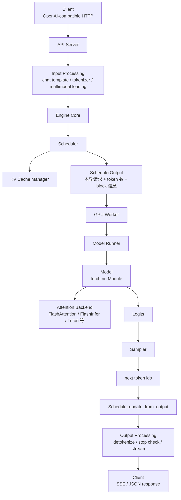

# 第 13 章：vLLM Runtime

## 1. 本章目标

学完本章后，你应该能回答：

- vLLM Runtime 和前 12 章的 Transformer 算子有什么区别？
- API Server、Engine Core、Scheduler、KV Cache Manager、GPU Worker、Model Runner 分别负责什么？
- 一个 OpenAI-compatible 请求从 HTTP 进入到流式输出 token，大致经过哪些组件？
- `Scheduler.schedule()`、`execute_model()`、`update_from_output()` 三者是什么关系？
- vLLM V1 为什么说 Scheduler 不再严格区分 Prefill 阶段和 Decode 阶段？
- Attention Backend、Sampler、Output Processing 在链路中分别处于什么位置？

本章基于 2026-06-18 可访问的 vLLM latest developer preview docs 和 GitHub `main` 分支源码入口整理。vLLM 变化很快，后续真正源码精读时必须固定具体 commit。

## 2. 五分钟直觉

前 12 章讲的是单个请求和单个技术点：

```text
Prompt -> Tokenizer -> Transformer -> Logits -> Sampling -> Text
```

到了 vLLM Runtime，要把视角换成在线服务系统：

```text
很多用户同时发请求；
每个请求长度不同；
每个请求都需要 KV Cache；
GPU Worker 要持续执行 batch；
Scheduler 每一轮决定哪些 token 被送进模型；
API Server 还要把 token 流式返回给客户端。
```

所以 vLLM Runtime 不是“一个 Transformer 模型文件”，而是一套推理服务系统。

最简直觉：

```text
API Server 管 HTTP 和输入输出；
Engine Core 管调度和 KV Cache；
GPU Worker / Model Runner 管模型 forward；
Attention Backend 管 attention kernel；
Sampler 管 logits 变 next token；
Output Processor 管 token id 变成用户看到的文本。
```

第 13 章最重要的一句话：

> vLLM 的核心不是把一个请求跑快，而是在显存、调度和 kernel 约束下，让很多请求持续、高效、可流式地一起跑。

## 3. 完整计算或数据流

### Online Serving 总链路



这条链路可以拆成三层：

```text
服务入口层：API Server、HTTP、OpenAI-compatible 协议、流式输出
引擎调度层：Engine Core、Scheduler、KV Cache Manager、Request 状态
模型执行层：GPU Worker、Model Runner、Attention Backend、Sampler
```

### Engine Core 的核心循环

根据当前 vLLM V1 源码入口，`EngineCore.step()` 的核心闭环可以简化为：

```text
1. scheduler.has_requests()
2. scheduler.schedule(...)
3. model_executor.execute_model(scheduler_output, non_block=True)
4. model_output = future.result()
5. scheduler.update_from_output(scheduler_output, model_output)
6. 返回 EngineCoreOutputs
```

注意这里有两个方向：

```text
SchedulerOutput: Scheduler -> Worker
ModelRunnerOutput: Worker -> Scheduler
```

`SchedulerOutput` 告诉 worker 本轮执行什么；`ModelRunnerOutput` 把模型输出、采样结果、KV connector 结果等信息交还给 scheduler。

### V1 Scheduler 的重要语义

vLLM V1 文档和源码都强调一个点：

```text
Scheduler 不一定硬分“Prefill 阶段”和“Decode 阶段”。
每个请求都有 num_computed_tokens 和目标 token 数。
每轮调度就是给每个请求分配若干 token，让已计算 token 数追上目标 token 数。
```

这能统一解释：

- Chunked Prefill：Prompt 没算完，每轮算一部分。
- Decode：Prompt 算完后，每轮推进新输出 token。
- Prefix Caching：有些 prompt token 已经命中 cache，不必重复计算。
- Speculative Decoding：目标 token 里可能包含 draft tokens。

这比“先 prefill 完全部请求，再 decode”更接近现代 Runtime 的真实调度方式。

## 图示阅读建议

- 来源：vLLM Architecture Overview
- URL：https://docs.vllm.ai/en/latest/design/arch_overview/
- 建议查看：Entrypoints Diagram、V1 Process Architecture、LLMEngine Diagram、Class Hierarchy。
- 图中重点：
  1. Offline `LLM` 和 Online `vllm serve` 是两个入口。
  2. Online serving 下，API Server、Engine Core、GPU Worker 是分工不同的进程。
  3. Engine Core 负责 Scheduler 和 KV cache management，GPU Worker 负责 forward。
  4. Model Runner 是 worker 内真正组织输入张量、运行模型和配合 CUDA Graph 的对象。

## 4. 关键术语

- API Server：接收 HTTP 请求，提供 OpenAI-compatible API，做输入处理并把结果流式返回给客户端。
- OpenAI-compatible Server：兼容 `/v1/completions`、`/v1/chat/completions`、`/v1/responses` 等接口的在线服务入口。
- Engine Core：vLLM V1 中运行 Scheduler、管理 KV Cache、协调 GPU Workers 的核心进程。
- Scheduler：每个 engine step 决定哪些请求、多少 token、哪些 blocks 被安排执行。
- KV Cache Manager：管理 KV Cache blocks、prefix cache、block ids、水位线和释放。
- GPU Worker：每个 GPU 对应的 worker 进程，加载模型权重、执行 forward、管理 GPU memory。
- Model Runner：worker 内负责加载和运行模型、准备输入张量、构造 attention metadata、捕获 CUDA Graph 的对象。
- Model：实际的 `torch.nn.Module`，例如某个 decoder-only LLM 类。
- Attention Backend：实际执行 attention 的后端，如 FlashAttention、FlashInfer、Triton Attention 等。
- Sampler：把 logits 转成 next token ids 的模块，包含 greedy、temperature、top-k、top-p、penalty 等逻辑。
- Output Processing：把 token ids、logprobs、finish reason 等整理成用户可读文本和流式响应。
- ZMQ：vLLM V1 文档中 API Server 和 Engine Core 通信使用的消息通道。
- VllmConfig：vLLM 中跨 Engine、Worker、Model Runner、Model 传递的配置对象。

## 5. Tensor Shape

vLLM Runtime 里的 shape 不只是一层 attention 的 shape，而是调度后的“本轮执行 batch shape”。

设：

```text
N = 本轮参与执行的请求数
T = 本轮被调度的 token 总数
H = hidden size
V = vocabulary size
L = number of layers
Nkv = number of KV heads
Dh = head dimension
block_size = KV cache block token 数
num_blocks = 当前 worker 管理的 KV blocks 数
```

### Engine Core 看到的形态

Scheduler 关心的是：

```text
num_scheduled_tokens: {request_id -> token_count}
req_to_new_blocks: {request_id -> KVCacheBlocks}
finished_req_ids: set[request_id]
```

也就是说，Engine Core 不直接把所有请求整理成 `[B, S, H]`，而是先决定：

```text
谁本轮执行？
每个请求执行几个 token？
需要新分配哪些 KV blocks？
哪些请求已经完成？
```

### Model Runner 看到的形态

Model Runner 会把 SchedulerOutput 变成模型可执行输入：

```text
input_tokens: [T]
positions: [T]
attention_metadata: 每层或每组 attention backend 所需元数据
```

模型 forward 后得到：

```text
hidden_states: [T, H]
logits: [num_logits_positions, V]
```

对于普通 decode，`num_logits_positions` 通常接近本轮需要采样的请求数；对于 prefill，可能只需要取每个请求最后一个位置用于首 token 采样，具体取决于任务、logprobs 和实现路径。

### KV Cache 形态

从第 11 章继承：

```text
K_blocks: [L, num_blocks, Nkv, block_size, Dh]
V_blocks: [L, num_blocks, Nkv, block_size, Dh]
```

但在 Runtime 里还要加一层映射：

```text
request_id -> logical blocks -> physical block ids
```

所以调度层真正传给执行层的不是完整大矩阵，而是“本轮 token + block id / slot mapping / attention metadata”。

## 6. 核心公式

### 进程数粗略关系

根据 vLLM Architecture Overview，设：

```text
N = GPU 数
TP = tensor parallel size
PP = pipeline parallel size
DP = data parallel size
A = API server count
```

概念上：

```text
GPU Worker 数 = N = DP * PP * TP
Engine Core 数 = DP
API Server 数 = A，默认可随 DP 扩展
DP Coordinator 数 = 1 if DP > 1 else 0
```

单机 4 GPU、`tp=4` 的典型示例：

```text
1 API Server + 1 Engine Core + 4 GPU Workers = 6 processes
```

### Runtime Step 预算

第 12 章的预算在 vLLM Runtime 中变成更具体的配置和状态：

```text
scheduled_tokens <= max_num_batched_tokens 或 max_num_scheduled_tokens
running_requests <= max_num_seqs
needed_kv_blocks <= usable_kv_blocks
```

Scheduler 每一轮实际上是在满足这些约束下做分配。

### Scheduler 的抽象状态推进

对某个请求：

```text
num_computed_tokens += num_scheduled_tokens[request_id]
```

当：

```text
num_computed_tokens < request.num_tokens + output_placeholders
```

这个请求仍可能处于 prefill chunk 或未追上状态；当模型输出新 token 后，请求的目标 token 数会增长，下一轮继续调度。

这就是为什么 V1 可以用统一 token budget 表达 prefill、decode、prefix cache 和 speculative decoding。

## 7. 与推理 Runtime 的联系

本章本身就是 Runtime 总图。它把前面章节连接起来：

| 前置章节 | 在 vLLM Runtime 中的位置 |
| --- | --- |
| Tokenizer / Embedding | API Server 输入处理、模型第一层 |
| Linear / Attention / FFN | Model 的 forward 内部 |
| Prefill / Decode | Scheduler 给请求分配 token 的不同状态 |
| KV Cache | KV Cache Manager 和 Attention Backend 的共享状态 |
| MQA / GQA | Model config 与 attention metadata / KV head 数 |
| FlashAttention | Attention Backend 的一种实现 |
| PagedAttention | KV Cache block 管理和 paged attention kernel 思想 |
| Continuous Batching | Scheduler 每轮动态调度 |

### 一次请求的生命周期

```text
1. Client 发 HTTP 请求。
2. API Server 解析 OpenAI-compatible payload。
3. API Server 做 chat template、tokenization、必要的多模态输入加载。
4. 请求进入 Engine Core。
5. Scheduler 把请求放入 waiting queue。
6. 某个 engine step 中，Scheduler 让请求进入 running，并分配 KV blocks。
7. GPU Worker / Model Runner 执行 prefill chunk 或 decode token。
8. Attention Backend 根据 attention metadata 和 KV blocks 执行 attention。
9. Model 输出 logits。
10. Sampler 选择 next token id。
11. Scheduler 根据输出更新请求状态、finish reason、KV blocks。
12. API Server detokenize 并通过 stream 返回增量文本。
13. 请求完成后释放或复用 KV blocks。
```

### 源码阅读顺序建议

本章先不要求你深入每行源码，但要知道阅读入口：

```text
vllm/entrypoints/openai/api_server.py
  -> OpenAI-compatible HTTP 入口

vllm/v1/engine/core.py
  -> EngineCore 初始化、KV cache 初始化、step 主循环

vllm/v1/core/sched/scheduler.py
  -> waiting/running 队列、schedule、preempt、update_from_output

vllm/v1/core/kv_cache_manager.py
  -> KVCacheBlocks、block ids、watermark、prefix cache 管理入口

vllm/v1/worker/gpu_worker.py
  -> GPU worker 进程、模型加载、显存管理

vllm/v1/worker/gpu_model_runner.py
  -> 输入张量准备、attention metadata、模型执行、CUDA Graph

vllm/v1/sample/sampler.py
  -> logits 到 next token ids
```

## 8. 易错点

| 易错说法 | 问题 | 正确认知 |
| --- | --- | --- |
| vLLM 就是 FlashAttention | 错 | vLLM 是完整 serving runtime，FlashAttention 只是可选 attention backend 之一 |
| vLLM 就是 PagedAttention | 不完整 | PagedAttention 是核心技术之一，但 vLLM 还包含 API server、scheduler、worker、sampler、metrics 等 |
| API Server 直接跑模型 forward | 不准确 | 在线 serving 下 API Server 主要处理 HTTP、输入和输出，模型执行由 Engine Core 协调 Worker 完成 |
| Scheduler 只做 batch 拼接 | 太浅 | 它还要处理 KV blocks、running/waiting、preemption、prefix cache、structured output、spec decode 等状态 |
| KV Cache Manager 负责采样 | 错 | 它负责 KV blocks 和缓存状态，采样由 Sampler 完成 |
| Model Runner 就是模型本身 | 错 | Model Runner 是执行组织者，Model 才是实际 `torch.nn.Module` |
| Attention Backend 决定采样策略 | 错 | Attention Backend 只管 attention kernel；采样策略在 Sampler / SamplingParams 侧 |
| V1 还必须严格先 Prefill 后 Decode | 不准确 | V1 Scheduler 以 token budget 统一处理 prompt token 和 output token，不强行分成两个全局阶段 |
| GitHub main 源码可以永久引用为固定事实 | 不严谨 | main 会变，正式源码笔记应固定 commit hash |

## 9. 面试回答模板

如果被问“vLLM 一次请求的 Runtime 链路是什么”，可以这样答：

1. 在线 serving 时，请求先进入 OpenAI-compatible API Server。
2. API Server 负责 HTTP、chat template、tokenization、多模态输入加载和流式输出。
3. 请求交给 Engine Core，Engine Core 内部运行 Scheduler 和 KV Cache 管理。
4. Scheduler 每个 step 决定哪些请求、多少 token、哪些 KV blocks 被送去执行。
5. GPU Worker 中的 Model Runner 准备输入张量和 attention metadata，调用模型 forward。
6. Attention Backend 执行 attention kernel，模型输出 logits。
7. Sampler 根据 logits 得到 next token id，Scheduler 更新请求状态，API Server 解码并流式返回。

如果追问“Scheduler、KV Cache Manager、Model Runner 的边界”，可以补一句：

> Scheduler 决定本轮谁跑和跑多少 token；KV Cache Manager 决定 KV blocks 怎么分配、复用和释放；Model Runner 把调度结果变成 GPU 上的输入张量，调用模型和 attention backend 执行 forward。三者分别对应调度决策、缓存资源管理和模型执行组织。

如果追问“为什么 V1 不严格区分 Prefill/Decode”，可以这样答：

> V1 Scheduler 把请求看成“已经计算了多少 token”和“目标一共有多少 token”的差值问题。Prompt 没算完就是 prefill chunk，输出 token 继续增长就是 decode；prefix cache 和 speculative decoding 也能统一成每轮给请求分配若干 token。这比固定分阶段更适合 continuous batching。

## 10. 真实面试问题

本章暂未收录与 vLLM Runtime 组件调用链直接相关的 `VERIFIED` 或 `PARTIAL` 面试问题。

### 未核实候选问题（UNVERIFIED）

以下问题来自本章知识点推导，已按牛客网、知乎、小红书、脉脉、CSDN、GitHub 和公开搜索结果做跨平台复核，但暂时没有可访问的一手面经正文支撑，只能用于自测，不能当作真实面经或高频题。完整候选池见 `面试题/未核实候选问题.md`，复核记录见 `面试题/来源登记.md` 的 I014。

1. vLLM 一次 OpenAI-compatible 请求从进入服务到输出 token 的链路是什么？
   - 对应能力：能把 API Server、Engine Core、Scheduler、Worker、Sampler、Output Processing 串起来。
   - 30 秒回答：请求先进入 API Server，经过协议解析、chat template 和 tokenization 后交给 Engine Core。Engine Core 中 Scheduler 根据 waiting/running 队列、token budget 和 KV block 情况生成 SchedulerOutput。GPU Worker 的 Model Runner 根据这个输出准备输入张量和 attention metadata，调用模型 forward，Attention Backend 执行 attention，Sampler 从 logits 采样 next token。最后 Scheduler 更新状态，API Server detokenize 并流式返回。
2. Scheduler、KV Cache Manager、Model Runner 分别负责什么？
   - 对应能力：能区分调度、缓存资源和模型执行组织。
   - 30 秒回答：Scheduler 负责决定本轮哪些请求执行、每个请求执行多少 token；KV Cache Manager 负责 KV blocks 的分配、复用、prefix cache 和释放；Model Runner 在 GPU Worker 内负责把调度结果变成模型输入，准备 attention metadata，调用模型和 CUDA Graph 等执行逻辑。
3. vLLM V1 为什么能用统一 token budget 处理 Prefill、Decode、Prefix Caching 和 Speculative Decoding？
   - 对应能力：能解释 V1 Scheduler 的抽象。
   - 30 秒回答：V1 不把所有请求硬切成全局 Prefill 和 Decode 阶段，而是为每个请求维护已计算 token 数和目标 token 数。每轮 Scheduler 分配若干 token 让请求追上目标。Prompt 未算完就是 chunked prefill，输出增长就是 decode，命中 prefix cache 会减少需要计算的 token，spec decode 也可以表现为目标 token 数里多了 draft tokens。

## 11. 我的回答

待用户后续复习本章时填写。

## 12. 纠错记录

暂无。

## 13. 本章验收

后续复习时回答：

1. API Server、Engine Core、GPU Worker 的进程边界是什么？
2. `EngineCore.step()` 的核心闭环是哪三步？
3. SchedulerOutput 和 ModelRunnerOutput 分别是什么方向的数据？
4. Model Runner 和 Model 有什么区别？
5. 为什么说 Attention Backend 不是 Sampler？
6. 为什么 vLLM main 分支源码引用必须标注访问日期或 commit？

## 14. 参考资料

- 页面标题：Architecture Overview
  - 发布者或作者：vLLM Project
  - URL：https://docs.vllm.ai/en/latest/design/arch_overview/
  - 发布时间：页面显示 2026-05-19
  - 访问日期：2026-06-18
  - 来源类型：官方开发者文档；latest developer preview docs
  - 本文使用内容：V1 process architecture、API Server、Engine Core、GPU Worker、LLMEngine、AsyncLLMEngine、Model Runner、Model 的组件边界。
- 页面标题：vLLM V1
  - 发布者或作者：vLLM Project
  - URL：https://docs.vllm.ai/en/latest/usage/v1_guide/
  - 发布时间：页面显示 2026-03-09
  - 访问日期：2026-06-18
  - 来源类型：官方用户文档；latest developer preview docs
  - 本文使用内容：V0 deprecation、V1 对 scheduler、KV cache manager、worker、sampler、API server 的重构说明，chunked prefill 默认启用条件，以及统一 scheduler token budget。
- 页面标题：OpenAI-Compatible Server
  - 发布者或作者：vLLM Project
  - URL：https://docs.vllm.ai/en/latest/serving/online_serving/openai_compatible_server/
  - 发布时间：未确认；页面为 latest developer preview docs
  - 访问日期：2026-06-18
  - 来源类型：官方文档
  - 本文使用内容：OpenAI-compatible HTTP server、支持的 `/v1/completions`、`/v1/chat/completions`、`/v1/responses` 等接口。
- 页面标题：Attention Backend Feature Support
  - 发布者或作者：vLLM Project
  - URL：https://docs.vllm.ai/en/latest/design/attention_backends/
  - 发布时间：未确认；页面为 latest developer preview docs
  - 访问日期：2026-06-18
  - 来源类型：官方开发者文档
  - 本文使用内容：Attention backend 的手动选择、自动选择、CUDA backend 优先级，以及 FlashAttention、FlashInfer、Triton 等后端定位。
- 页面标题：vllm/v1/engine/core.py
  - 发布者或作者：vLLM Project GitHub
  - URL：https://raw.githubusercontent.com/vllm-project/vllm/main/vllm/v1/engine/core.py
  - 发布时间：main 分支持续变化，未固定 commit
  - 访问日期：2026-06-18
  - 来源类型：官方源码入口
  - 本文使用内容：`EngineCore` 初始化 KV cache 与 Scheduler、`step()` 中 `schedule -> execute_model -> update_from_output` 的主循环。
- 页面标题：vllm/v1/core/sched/scheduler.py
  - 发布者或作者：vLLM Project GitHub
  - URL：https://raw.githubusercontent.com/vllm-project/vllm/main/vllm/v1/core/sched/scheduler.py
  - 发布时间：main 分支持续变化，未固定 commit
  - 访问日期：2026-06-18
  - 来源类型：官方源码入口
  - 本文使用内容：`waiting`、`running`、`KVCacheManager`、`schedule()`、preemption、V1 不严格区分 prefill/decode phase 的调度注释。
- 页面标题：vllm/v1/core/kv_cache_manager.py
  - 发布者或作者：vLLM Project GitHub
  - URL：https://raw.githubusercontent.com/vllm-project/vllm/main/vllm/v1/core/kv_cache_manager.py
  - 发布时间：main 分支持续变化，未固定 commit
  - 访问日期：2026-06-18
  - 来源类型：官方源码入口
  - 本文使用内容：`KVCacheBlocks` 作为 Scheduler 与 KVCacheManager 的接口、block ids、水位线和 block pool 管理入口。
- 页面标题：vllm/v1/worker/gpu_worker.py 与 gpu_model_runner.py
  - 发布者或作者：vLLM Project GitHub
  - URL：https://raw.githubusercontent.com/vllm-project/vllm/main/vllm/v1/worker/gpu_worker.py
  - URL：https://raw.githubusercontent.com/vllm-project/vllm/main/vllm/v1/worker/gpu_model_runner.py
  - 发布时间：main 分支持续变化，未固定 commit
  - 访问日期：2026-06-18
  - 来源类型：官方源码入口
  - 本文使用内容：GPU Worker、GPU Model Runner 的模型加载、输入张量准备、attention metadata、CUDA Graph 和执行组织入口。
- 页面标题：vllm/v1/sample/sampler.py
  - 发布者或作者：vLLM Project GitHub
  - URL：https://raw.githubusercontent.com/vllm-project/vllm/main/vllm/v1/sample/sampler.py
  - 发布时间：main 分支持续变化，未固定 commit
  - 访问日期：2026-06-18
  - 来源类型：官方源码入口
  - 本文使用内容：Sampler 从 logits 到 next token ids 的处理步骤，包括 logprobs、logits processors、penalties、top-k/top-p 和 greedy/random sampling。
