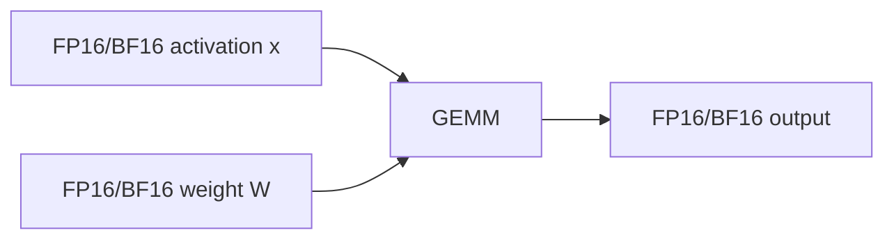
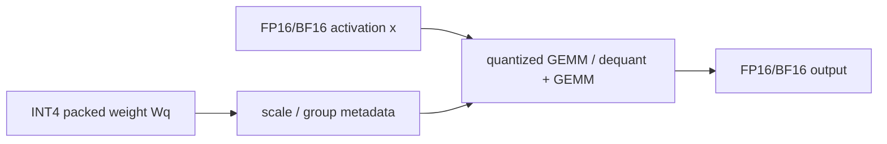
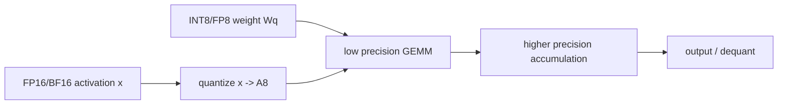
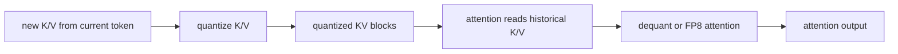

# 第 14 章：量化

## 1. 本章目标

学完本章后，你应该能回答：

- 为什么量化可以降低模型权重显存和 KV Cache 显存？
- FP32、FP16、BF16、FP8、INT8、INT4 分别是什么级别的数值格式？
- W8A8、W4A16、weight-only quantization、activation quantization 有什么区别？
- `scale`、`zero_point`、per-tensor、per-channel、per-group 分别解决什么问题？
- PTQ、QAT、calibration 的关系是什么？
- 为什么“模型变小”不等于“一定变快”？
- KV Cache quantization 和 weight quantization 解决的是同一个问题吗？

本章只讲推理工程中的量化概念和 Runtime 影响，不记录任何本机实测结果，也不伪造吞吐、延迟或精度结论。

## 2. 五分钟直觉

前面章节里，模型计算大多可以简化成：

```text
y = x @ W
```

其中：

- `W` 是权重，模型加载后长期占显存。
- `x` 是 activation，每一轮 forward 动态产生。
- KV Cache 是 decode 过程中不断增长的历史 K/V。

量化的核心直觉是：

```text
不要总用 16 bit 或 32 bit 存所有数。
把一批浮点数映射到更少 bit 的整数或低精度浮点数。
需要计算时，再用 scale / zero_point 还原成近似值，或者直接用低精度 kernel 计算。
```

最常见的三个压缩对象：

```text
权重量化：压缩 W，降低模型权重显存和读权重带宽。
激活量化：压缩 x，让矩阵乘法可以用低精度输入。
KV Cache 量化：压缩历史 K/V，降低长上下文和高并发时的 KV 显存。
```

第 14 章最重要的一句话：

> 量化不是“无脑把模型变小”，而是在精度、显存、带宽、kernel 支持和误差之间做工程取舍。

## 3. 完整计算或数据流

### 普通 FP16/BF16 推理



特点：

- 权重通常按 16 bit 存储。
- activation 通常也是 16 bit。
- Tensor Core 支持成熟。
- 精度风险相对小。

### Weight-only Quantization

以 W4A16 为例：



含义：

```text
W4A16 = weight 4-bit，activation 16-bit
```

它主要压缩权重，activation 仍是 FP16/BF16。对 decode 这种经常读权重、batch 较小、容易受内存带宽影响的场景，weight-only 可能有收益。但是否更快取决于 kernel、GPU、batch size、group size 和反量化开销。

### Weight + Activation Quantization

以 W8A8 为例：



含义：

```text
W8A8 = weight 8-bit，activation 8-bit
```

它不只是压缩权重，还试图让计算本身走 INT8 或 FP8 路径。它更依赖硬件和 kernel 支持；如果硬件没有高效低精度矩阵乘法，或者 activation quantize/dequantize 开销太大，就不一定比 FP16/BF16 快。

### KV Cache Quantization

从第 8 章和第 11 章继承：

```text
K_cache: [L, total_tokens, Nkv, Dh]
V_cache: [L, total_tokens, Nkv, Dh]
```

KV Cache 量化后：



它解决的是：

```text
长上下文 + 高并发 -> KV Cache 越来越大 -> 显存和读带宽成为瓶颈
```

这和 weight quantization 不同。权重量化压缩模型参数；KV Cache 量化压缩运行时状态。

## 图示阅读建议

- 来源 1：Hugging Face Transformers Quantization concepts
  - URL：https://huggingface.co/docs/transformers/en/quantization/concept_guide
  - 建议查看：affine quantization、symmetric/asymmetric、int4 weight packing、FP8、granularity、PTQ/QAT。
- 来源 2：vLLM Quantization
  - URL：https://docs.vllm.ai/en/latest/features/quantization/
  - 建议查看：vLLM 支持的量化格式和硬件兼容表；注意该表会随版本变化。
- 来源 3：vLLM Quantized KV Cache
  - URL：https://docs.vllm.ai/en/latest/features/quantization/quantized_kvcache/
  - 建议查看：FP8 KV Cache、per-tensor/per-attention-head scales、calibration 方式。

## 4. 关键术语

- Quantization：把高精度数值映射到低 bit 表示，以降低存储、带宽或计算成本。
- Dequantization：把低精度表示近似还原为浮点数，供后续计算使用。
- Scale：浮点数范围和低精度整数范围之间的比例因子。
- Zero point：低精度整数中对应浮点 0 的位置，常见于 asymmetric quantization。
- Symmetric quantization：以 0 为中心做映射，通常 `zero_point = 0`。
- Asymmetric quantization：不强制以 0 为中心，使用 `scale + zero_point` 表示偏移。
- Per-tensor：整个 tensor 共用一组 scale/zero_point。
- Per-channel：不同通道使用不同 scale/zero_point。
- Per-group：把一个通道或权重行再分组，每组一套 scale/zero_point。
- PTQ：Post-Training Quantization，训练后量化。
- QAT：Quantization-Aware Training，训练中模拟量化误差，让模型适应低精度。
- Calibration：用校准数据估计 activation、weight 或 KV Cache 的数值范围和 scale。
- Weight-only quantization：只量化权重，activation 仍保持 FP16/BF16 等较高精度。
- Activation quantization：对 forward 中的 activation 也做低精度表示。
- W8A8：weight 8-bit、activation 8-bit。
- W4A16：weight 4-bit、activation 16-bit。
- KV Cache quantization：对推理过程中缓存的 K/V 做低精度存储。
- Outlier：数值分布中特别大的值，容易扩大量化范围，导致大部分普通值精度变差。

## 5. Tensor Shape

设一个线性层：

```text
x: [T, Hin]
W: [Hout, Hin]
y = x @ W.T
y: [T, Hout]
```

### Weight-only 的 shape

原始权重：

```text
W_fp16: [Hout, Hin]
```

INT4 per-group 量化后可以理解为：

```text
W_q_packed: [Hout, Hin / 2]       # 两个 int4 打包进一个 byte，概念表示
scale: [Hout, Hin / group_size]   # 每组一个 scale
zero_point: 可选，同 scale 粒度
```

如果是 per-channel：

```text
scale: [Hout]
```

如果是 per-tensor：

```text
scale: [1]
```

粒度越细，通常越准，但 metadata 更多，kernel 也更复杂。

### W8A8 的 shape

activation 也要量化：

```text
x_fp16: [T, Hin]
x_q: [T, Hin]
x_scale: [1] 或 [T] 或 [T, groups]
W_q: [Hout, Hin]
W_scale: [Hout] 或 [Hout, groups]
```

计算可能是：

```text
int8/fp8 matmul -> higher precision accumulation -> output cast
```

这里的 `higher precision accumulation` 很关键。低精度输入不等于所有中间累加都低精度。

### KV Cache Quantization 的 shape

原始 KV Cache：

```text
K_cache: [L, total_tokens, Nkv, Dh]
V_cache: [L, total_tokens, Nkv, Dh]
```

FP8 KV Cache 可以概念化为：

```text
K_q: [L, total_tokens, Nkv, Dh]
V_q: [L, total_tokens, Nkv, Dh]
K_scale / V_scale: per-tensor 或 per-head / per-group metadata
```

在 vLLM 的 paged KV Cache 中，还会叠加 block 管理：

```text
request_id -> logical blocks -> physical block ids
physical block -> quantized K/V data + scales
```

所以 KV Cache 量化不仅是数值问题，也是 Runtime 内存布局和 attention backend 问题。

## 6. 核心公式

### 存储量估算

权重显存：

```text
weight_bytes ~= num_params * bits_per_weight / 8 + scale_metadata
```

对 1B 参数，只看权重本体：

| 格式 | 每参数字节数 | 1B 参数约占 |
| --- | ---: | ---: |
| FP32 | 4 bytes | 4 GB |
| FP16/BF16 | 2 bytes | 2 GB |
| FP8/INT8 | 1 byte | 1 GB |
| INT4 | 0.5 byte | 0.5 GB |

注意：真实占用还包括 scale、zero_point、padding、对齐、metadata、Runtime buffer、KV Cache、activation、CUDA workspace 等。

KV Cache 显存：

```text
kv_cache_bytes ~= 2 * L * total_cached_tokens * Nkv * Dh * bytes_per_elem
```

其中 `2` 来自 K 和 V 两份缓存。

如果把 KV Cache 从 FP16 压到 FP8，本体字节数大约减半；如果压到 INT4，本体字节数大约变成四分之一。但仍要考虑 scale metadata 和 attention kernel 开销。

### Affine Quantization

给定浮点范围：

```text
x_min, x_max
q_min, q_max
```

常见 asymmetric 公式：

```text
scale = (x_max - x_min) / (q_max - q_min)
zero_point = round(q_min - x_min / scale)
q = clamp(round(x / scale) + zero_point, q_min, q_max)
x_hat = scale * (q - zero_point)
```

`x_hat` 是还原后的近似值，不等于原始 `x`。

### Symmetric Quantization

如果数值范围近似以 0 为中心：

```text
abs_max = max(abs(x))
scale = abs_max / q_max
zero_point = 0
q = clamp(round(x / scale), q_min, q_max)
x_hat = scale * q
```

它更简单，也更容易让 kernel 高效，但对偏移明显的分布可能误差更大。

### Quantization Error

```text
error = x - x_hat
```

量化误差会进入矩阵乘法：

```text
y_hat = x_hat @ W_hat.T
```

如果 `x` 或 `W` 中有 outlier，scale 会被 outlier 拉大，普通值的可用精度会下降。这就是 SmoothQuant、AWQ、GPTQ、KIVI 等方法要处理的问题之一。

## 7. 与推理 Runtime 的联系

量化和 Runtime 的关系可以按“压缩对象”理解：

| 压缩对象 | 主要影响 | Runtime 位置 |
| --- | --- | --- |
| Weight | 模型加载显存、读权重带宽 | Model Runner 加载权重，Linear/MoE kernel |
| Activation | GEMM 输入、低精度计算路径 | 每层 forward 中动态产生 |
| KV Cache | 长上下文和并发显存、attention 读带宽 | KV Cache Manager、Attention Backend |
| Scales / metadata | 精度和额外存储 | quantized kernel 和 cache layout |

### Prefill 与 Decode 中的区别

Prefill：

```text
T 很大，GEMM 更大，更容易吃计算能力。
W8A8 / FP8 如果硬件支持好，可能影响 prefill 计算吞吐。
```

Decode：

```text
每轮新 token 少，但要反复读权重和读 KV Cache。
weight-only quantization 可能降低读权重带宽。
KV Cache quantization 可能降低 attention 读历史 K/V 的带宽。
```

但这些只是工程倾向，不是固定结论。真实收益必须看：

- GPU 是否支持对应低精度 Tensor Core。
- vLLM / TensorRT-LLM / llama.cpp 等 Runtime 是否有高质量 kernel。
- batch size、sequence length、context length 和并发。
- quantize/dequantize 是否被融合进 kernel。
- 精度下降是否导致输出质量、重试率或业务指标变差。

### 为什么模型变小不一定更快

常见原因：

1. 只是存储变小，计算时仍要 dequant 到 FP16/BF16。
2. 低精度 kernel 不成熟，反量化和 unpack 开销抵消了节省的带宽。
3. 当前瓶颈不是读权重，而是调度、KV Cache、网络、采样或 CPU 预处理。
4. INT4 metadata、scale、zero_point 和 padding 带来额外开销。
5. GPU 不支持对应格式的高速矩阵乘法。
6. 小 batch 下 kernel launch 和调度开销更明显。
7. 精度下降后，业务侧可能需要更长输出、更复杂 prompt 或人工兜底。

## 8. 易错点

| 易错说法 | 问题 | 正确认知 |
| --- | --- | --- |
| 量化就是把小数直接截断 | 太粗糙 | 常见量化需要 scale、zero_point、粒度和校准 |
| INT4 一定比 INT8 快 | 错 | INT4 可能省带宽，但 unpack/dequant/kernel 支持可能抵消收益 |
| W4A16 表示 activation 也是 4 bit | 错 | W4A16 是 weight 4-bit，activation 16-bit |
| W8A8 和 weight-only 是一回事 | 错 | W8A8 同时量化权重和 activation，weight-only 只量化权重 |
| FP16 和 BF16 精度完全一样 | 错 | 二者都是 16 bit，但 exponent/mantissa 分配不同，BF16 动态范围更接近 FP32，FP16 有更多尾数位 |
| FP8/INT8 不需要校准 | 不准确 | 是否需要校准取决于方法；activation 和 KV Cache 往往更依赖合理 scale |
| 量化只影响显存，不影响准确率 | 错 | 量化会引入误差，低 bit 越激进越要评估质量 |
| KV Cache 量化和 PagedAttention 是同一个东西 | 错 | PagedAttention 管理 KV Cache 布局和分页；KV Cache 量化改变 K/V 数值存储精度 |
| 模型权重减半，服务吞吐就一定翻倍 | 错 | 端到端吞吐受 kernel、调度、KV Cache、采样、网络和请求分布共同影响 |

## 9. 面试回答模板

如果被问“量化是什么，为什么能省显存”，可以这样答：

> 量化就是把 FP32/FP16/BF16 这类高精度数值，用 INT8、INT4、FP8 等低 bit 格式近似表示。核心是用 scale 和可选 zero_point 把浮点范围映射到低精度范围。权重量化能减少模型参数显存，KV Cache 量化能减少长上下文和高并发时的运行时缓存显存。但量化会引入误差，还依赖硬件和 kernel 支持，所以模型变小不代表一定端到端变快。

如果被问“W8A8 和 W4A16 有什么区别”，可以这样答：

> W8A8 表示权重和 activation 都是 8 bit，目标是让矩阵乘法走 INT8 或 FP8 等低精度计算路径。W4A16 表示权重 4 bit、activation 仍然 16 bit，本质上是 weight-only quantization，主要减少权重显存和读权重带宽。W8A8 对硬件低精度 GEMM 和 activation scale 更敏感，W4A16 对权重反量化、packing 和 group size 更敏感。

如果被问“为什么量化后不一定更快”，可以这样答：

> 因为压缩存储和加速计算不是一回事。INT4 权重虽然更小，但计算前可能要 unpack 和 dequant；如果 kernel 没有融合好，开销会抵消收益。服务端瓶颈也可能在 KV Cache 读带宽、scheduler、采样、网络或 CPU 预处理上。只有当低精度格式被硬件和 Runtime 高效支持，并且当前瓶颈确实被量化缓解，端到端性能才会提升。

如果被问“KV Cache 量化和权重量化有什么区别”，可以这样答：

> 权重量化压缩的是模型参数，模型加载后基本固定；KV Cache 量化压缩的是推理过程中每个请求不断增长的历史 K/V。前者主要影响模型显存和线性层读权重带宽，后者主要影响长上下文、高并发 decode 时的 KV 显存和 attention 读带宽。KV Cache 量化还要和 paged cache layout、attention backend、scale 粒度配合。

## 10. 真实面试问题

本章暂未收录与 LLM 量化直接相关的 `VERIFIED` 或 `PARTIAL` 一手面试问题。

### 未核实候选问题（UNVERIFIED）

以下问题来自本章知识点推导，已按牛客网、知乎、小红书、脉脉、CSDN、GitHub 和公开搜索结果做跨平台复核，但暂时没有可访问的一手面经正文支撑，只能用于自测，不能当作真实面经或高频题。完整候选池见 `面试题/未核实候选问题.md`，复核记录见 `面试题/来源登记.md` 的 I015。

1. 量化为什么能降低显存？为什么模型变小不一定推理更快？
   - 对应能力：能区分存储压缩、计算加速和端到端服务瓶颈。
   - 30 秒回答：量化用更少 bit 表示权重、activation 或 KV Cache，因此能降低权重显存、KV Cache 显存和部分内存带宽。但推理是否更快取决于低精度 kernel、硬件 Tensor Core 支持、反量化是否融合、当前瓶颈是不是内存带宽，以及精度下降是否影响业务效果。
2. W8A8、W4A16、weight-only quantization 分别是什么意思？
   - 对应能力：能准确解释常见量化格式。
   - 30 秒回答：W8A8 是权重和 activation 都 8 bit，目标是低精度 GEMM；W4A16 是权重 4 bit、activation 16 bit，属于 weight-only，主要压缩权重和读权重带宽；weight-only 泛指只量化权重，activation 仍用 FP16/BF16 等较高精度。
3. Per-tensor、per-channel、per-group 量化有什么区别？
   - 对应能力：能解释 scale 粒度和误差/metadata 取舍。
   - 30 秒回答：Per-tensor 是整个 tensor 一套 scale，最简单但误差可能大；per-channel 是每个输出通道或 attention head 一套 scale，能适配不同通道分布；per-group 是再把通道内部分组，精度更细但 metadata 和 kernel 复杂度更高。
4. KV Cache quantization 和 weight quantization 的目标有什么不同？
   - 对应能力：能把量化和 Runtime 内存瓶颈联系起来。
   - 30 秒回答：权重量化压缩模型参数，主要影响模型加载显存和线性层读权重带宽；KV Cache 量化压缩运行时每个请求的历史 K/V，主要影响长上下文和高并发 decode 的显存占用与 attention 读带宽。两者可以同时存在，但解决的问题不同。

## 11. 我的回答

待用户后续复习本章时填写。

## 12. 纠错记录

暂无。

## 13. 本章验收

后续复习时回答：

1. 用一句话解释 `scale` 和 `zero_point`。
2. W8A8 和 W4A16 的区别是什么？
3. 为什么 INT4 权重不一定比 FP16 端到端更快？
4. Per-tensor、per-channel、per-group 的取舍是什么？
5. KV Cache 量化和 PagedAttention 分别解决什么问题？
6. 为什么 activation quantization 往往比 weight-only quantization 更依赖校准？

## 14. 参考资料

- 页面标题：Quantization concepts
  - 发布者或作者：Hugging Face
  - URL：https://huggingface.co/docs/transformers/en/quantization/concept_guide
  - 发布时间：未确认；页面为 Transformers 文档
  - 访问日期：2026-06-18
  - 来源类型：官方文档
  - 本文使用内容：量化定义、affine/symmetric/asymmetric、scale、zero-point、int4 packing、FP8、granularity、PTQ/QAT。
- 页面标题：Overview - Quantization
  - 发布者或作者：Hugging Face
  - URL：https://huggingface.co/docs/transformers/en/quantization/overview
  - 发布时间：未确认；页面为 Transformers 文档
  - 访问日期：2026-06-18
  - 来源类型：官方文档
  - 本文使用内容：Transformers 中常见量化方法和量化方法选择入口。
- 页面标题：Quantization
  - 发布者或作者：vLLM Project
  - URL：https://docs.vllm.ai/en/latest/features/quantization/
  - 发布时间：未确认；页面为 latest developer preview docs
  - 访问日期：2026-06-18
  - 来源类型：官方文档
  - 本文使用内容：vLLM 支持的量化格式、硬件兼容表、LLM Compressor、AWQ、GPTQ、BitsAndBytes、TorchAO 等入口。
- 页面标题：Quantized KV Cache
  - 发布者或作者：vLLM Project
  - URL：https://docs.vllm.ai/en/latest/features/quantization/quantized_kvcache/
  - 发布时间：未确认；页面为 latest developer preview docs
  - 访问日期：2026-06-18
  - 来源类型：官方文档
  - 本文使用内容：FP8 KV Cache、per-tensor/per-attention-head quantization、scale calibration、`kv_cache_dtype` 选项。
- 页面标题：FP8 Formats for Deep Learning
  - 发布者或作者：Paulius Micikevicius 等，arXiv
  - URL：https://arxiv.org/abs/2209.05433
  - 发布时间：2022-09-12
  - 访问日期：2026-06-18
  - 来源类型：论文
  - 本文使用内容：FP8 E4M3/E5M2 格式和深度学习中的 FP8 背景。
- 页面标题：LLM.int8(): 8-bit Matrix Multiplication for Transformers at Scale
  - 发布者或作者：Tim Dettmers 等，arXiv
  - URL：https://arxiv.org/abs/2208.07339
  - 发布时间：2022-08-15
  - 访问日期：2026-06-18
  - 来源类型：论文
  - 本文使用内容：LLM.int8、outlier 和 mixed-precision decomposition 的背景。
- 页面标题：SmoothQuant: Accurate and Efficient Post-Training Quantization for Large Language Models
  - 发布者或作者：Guangxuan Xiao 等，arXiv
  - URL：https://arxiv.org/abs/2211.10438
  - 发布时间：2022-11-18
  - 访问日期：2026-06-18
  - 来源类型：论文
  - 本文使用内容：W8A8、activation outlier、PTQ 和把量化难点从 activation 迁移到 weight 的思想。
- 页面标题：GPTQ: Accurate Post-Training Quantization for Generative Pre-trained Transformers
  - 发布者或作者：Elias Frantar 等，arXiv
  - URL：https://arxiv.org/abs/2210.17323
  - 发布时间：2022-10-31
  - 访问日期：2026-06-18
  - 来源类型：论文
  - 本文使用内容：one-shot weight quantization、3/4-bit 权重量化和二阶信息思想。
- 页面标题：AWQ: Activation-aware Weight Quantization for LLM Compression and Acceleration
  - 发布者或作者：Ji Lin 等，arXiv
  - URL：https://arxiv.org/abs/2306.00978
  - 发布时间：2023-06-01
  - 访问日期：2026-06-18
  - 来源类型：论文
  - 本文使用内容：activation-aware weight-only quantization、salient weights、4-bit LLM/VLM 部署背景。
- 页面标题：KIVI: A Tuning-Free Asymmetric 2bit Quantization for KV Cache
  - 发布者或作者：Zirui Liu 等，arXiv
  - URL：https://arxiv.org/abs/2402.02750
  - 发布时间：2024-02-05
  - 访问日期：2026-06-18
  - 来源类型：论文
  - 本文使用内容：KV Cache 量化、key/value 不同量化粒度和长上下文 serving 中 KV Cache 显存瓶颈。
