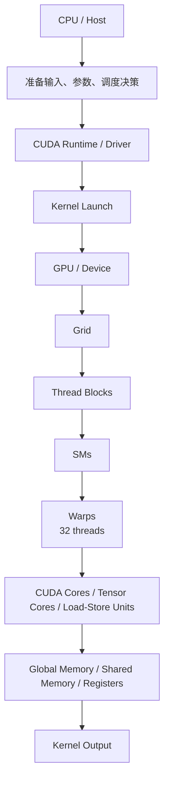

# 第 15 章：GPU 与 CUDA 推理常识

## 1. 本章目标

学完本章后，你应该能回答：

- CPU、GPU、CUDA kernel、host、device 分别是什么？
- Grid、Block、Thread、Warp、SM 的关系是什么？
- Register、Shared Memory、L1/L2 Cache、Global Memory 的层级差异是什么？
- Coalesced Access、Bank Conflict、Warp Divergence、Occupancy 分别为什么影响性能？
- Tensor Core 和 CUDA Core 的区别是什么？为什么 GEMM shape 会影响 Tensor Core 效率？
- Kernel Launch Overhead 是什么？CUDA Graph 为什么能降低重复提交开销？
- 这些概念和 LLM 推理中的 Prefill、Decode、FlashAttention、PagedAttention、KV Cache、量化有什么关系？

本章只讲概念和推理工程联系，不运行 CUDA 程序，不检查本机 GPU，不记录任何实测性能数据。

## 2. 五分钟直觉

CPU 像少量很强的工人，适合复杂控制流和串行调度；GPU 像大量相对简单的工人，适合把同一种操作分给很多数据一起做。

CUDA 的基本直觉：

```text
CPU 上的 host code 发起任务；
GPU 上的 device code 执行 kernel；
一个 kernel 会启动很多 threads；
threads 按 block 分组；
blocks 组成 grid；
block 被调度到 SM 上执行；
SM 内部按 warp 组织线程执行。
```

在 LLM 推理里，你通常不亲手写每个 CUDA kernel，但你必须知道这些概念，因为性能问题经常表现为：

```text
GEMM 太小，GPU 吃不满；
Decode 每轮 token 少，kernel launch 和访存更突出；
KV Cache 读历史 K/V，global memory 带宽压力大；
Attention kernel 要靠 tiling 和 shared memory 降低 HBM 访问；
量化格式变小，但如果 kernel 不支持或 dequant 开销大，不一定更快；
CUDA Graph 能降低重复 kernel 提交的 CPU 开销。
```

第 15 章最重要的一句话：

> LLM 推理性能不是只看 FLOPs；还要看线程组织、内存访问、kernel 形状、Tensor Core 利用率和调度开销。

## 3. 完整计算或数据流

### Host 到 Device 的执行链路



对应到 LLM Runtime：

```text
API Server / Scheduler 在 CPU 侧组织请求。
Model Runner 根据本轮 batch 构造输入张量和 attention metadata。
Runtime 调用 PyTorch / CUDA / cuBLAS / custom kernels。
GPU 执行 GEMM、attention、sampling 前后处理等 kernels。
结果回到 Runtime，继续下一轮 decode。
```

### Grid、Block、Thread 的层级

概念结构：

```text
Grid
  Block 0
    Thread 0
    Thread 1
    ...
  Block 1
    Thread 0
    Thread 1
    ...
```

一个常见的一维索引写法：

```text
global_thread_id = blockIdx.x * blockDim.x + threadIdx.x
```

含义：

- `threadIdx.x`：线程在当前 block 内的位置。
- `blockIdx.x`：当前 block 在 grid 内的位置。
- `blockDim.x`：每个 block 有多少线程。
- `gridDim.x`：grid 有多少 block。

CUDA 允许 1D、2D、3D 的 grid 和 block；维度主要是为了方便映射向量、矩阵、图像或张量。

### Block 到 SM、Thread 到 Warp

关键关系：

```text
一个 block 通常在一个 SM 上执行。
一个 SM 可以同时驻留多个 block。
一个 block 里的 threads 会被分成 warps。
一个 warp 通常包含 32 个 threads。
```

如果一个 block 有 `T` 个线程：

```text
warps_per_block = ceil(T / 32)
```

如果 `T` 不是 32 的倍数，最后一个 warp 会有一些 lane 空着，可能降低利用率。

## 图示阅读建议

- 来源 1：CUDA Programming Guide
  - URL：https://docs.nvidia.com/cuda/cuda-programming-guide/index.html
  - 建议查看：Programming Model、Thread Blocks and Grids、Warps and SIMT、GPU Memory。
- 来源 2：Writing SIMT Kernels
  - URL：https://docs.nvidia.com/cuda/cuda-programming-guide/02-basics/writing-cuda-kernels.html
  - 建议查看：Thread Hierarchy、GPU Device Memory Spaces、Coalesced Global Memory Access、Shared Memory Bank Conflicts、Kernel Launch and Occupancy。
- 来源 3：CUDA Graphs
  - URL：https://docs.nvidia.com/cuda/cuda-programming-guide/04-special-topics/cuda-graphs.html
  - 建议查看：graph definition 和 execution 分离，以及重复 launch 如何降低 CPU launch cost。

## 4. 关键术语

- Host：CPU 侧代码和内存。
- Device：GPU 侧设备和显存。
- Kernel：在 GPU 上并行执行的函数。
- Kernel Launch：CPU 侧提交一个 kernel 到 GPU 执行。
- Grid：一次 kernel launch 中所有 thread blocks 的集合。
- Thread Block：一组可以共享 shared memory 并用 block 内同步协作的 threads。
- Thread：CUDA 中最小的程序员可见并行执行单位。
- Warp：硬件执行组织单位，通常由 32 个 threads 构成。
- SM：Streaming Multiprocessor，GPU 上调度和执行 thread blocks/warps 的核心单元。
- Register：SM 上最快的线程私有存储，数量有限。
- Shared Memory：SM 上的 block 内共享存储，延迟低，容量有限，需要注意 bank conflict。
- Global Memory：GPU 显存，容量大，但访问延迟和带宽成本远高于片上存储。
- L1/L2 Cache：GPU cache 层级。L1 通常靠近 SM，L2 通常设备级共享。
- Coalesced Access：同一个 warp 中相邻线程访问相邻或同一段 global memory，使内存事务更高效。
- Bank Conflict：多个线程访问 shared memory 中会冲突的 bank，导致访问被序列化或效率下降。
- Warp Divergence：同一个 warp 中不同线程走不同分支，未走当前分支的线程被 mask，降低有效利用。
- Occupancy：活跃 warps 数与 SM 支持的最大活跃 warps 数的比例。
- Kernel Launch Overhead：CPU/driver 提交 kernel 前的设置和调度开销。
- Tensor Core：面向矩阵乘加的专用硬件单元，常用于 FP16/BF16/TF32/FP8/INT8 等 GEMM。
- CUDA Core：更通用的算术执行单元，适合普通标量/向量运算。
- Operator Fusion：把多个小算子融合成一个 kernel，减少中间读写和 kernel launch 次数。

## 5. Tensor Shape

CUDA 里的 shape 不是模型语义 shape，而是 kernel 把张量切成多少 work items。

### 向量 kernel

假设：

```text
x: [N]
y: [N]
```

每个 thread 处理一个元素：

```text
global_thread_id = blockIdx.x * blockDim.x + threadIdx.x
if global_thread_id < N:
    y[global_thread_id] = f(x[global_thread_id])
```

这类 kernel 如果 `global_thread_id` 连续，对 global memory 通常更容易 coalesced。

### GEMM kernel

LLM 里的线性层常见：

```text
X: [T, Hin]
W: [Hout, Hin]
Y = X @ W.T
Y: [T, Hout]
```

用 GEMM 表达：

```text
A: [M, K] = X
B: [K, N] = W.T
C: [M, N] = Y
```

其中：

```text
M = T
K = Hin
N = Hout
```

GPU GEMM 通常把 `C[M, N]` 切成 tiles：

```text
每个 block 负责一个或多个 C tile；
block 内多个 warps 协作；
从 global memory 读 A/B tile；
把 tile 放入 registers / shared memory；
用 CUDA Core 或 Tensor Core 做乘加；
写回 C tile。
```

这就是为什么 shape 会影响性能：

- `M/N/K` 太小，tile 数不够，SM 吃不满。
- `M/N/K` 对齐不好，Tensor Core 效率可能下降。
- Decode 时 `M` 可能很小，更容易暴露 kernel launch 和 memory bandwidth 问题。

### Attention kernel

第 4 章的 attention：

```text
Q: [Tq, Nq, Dh]
K/V cache: [Tk, Nkv, Dh]
```

在 GPU 上不会简单生成完整大矩阵再慢慢算，而是靠 tiling：

```text
把 Q、K、V 分块；
每个 block/warp 负责部分 tile；
尽量把复用数据放进 shared memory / registers；
在线 softmax，减少 HBM 中间结果读写；
写回 attention output。
```

这就是 FlashAttention 类方法和 CUDA 内存层级的直接关系。

## 6. 核心公式

### 线程索引

一维 kernel：

```text
global_id = blockIdx.x * blockDim.x + threadIdx.x
```

二维矩阵常见映射：

```text
row = blockIdx.y * blockDim.y + threadIdx.y
col = blockIdx.x * blockDim.x + threadIdx.x
```

### Warp 数

```text
warps_per_block = ceil(threads_per_block / 32)
```

如果：

```text
threads_per_block = 256
```

则：

```text
warps_per_block = 8
```

### Occupancy

概念公式：

```text
occupancy = active_warps_per_SM / max_warps_per_SM
```

但 occupancy 不是越高越必然快。它主要帮助隐藏延迟；如果已经足够隐藏 latency，再提高 occupancy 可能收益有限，甚至因为 register spilling 或 shared memory 压力变差。

### GEMM FLOPs

对：

```text
A: [M, K]
B: [K, N]
C: [M, N]
```

矩阵乘法需要：

```text
FLOPs ~= 2 * M * N * K
```

其中 `2` 来自一次 multiply + add。

### Arithmetic Intensity

```text
arithmetic_intensity = FLOPs / bytes_moved
```

- 高 arithmetic intensity：更可能 compute-bound。
- 低 arithmetic intensity：更可能 memory-bound。

第 7 章说过，GEMV 或小 batch decode 往往 arithmetic intensity 低，所以读权重和读 KV Cache 更容易成为瓶颈。

### Global Memory Coalescing 的直觉

同一个 warp 有 32 个线程。假设每个线程读 4 bytes：

```text
理想情况：相邻线程读相邻地址，总有效数据 128 bytes。
糟糕情况：线程地址跨度很大，可能需要更多 memory transactions。
```

核心不是死记事务数字，而是记住：

```text
同一个 warp 中，线程访问越连续、越集中，global memory 利用率越高。
```

## 7. 与推理 Runtime 的联系

### Prefill

Prefill 处理完整 prompt：

```text
T 较大；
GEMM 更大；
更有机会用满 SM 和 Tensor Core；
FlashAttention 能通过 tiling 减少 attention 中间矩阵读写。
```

所以 prefill 往往更关注：

- 大 GEMM 的 Tensor Core 利用率。
- Attention kernel 的 tiling 和 IO。
- Batch 中 prompt 长度差异造成的 padding 或调度问题。

### Decode

Decode 每轮通常只新增少量 token：

```text
M 小；
kernel 多；
每轮都要读权重和 KV Cache；
CPU 侧调度和 kernel launch overhead 更明显；
KV Cache 访问模式影响很大。
```

所以 decode 往往更关注：

- Continuous batching 是否让 GPU 有足够工作。
- KV Cache layout 是否利于 attention backend 读取。
- CUDA Graph 是否能降低重复 launch overhead。
- 量化是否减少权重和 KV Cache 带宽。

### FlashAttention

FlashAttention 的 CUDA 直觉：

```text
不要把完整 attention score 矩阵写到 HBM 再读回来；
把 Q/K/V 分块；
用 shared memory / registers 做 tile 内复用；
用 online softmax 保持精确结果；
减少 global memory IO。
```

所以第 10 章的 IO-aware，本质上就是在利用 GPU 内存层级。

### PagedAttention / KV Cache

PagedAttention 不是单纯 CUDA 线程技巧，而是 Runtime 内存管理 + kernel 访问配合：

```text
Runtime 把请求的 KV Cache 分成 blocks；
Scheduler 维护 logical block 到 physical block 的映射；
Attention kernel 根据 block table 读取 K/V；
读取是否连续、metadata 是否复杂，会影响 kernel 效率。
```

### Quantization

量化和 CUDA 的关系：

```text
如果只是压缩权重，但计算前频繁 dequant，可能增加 kernel 工作。
如果硬件和 kernel 支持 INT8/FP8 Tensor Core，可能降低带宽并加速 GEMM。
如果 shape 不对齐或 batch 太小，低精度硬件不一定吃满。
```

所以第 14 章说“模型变小不一定更快”，第 15 章给出底层原因。

## 8. 易错点

| 易错说法 | 问题 | 正确认知 |
| --- | --- | --- |
| GPU 快是因为单个核心比 CPU 强 | 错 | GPU 依靠大量并行线程和高内存带宽，单个线程通常不如 CPU 复杂 |
| Thread、Warp、Block 是一回事 | 错 | Thread 是执行单位，Warp 是硬件执行组，Block 是可共享 shared memory 的线程组 |
| 一个 block 可以跨多个 SM | 通常不对 | CUDA 编程模型中一个 thread block 的线程在同一个 SM 上执行 |
| Warp divergence 会让结果错误 | 不一定 | 通常结果仍正确，但不同分支被分批执行，效率下降 |
| Shared memory 一定比 global memory 快，所以越多越好 | 不完整 | Shared memory 快但容量有限，也可能有 bank conflict，并会影响 occupancy |
| Occupancy 越高性能一定越好 | 错 | Occupancy 主要用于隐藏延迟，过高可能带来 register spilling 或资源压力 |
| Tensor Core 会自动加速所有算子 | 错 | 主要适合特定矩阵乘加格式、数据类型和 shape |
| CUDA Graph 能减少 GPU 计算量 | 错 | 它主要减少重复提交和 CPU launch 开销，不改变 kernel 本身计算量 |
| 算子融合一定提升性能 | 不一定 | 融合能减少 launch 和中间内存读写，但可能增加 register pressure 或降低复用 |
| Decode 慢一定是 FLOPs 不够 | 不准确 | Decode 常见瓶颈包括 memory bandwidth、KV Cache、launch overhead、调度和小 batch 利用率 |

## 9. 面试回答模板

如果被问“Grid、Block、Thread、Warp、SM 的关系”，可以这样答：

> CUDA kernel launch 会启动一个 grid，grid 由多个 thread blocks 组成，block 里有很多 threads。一个 block 通常在一个 SM 上执行，block 内线程可以通过 shared memory 和同步协作。硬件执行时，threads 会按 warp 组织，常见 warp 大小是 32 个线程。SM 调度 warps 执行指令，并用多 warps 来隐藏访存和指令延迟。

如果被问“为什么 coalesced access 重要”，可以这样答：

> GPU global memory 访问是按内存事务服务 warp 的。如果同一个 warp 的连续线程访问连续地址，一次或少量事务就能服务很多线程，带宽利用率高；如果线程访问地址分散，就会产生更多事务，实际用到的数据少但搬运的数据多。LLM 推理里的 KV Cache 读取、activation 读写、transpose 和 attention kernel 都会受访问模式影响。

如果被问“Occupancy 是什么，越高越好吗”，可以这样答：

> Occupancy 是 SM 上活跃 warps 数相对最大可活跃 warps 数的比例。较高 occupancy 可以让 warp scheduler 在某些 warp 等待内存或依赖时切到其他 ready warp，从而隐藏 latency。但 occupancy 不是越高越好，如果为了提高 occupancy 限制 register 导致 spilling，或者 shared memory 使用过少导致 IO 变多，性能反而可能下降。

如果被问“Tensor Core 和 CUDA Core 的区别”，可以这样答：

> CUDA Core 是更通用的算术执行单元，Tensor Core 是面向矩阵乘加的专用单元。LLM 的 Linear、attention 中的矩阵乘法、部分低精度 GEMM 可以用 Tensor Core 获得更高吞吐，但前提是数据类型、shape、对齐、kernel 和库实现都合适。不是所有算子都能被 Tensor Core 加速，memory-bound kernel 也不会因为用了 Tensor Core 就自动快。

## 10. 真实面试问题

本章暂未收录与 GPU/CUDA 推理常识直接相关的 `VERIFIED` 或 `PARTIAL` 一手面试问题。

### 未核实候选问题（UNVERIFIED）

以下问题来自本章知识点推导，已按牛客网、知乎、小红书、脉脉、CSDN、GitHub 和公开搜索结果做跨平台复核，但暂时没有可访问的一手面经正文支撑，只能用于自测，不能当作真实面经或高频题。完整候选池见 `面试题/未核实候选问题.md`，复核记录见 `面试题/来源登记.md` 的 I016。

1. CUDA 中 Grid、Block、Thread、Warp、SM 的关系是什么？
   - 对应能力：能解释 CUDA 执行层级。
   - 30 秒回答：一次 kernel launch 启动一个 grid，grid 包含很多 thread blocks，每个 block 包含多个 threads。block 通常被调度到一个 SM 上执行，block 内线程可以共享 shared memory。硬件执行时 threads 按 warp 组织，常见 32 个线程一个 warp，SM 通过调度多个 warps 来隐藏延迟。
2. 什么是 coalesced access？为什么 LLM 推理关心它？
   - 对应能力：能把 CUDA memory access 和 KV Cache / attention 联系起来。
   - 30 秒回答：Coalesced access 是同一个 warp 的线程访问连续或集中地址，使 global memory 事务更少、带宽利用率更高。LLM 推理中 attention 读 KV Cache、activation 读写和各种 tensor layout 转换都依赖高效访存；访问分散会浪费带宽，让 decode 或 attention kernel 变慢。
3. Shared memory、register、global memory 有什么区别？
   - 对应能力：能解释 GPU 内存层级。
   - 30 秒回答：Register 是线程私有、最快但数量有限；shared memory 在 SM 上，block 内线程共享，适合 tile 复用和线程协作，但要注意 bank conflict；global memory 是 GPU 显存，容量大但访问成本高。高性能 kernel 会尽量提高片上复用，减少 global memory 往返。
4. Tensor Core、kernel launch overhead、CUDA Graph 在 LLM 推理中分别有什么作用？
   - 对应能力：能连接硬件和 Runtime。
   - 30 秒回答：Tensor Core 加速合适 dtype 和 shape 的矩阵乘加，主要影响 Linear 和 attention 中的 GEMM；kernel launch overhead 是 CPU/driver 每次提交 kernel 的固定开销，decode 小 batch 多轮生成时更明显；CUDA Graph 把重复工作流预先定义并反复 launch，可以降低重复提交开销，但不减少 kernel 本身计算量。

## 11. 我的回答

待用户后续复习本章时填写。

## 12. 纠错记录

暂无。

## 13. 本章验收

后续复习时回答：

1. `global_id = blockIdx.x * blockDim.x + threadIdx.x` 中每个变量是什么意思？
2. 为什么 warp 通常按 32 个线程理解？如果 block 线程数不是 32 的倍数会怎样？
3. Coalesced global memory access 和 shared memory bank conflict 分别是什么？
4. Occupancy 为什么能隐藏 latency？为什么它不是越高越好？
5. Prefill 和 Decode 哪个更容易吃满 Tensor Core？为什么？
6. CUDA Graph 降低的是什么开销？它会不会减少模型 FLOPs？

## 14. 参考资料

- 页面标题：CUDA Programming Guide
  - 发布者或作者：NVIDIA
  - URL：https://docs.nvidia.com/cuda/cuda-programming-guide/index.html
  - 发布时间：文档页面显示 v13.3，Last updated on 2026-05-27
  - 访问日期：2026-06-18
  - 来源类型：官方文档
  - 本文使用内容：CUDA 官方编程模型入口，确认 CUDA 是 NVIDIA 官方并行计算平台和编程模型。
- 页面标题：Programming Model
  - 发布者或作者：NVIDIA
  - URL：https://docs.nvidia.com/cuda/cuda-programming-guide/01-introduction/programming-model.html
  - 发布时间：文档页面显示 v13.3，Last updated on 2026-05-27
  - 访问日期：2026-06-18
  - 来源类型：官方文档
  - 本文使用内容：host/device、kernel launch、SM、thread block、grid、warp、SIMT、GPU memory、register/shared/global memory。
- 页面标题：Writing SIMT Kernels
  - 发布者或作者：NVIDIA
  - URL：https://docs.nvidia.com/cuda/cuda-programming-guide/02-basics/writing-cuda-kernels.html
  - 发布时间：文档页面显示 v13.3，Last updated on 2026-05-27
  - 访问日期：2026-06-18
  - 来源类型：官方文档
  - 本文使用内容：thread hierarchy、built-in variables、register/local memory、coalesced global memory access、shared memory bank conflicts、occupancy。
- 页面标题：CUDA Graphs
  - 发布者或作者：NVIDIA
  - URL：https://docs.nvidia.com/cuda/cuda-programming-guide/04-special-topics/cuda-graphs.html
  - 发布时间：文档页面显示 v13.3，Last updated on 2026-05-27
  - 访问日期：2026-06-18
  - 来源类型：官方文档
  - 本文使用内容：CUDA Graph 将工作流定义和执行分离，降低重复 kernel launch 的 CPU launch cost。
- 页面标题：Matrix Multiplication Background User's Guide
  - 发布者或作者：NVIDIA
  - URL：https://docs.nvidia.com/deeplearning/performance/dl-performance-matrix-multiplication/index.html
  - 发布时间：未确认
  - 访问日期：2026-06-18
  - 来源类型：官方文档
  - 本文使用内容：GEMM FLOPs、arithmetic intensity、GEMM tiling、Tensor Core shape/alignment 和小 GEMM 利用率直觉。
