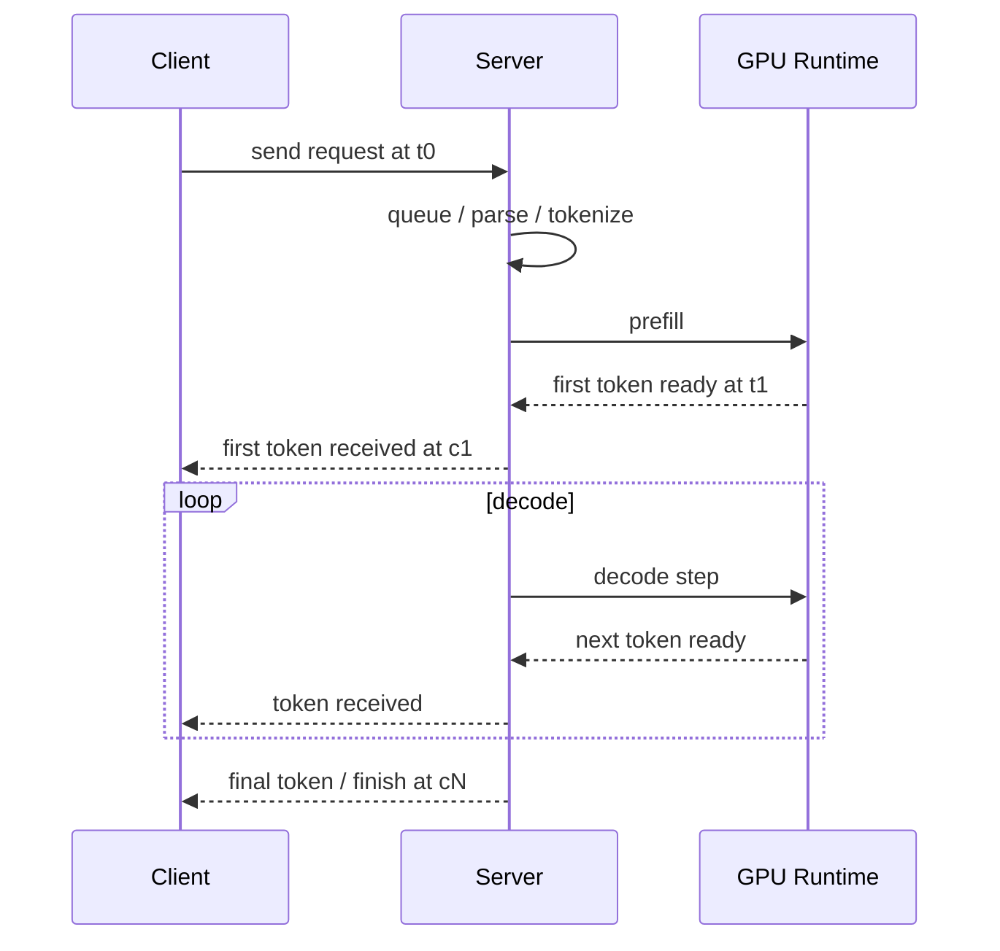

# 第 16 章：推理性能指标与分析

## 1. 本章目标

学完本章后，你应该能回答：

- Latency、Throughput、TTFT、TPOT、ITL/TBT、E2E latency 分别是什么？
- P50、P95、P99 为什么比平均值更适合看线上体验？
- Goodput 和 Throughput 有什么区别？为什么 SLO 下只看 tokens/s 不够？
- Warmup、冷启动、首轮编译、CUDA Graph capture、cache 命中为什么会影响计时？
- 单请求吞吐、系统吞吐、输出 token 吞吐、总 token 吞吐有什么区别？
- 如何设计一个不误导自己的 LLM serving benchmark？
- 为什么不能伪造或外推真实性能数据？

本章只讲指标定义和分析方法，不运行压测，不记录任何本机、GPU、vLLM、CUDA 或模型实测结果。

## 2. 五分钟直觉

LLM 推理不是一次性返回完整结果，而是：

```text
用户发请求；
服务先处理 prompt；
生成第一个 token；
之后一个 token 一个 token 流式吐出；
最后请求结束。
```

所以用户体验至少有三段：

```text
等第一个 token：TTFT
看后续 token 流速：ITL / TBT / TPOT
等完整回答结束：E2E latency / TTLT
```

系统视角又不同：

```text
单位时间处理多少请求：request throughput
单位时间输出多少 token：output token throughput
单位时间处理多少输入 + 输出 token：total token throughput
满足 SLO 的有效请求数：goodput
```

第 16 章最重要的一句话：

> 推理性能分析不能只看平均 latency 或 tokens/s；要同时看请求长度分布、并发负载、TTFT、TPOT/ITL、尾延迟和 SLO 达成率。

## 3. 完整计算或数据流

### 一次流式请求的时间线



如果从客户端观测：

```text
t0 = request send time
c1 = first token received time
c2...cN = subsequent token received times
cN = final token received time
```

则：

```text
TTFT = c1 - t0
ITL_i = c_i - c_{i-1}, i >= 2
E2E_latency = cN - t0
```

如果从服务器内部观测，还要明确是否包含：

- HTTP 排队和网络时间。
- Tokenizer / detokenizer。
- Scheduler waiting queue。
- Prefill execution。
- Decode execution。
- Output streaming。

同一个名字如果测量边界不同，数值不能直接比较。

### 指标分层

```text
用户体验层：
  TTFT、ITL/TBT、TPOT、E2E latency、P95/P99

系统容量层：
  request throughput、output token throughput、total token throughput、GPU utilization

SLO 层：
  SLO attainment、goodput、capacity

实验方法层：
  request rate、concurrency、prompt length distribution、output length distribution、warmup、duration
```

### Open-loop 与 Closed-loop

Open-loop：

```text
按固定 request rate 发请求，不等前一个请求完成。
更接近线上流量到达。
系统过载时排队会快速暴露。
```

Closed-loop：

```text
固定并发数，一个请求完成后再补一个。
更容易控制并发。
但请求到达率会被系统速度反向影响，可能掩盖过载。
```

两者都可以用，但报告里必须写清楚。

## 图示阅读建议

- 来源 1：DistServe
  - URL：https://arxiv.org/abs/2401.09670
  - 建议查看：TTFT、TPOT、goodput 与 Prefill/Decode disaggregation 的关系。
- 来源 2：Revisiting SLO and Goodput Metrics in LLM Serving
  - URL：https://arxiv.org/abs/2410.14257
  - 建议查看：E2E latency、TPOT、TTFT、TBT、SLO attainment、goodput 的定义和局限。
- 来源 3：Etalon
  - URL：https://arxiv.org/abs/2407.07000
  - 建议查看：为什么传统 TTFT/TBT/TPOT 等指标仍可能无法完整表达实时用户体验。

## 4. 关键术语

- Latency：延迟。一次操作从开始到结束的耗时。
- E2E latency：端到端延迟。请求从发出到完整响应结束的耗时。
- TTLT：Time To Last Token，收到最后一个 token 的时间，常与 E2E latency 近似对应。
- TTFT：Time To First Token，从请求发出到第一个输出 token 到达的时间。
- ITL：Inter-Token Latency，两个相邻输出 token 之间的时间间隔。
- TBT：Time Between Tokens，通常与 ITL 接近，强调相邻 token delivery 间隔。
- TPOT：Time Per Output Token，生成后续输出 token 的平均耗时，常排除第一个 token。
- Throughput：吞吐。单位时间完成的请求数或 token 数。
- Request throughput：单位时间完成请求数，常用 requests/s。
- Output token throughput：单位时间输出 token 数，常用 output tokens/s。
- Total token throughput：单位时间处理输入 token + 输出 token 的总数。
- Goodput：满足 SLO 的有效吞吐，常表示为满足 SLO 的 requests/s。
- SLO：Service Level Objective，服务等级目标，例如 `P95 TTFT <= 1s`。
- SLO attainment：满足 SLO 的请求比例。
- P50：中位数，50% 请求不超过该值。
- P95：95% 请求不超过该值。
- P99：99% 请求不超过该值。
- Tail latency：尾延迟，常指 P95/P99/P999 等高分位延迟。
- Warmup：正式计时前的预热阶段，用于排除模型加载、JIT、cache 初始化、CUDA Graph capture 等一次性开销。
- Cold start：冷启动，包括模型加载、权重搬运、编译、profile、graph capture 等启动成本。
- Steady state：系统进入稳定服务后的性能状态。
- Workload distribution：输入长度、输出长度、到达率、并发和采样参数的分布。

## 5. Tensor Shape

性能指标必须和 shape 一起读。

设：

```text
input_tokens_i = 第 i 个请求的 prompt token 数
output_tokens_i = 第 i 个请求生成 token 数
```

总输入 token：

```text
total_input_tokens = sum(input_tokens_i)
```

总输出 token：

```text
total_output_tokens = sum(output_tokens_i)
```

总 token：

```text
total_tokens = total_input_tokens + total_output_tokens
```

为什么 shape 重要：

```text
短 prompt + 长输出：decode 压力更大，TPOT/ITL 更关键。
长 prompt + 短输出：prefill 压力更大，TTFT 更关键。
长 prompt + 长输出：TTFT、TPOT、KV Cache 显存和调度都关键。
```

一个 benchmark 如果只给 tokens/s，不给输入/输出长度分布，基本无法判断结果含义。

### Prefill Shape 与 TTFT

Prefill 输入：

```text
[B_prefill, S_prompt, H]
```

或者在连续批处理中按本轮总 token 表示：

```text
T_prefill = sum(prompt tokens scheduled this step)
```

长 prompt 会增加 prefill 工作量，也会影响第一个 token 出来的时间。

### Decode Shape 与 TPOT/ITL

Decode 每轮通常是：

```text
[B_decode, 1, H]
```

但要读：

```text
KV Cache: [L, cached_tokens, Nkv, Dh]
```

所以 decode 的 TPOT/ITL 不只由当前 token shape 决定，还和历史上下文、并发请求数、KV Cache 布局、调度策略有关。

## 6. 核心公式

### 单请求时间

设：

```text
t0 = 请求发出时间
t1 = 第一个 token 到达时间
tN = 最后一个 token 到达时间
Nout = 输出 token 数
```

则：

```text
TTFT = t1 - t0
E2E_latency = tN - t0
```

当 `Nout > 1` 时：

```text
TPOT = (E2E_latency - TTFT) / (Nout - 1)
```

更细粒度：

```text
ITL_i = t_i - t_{i-1}, i = 2...Nout
```

于是：

```text
TPOT = average(ITL_i)
```

注意：有的工具会按服务器生成时间算，有的按客户端收到时间算；有的会排除网络，有的不会。报告必须写清楚。

### 吞吐

请求吞吐：

```text
request_throughput = completed_requests / benchmark_duration_seconds
```

输出 token 吞吐：

```text
output_token_throughput = total_output_tokens / benchmark_duration_seconds
```

总 token 吞吐：

```text
total_token_throughput = (total_input_tokens + total_output_tokens) / benchmark_duration_seconds
```

单请求输出速度：

```text
per_request_output_speed_i = output_tokens_i / E2E_latency_i
```

不要把单请求输出速度和系统输出 token throughput 混为一谈。

### 分位数

给定延迟样本：

```text
latencies = [l1, l2, ..., ln]
```

排序：

```text
sorted_latencies = sort(latencies)
```

Nearest-rank 近似：

```text
P95 = sorted_latencies[ceil(0.95 * n) - 1]
P99 = sorted_latencies[ceil(0.99 * n) - 1]
```

真实工具可能使用插值算法，因此报告中最好说明 percentile 计算方法或使用工具版本。

### SLO Attainment 与 Goodput

定义一个请求满足 SLO：

```text
meet_slo_i = (TTFT_i <= TTFT_target)
          and (TPOT_i <= TPOT_target)
          and (E2E_i <= E2E_target, if required)
```

SLO 达成率：

```text
slo_attainment = count(meet_slo_i) / total_requests
```

Goodput：

```text
goodput = count(meet_slo_i) / benchmark_duration_seconds
```

Capacity 常被定义为：

```text
在给定 SLO attainment 目标下，系统能承受的最大 request rate
```

例如：

```text
P95 TTFT <= A
P95 TPOT <= B
SLO attainment >= 90%
```

这里的 A/B 必须来自业务目标或实验设定，不能事后随便调。

## 7. 与推理 Runtime 的联系

### TTFT 对应什么

TTFT 主要受这些因素影响：

- 网络、HTTP、排队。
- Tokenizer 和输入处理。
- Scheduler waiting queue。
- Prefill 计算。
- Prefix cache 命中或未命中。
- Chunked prefill 策略。
- 冷启动、编译、graph capture。

长 prompt、请求排队和 prefill/decode 相互干扰都会抬高 TTFT。

### TPOT / ITL 对应什么

TPOT/ITL 主要受这些因素影响：

- Decode batch size。
- KV Cache 读带宽。
- Attention backend。
- Continuous batching。
- 每步 kernel launch 和 CUDA Graph。
- 采样、detokenization、streaming flush。
- 长上下文下的 KV Cache layout。

Decode 不是只看 FLOPs。第 15 章已经解释过，decode 更容易暴露 memory bandwidth 和 launch overhead。

### Throughput 与 Latency 的张力

更大的 batch 通常能提升吞吐，但可能提高延迟：

```text
batch 更大 -> GPU 利用率更高 -> tokens/s 更高
batch 更大 -> 请求等待和同批执行时间可能变长 -> TTFT/TPOT/P95 变差
```

这就是第 12 章 Scheduler 要处理的核心矛盾。

### Goodput 的意义

如果系统 A tokens/s 更高，但大量请求超过 SLO；系统 B tokens/s 略低，但更多请求满足 SLO，那么在线服务里 B 可能更有价值。

所以 SLO 场景下更应该问：

```text
在 P95 TTFT / TPOT 限制下，最多能服务多少请求？
```

而不是只问：

```text
最高 tokens/s 是多少？
```

### Benchmark 契约

任何可信 benchmark 至少要记录：

- 模型名、参数规模、上下文长度。
- Runtime 名称和版本，例如 vLLM / TensorRT-LLM / TGI / llama.cpp。
- 代码 commit、容器镜像、CUDA、driver、Python、PyTorch。
- GPU 型号、数量、显存、互联方式。
- 量化格式、dtype、tensor parallel、pipeline parallel。
- Prompt 长度分布、输出长度分布、数据集来源。
- 请求到达模式：open-loop 或 closed-loop。
- request rate、concurrency、总请求数、压测时长。
- warmup 时长和是否计入结果。
- streaming 或 non-streaming。
- sampling 参数：temperature、top_p、max_tokens、stop 条件。
- 原始日志路径和统计脚本。

没有这些上下文，数字通常不可复现，也不应该写进课程结论。

## 8. 易错点

| 易错说法 | 问题 | 正确认知 |
| --- | --- | --- |
| 平均 latency 低就代表用户体验好 | 错 | 尾延迟可能很差，线上更要看 P95/P99 |
| tokens/s 高就一定服务好 | 错 | 可能牺牲 TTFT/TPOT 或 SLO attainment |
| TTFT 只等于 prefill 执行时间 | 不完整 | 客户端 TTFT 还可能包含排队、网络、tokenizer、调度和 streaming |
| TPOT 和 ITL 完全一样 | 不严谨 | TPOT 通常是后续 token 平均耗时，ITL/TBT 是相邻 token 间隔序列 |
| 单请求吞吐就是系统吞吐 | 错 | 单请求速度和多用户系统容量是不同问题 |
| P99 可以用很少样本稳定估计 | 错 | 高分位需要足够样本，否则波动很大 |
| Warmup 可有可无 | 错 | 冷启动、编译、graph capture 和 cache 状态会明显污染结果 |
| 不同 prompt/output 长度的 benchmark 可以直接比 | 不严谨 | 长度分布不同，TTFT、TPOT、吞吐含义都不同 |
| Goodput 就是 throughput | 错 | Goodput 只统计满足 SLO 的有效吞吐 |
| 失败或超时请求可以直接丢掉 | 错 | 这会美化结果；必须记录失败率、超时策略和是否纳入统计 |

## 9. 面试回答模板

如果被问“TTFT、TPOT、ITL、E2E latency 的关系”，可以这样答：

> TTFT 是从请求发出到第一个输出 token 到达的时间，主要反映排队和 prefill。ITL 或 TBT 是相邻输出 token 之间的间隔，反映流式输出是否平滑。TPOT 通常是除第一个 token 之外，后续 token 的平均生成时间，可以看成 ITL 的平均。E2E latency 是从请求发出到最后一个 token 到达的总时间，大致等于 TTFT 加上后续 token 的生成时间。

如果被问“为什么不能只看 throughput”，可以这样答：

> Throughput 只说明单位时间处理了多少请求或 token，但不说明用户等多久。LLM serving 里可以通过增大 batch 提高 tokens/s，但 TTFT、TPOT 或 P99 可能变差。在线服务更关心在延迟约束下能服务多少请求，所以要看 SLO attainment 和 goodput，也就是满足 TTFT/TPOT/E2E 目标的有效吞吐。

如果被问“P50、P95、P99 怎么读”，可以这样答：

> P50 是中位体验，P95/P99 是尾部体验。线上用户通常更容易感受到尾延迟，尤其在多轮对话或交互式场景里，少量慢请求也会影响质量。平均值会掩盖尾部问题，所以性能报告至少要同时给平均值、P50、P95/P99、样本数和失败率。

如果被问“如何设计一个可信的 LLM benchmark”，可以这样答：

> 先固定模型、Runtime 版本、硬件、dtype、并行配置和采样参数；再固定 workload，包括 prompt/output 长度分布、请求到达模式、request rate 或 concurrency、总请求数和压测时长。计时要区分 warmup 和 steady state，记录 streaming/non-streaming、客户端还是服务端计时、失败和超时策略。最后同时报告 TTFT、TPOT/ITL、E2E、吞吐、P95/P99、SLO attainment 和原始日志路径。

## 10. 真实面试问题

本章暂未收录与 LLM 推理性能指标直接相关的 `VERIFIED` 或 `PARTIAL` 一手面试问题。

### 未核实候选问题（UNVERIFIED）

以下问题来自本章知识点推导，已按牛客网、知乎、小红书、脉脉、CSDN、GitHub 和公开搜索结果做跨平台复核，但暂时没有可访问的一手面经正文支撑，只能用于自测，不能当作真实面经或高频题。完整候选池见 `面试题/未核实候选问题.md`，复核记录见 `面试题/来源登记.md` 的 I017。

1. TTFT、TPOT、ITL/TBT、E2E latency 分别是什么？
   - 对应能力：能解释 LLM 流式推理的用户体验指标。
   - 30 秒回答：TTFT 是请求到第一个 token 的时间，主要受排队和 prefill 影响；ITL/TBT 是相邻输出 token 的间隔；TPOT 是后续输出 token 的平均耗时；E2E latency 是从请求发出到完整响应结束的总时间。
2. Throughput 和 Goodput 有什么区别？
   - 对应能力：能区分系统容量和 SLO 下有效容量。
   - 30 秒回答：Throughput 是单位时间完成多少请求或 token，不关心是否超时；Goodput 是单位时间内满足 SLO 的有效请求数。在线服务不能只追 tokens/s，因为高 throughput 可能伴随很差的 TTFT、TPOT 或 P99。
3. 为什么压测必须报告 prompt/output 长度分布和 warmup 策略？
   - 对应能力：能识别误导性 benchmark。
   - 30 秒回答：长度分布决定 prefill、decode、KV Cache 和调度压力，短 prompt 长输出与长 prompt 短输出的瓶颈完全不同。Warmup 会影响模型加载、JIT、CUDA Graph、cache 状态，如果把冷启动混进 steady-state 结果，指标会被污染。
4. P50、P95、P99 在推理服务里应该怎么用？
   - 对应能力：能解释尾延迟。
   - 30 秒回答：P50 看中位体验，P95/P99 看尾部慢请求。线上交互服务通常不能只看平均值，因为少量慢请求也会影响用户体验。报告高分位时还要给样本数、失败率和超时处理方式。

## 11. 我的回答

待用户后续复习本章时填写。

## 12. 纠错记录

暂无。

## 13. 本章验收

后续复习时回答：

1. 用公式写出 TTFT、TPOT、E2E latency。
2. ITL/TBT 和 TPOT 的区别是什么？
3. 为什么 `output tokens/s` 和 `requests/s` 不能互相替代？
4. Goodput 为什么比 throughput 更适合 SLO 场景？
5. Benchmark 里为什么必须记录 prompt/output 长度分布？
6. 为什么 warmup、失败请求和超时策略不能省略？

## 14. 参考资料

- 页面标题：DistServe: Disaggregating Prefill and Decoding for Goodput-optimized Large Language Model Serving
  - 发布者或作者：Yinmin Zhong 等，arXiv
  - URL：https://arxiv.org/abs/2401.09670
  - 发布时间：2024-01-18
  - 访问日期：2026-06-18
  - 来源类型：论文
  - 本文使用内容：TTFT、TPOT、goodput、Prefill/Decode 干扰和 SLO 下资源规划。
- 页面标题：Revisiting SLO and Goodput Metrics in LLM Serving
  - 发布者或作者：Zhibin Wang 等，arXiv
  - URL：https://arxiv.org/abs/2410.14257
  - 发布时间：2024-10-18
  - 访问日期：2026-06-18
  - 来源类型：论文
  - 本文使用内容：E2E latency、TPOT、TTFT、TBT、SLO attainment、goodput 定义，以及 token-level SLO 的局限讨论。
- 页面标题：Etalon: Holistic Performance Evaluation Framework for LLM Inference Systems
  - 发布者或作者：Amey Agrawal 等，arXiv
  - URL：https://arxiv.org/abs/2407.07000
  - 发布时间：2024-07-09
  - 访问日期：2026-06-18
  - 来源类型：论文
  - 本文使用内容：传统 TTFT、TBT、normalized latency、TPOT 等指标不能完整表达实时用户体验的提醒。
- 页面标题：Taming Throughput-Latency Tradeoff in LLM Inference with Sarathi-Serve
  - 发布者或作者：Amey Agrawal 等，arXiv
  - URL：https://arxiv.org/abs/2403.02310
  - 发布时间：2024-03-04
  - 访问日期：2026-06-18
  - 来源类型：论文
  - 本文使用内容：Prefill/Decode 两阶段、chunked-prefill、吞吐-延迟权衡和 tail latency 约束。
