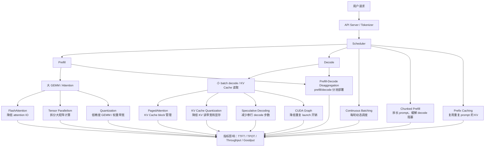

# 第 17 章：推理优化总图

## 1. 本章目标

学完本章后，你应该能回答：

- FlashAttention、PagedAttention、Continuous Batching、Chunked Prefill、Prefix Caching、CUDA Graph、Quantization、Speculative Decoding、Tensor Parallelism、Prefill-Decode Disaggregation 分别解决什么问题？
- 哪些优化主要解决计算问题？哪些解决显存问题？哪些解决内存 IO、调度、通信或服务延迟？
- 为什么同一个优化可能提升吞吐，却伤害 TTFT、TPOT 或 P99？
- 为什么不能把所有优化简单叠加后假设一定更快？
- 面试时如何用一张图把 LLM 推理优化讲清楚？

本章是前 16 章的总复盘，不运行程序，不记录任何本机实验数据，也不把论文或博客中的 benchmark 数字当作本仓库结论。

## 2. 五分钟直觉

LLM 推理优化不要从“背技术名词”开始，而要从瓶颈开始：

```text
算不动：计算量太大，GEMM / attention 太重。
放不下：权重、KV Cache、activation 占显存。
搬太慢：HBM / KV Cache / 权重读取带宽成为瓶颈。
排不好：请求长度不同，prefill 和 decode 相互干扰。
发太频：decode 每步 kernel 多，CPU launch overhead 明显。
拆不开：单卡放不下或不够快，需要多 GPU，但通信增加。
等太久：TTFT、TPOT、P95/P99 或 SLO 不达标。
```

优化方法只是针对这些瓶颈的工具。

第 17 章最重要的一句话：

> 先判断瓶颈，再选择优化；不要看到一个技术名词就假设它一定能提升端到端性能。

## 3. 完整计算或数据流

### LLM 推理优化总图



### 按瓶颈归类

| 瓶颈类型 | 典型表现 | 主要优化 |
| --- | --- | --- |
| Attention IO | attention 中间矩阵读写多，长上下文慢 | FlashAttention |
| KV Cache 显存 | 长上下文、高并发显存吃紧 | PagedAttention、KV Cache Quantization、GQA/MQA |
| KV Cache 读带宽 | Decode 读历史 K/V 慢 | GQA/MQA、KV Cache Quantization、Attention Backend |
| 权重显存/带宽 | 模型大，权重读写压力大 | Weight Quantization、Tensor Parallelism |
| GPU 利用率 | 请求长短不一，GPU 空转 | Continuous Batching、Scheduler |
| Prefill 阻塞 Decode | 长 prompt 抢占 GPU，TPOT/P99 变差 | Chunked Prefill、Prefill-Decode Disaggregation |
| 重复 Prompt 计算 | 多请求共享前缀但重复 prefill | Prefix Caching |
| Decode 串行步数 | 一次只确认一个 token，长输出慢 | Speculative Decoding |
| CPU launch overhead | decode 每步 kernel 多，小 batch 开销明显 | CUDA Graph、算子融合 |
| 单卡容量/速度 | 单卡放不下或不够快 | Tensor Parallelism、Pipeline Parallelism、Quantization |
| SLO 不达标 | TTFT/TPOT/P95/P99 超目标 | 调度、限流、分池、Goodput 优化 |

## 图示阅读建议

- 先把第 1 章的全链路图和本章总图放在一起看。
- 再按瓶颈回看对应章节：
  - 算子 IO：第 10 章 FlashAttention。
  - KV Cache：第 8、9、11、14 章。
  - 调度：第 12、13 章。
  - 硬件：第 15 章。
  - 指标：第 16 章。
- 最后用本章的表格练习面试回答：不要只说“用了某优化”，要说“它解决哪个瓶颈，代价是什么，用什么指标验证”。

## 4. 关键术语

- Optimization target：优化目标，例如降低 TTFT、降低 TPOT、提升 goodput、降低成本或降低显存。
- Bottleneck：当前系统最限制性能的环节。
- Compute-bound：主要受算力限制。
- Memory-bound：主要受内存带宽或访存模式限制。
- IO-aware：显式减少高成本内存读写的算法设计。
- Scheduler policy：调度策略，决定哪些请求、多少 token、何时执行。
- Admission control：准入控制，决定是否接受新请求，以保护 SLO。
- Backpressure：系统过载时向上游施加压力，避免无限排队。
- SLO-driven optimization：以 TTFT、TPOT、P95/P99、goodput 等服务目标为约束进行优化。
- Workload-aware optimization：根据 prompt 长度、输出长度、并发、到达率和缓存命中率选择优化。
- Communication overhead：多 GPU 或分布式部署中跨设备传输带来的额外成本。
- State transfer：跨设备或跨节点传输 KV Cache、hidden states 或请求状态。
- Critical path：决定请求端到端延迟的最长依赖链。

## 5. Tensor Shape

优化必须回到 shape。

### Prefill

```text
Prompt tokens: S_prompt 很大
Activation: [B, S_prompt, H]
Attention: Q/K/V 覆盖完整 prompt
Linear GEMM: [B*S_prompt, H] @ [H, H]
```

Prefill 的特点：

- 更像大 GEMM。
- 更容易用满 Tensor Core。
- 长 prompt 会抬高 TTFT。
- attention IO 会随着序列长度变重。

对应优化：

```text
FlashAttention、Chunked Prefill、Prefix Caching、Tensor Parallelism、Quantization、Prefill-Decode Disaggregation
```

### Decode

```text
Current token: [B, 1, H]
KV Cache: [L, cached_tokens, Nkv, Dh]
每轮新增一个或少量 token
```

Decode 的特点：

- 自回归依赖强。
- 每步工作小，kernel launch overhead 更明显。
- 需要反复读权重和 KV Cache。
- 长上下文和高并发会放大 KV Cache 压力。

对应优化：

```text
Continuous Batching、PagedAttention、GQA/MQA、KV Cache Quantization、Speculative Decoding、CUDA Graph、Prefix Caching
```

### Tensor Parallelism 的 shape 直觉

线性层：

```text
Y = X @ W
```

Column parallel：

```text
W = [W1, W2, ..., Wn]
Y_i = X @ W_i
Y = concat(Y_i)
```

Row parallel：

```text
X = [X1, X2, ..., Xn]
W = [W1; W2; ...; Wn]
Y = sum(X_i @ W_i)
```

它可以降低单卡权重和计算压力，但会引入通信：

```text
all-reduce / all-gather / reduce-scatter
```

所以 tensor parallelism 不是“GPU 越多越快”，而是计算、显存和通信的平衡。

## 6. 核心公式

### 优化是否有效的基本判断

```text
end_to_end_latency = queue_time
                     + input_processing
                     + prefill_time
                     + decode_time
                     + output_processing
                     + network_time
```

如果某优化只降低 `prefill_time`，但当前瓶颈是 `decode_time` 或 `queue_time`，端到端收益可能很小。

### Amdahl 直觉

如果某部分占总耗时比例为 `p`，该部分加速 `s` 倍：

```text
overall_speedup = 1 / ((1 - p) + p / s)
```

这说明：

```text
优化一个不占主要耗时的部分，端到端收益有限。
```

### KV Cache 显存

从第 8 章继承：

```text
kv_cache_bytes ~= 2 * L * total_cached_tokens * Nkv * Dh * bytes_per_elem
```

优化方向：

```text
减少 Nkv：MQA/GQA
减少 bytes_per_elem：KV Cache Quantization
减少浪费：PagedAttention
减少重复计算/存储：Prefix Caching / KV sharing
```

### 服务指标

第 16 章指标仍是最终验收标准：

```text
TTFT = first_token_time - request_start
TPOT = (end_time - first_token_time) / (output_tokens - 1)
goodput = requests_meeting_SLO / benchmark_duration
```

任何优化最终都要落到：

```text
TTFT 是否下降？
TPOT/ITL 是否下降？
P95/P99 是否改善？
Goodput 是否提升？
成本或显存是否下降？
输出质量是否保持？
```

## 7. 与推理 Runtime 的联系

### 优化方法总表

| 技术 | 主要解决 | 主要影响阶段 | 常见收益 | 常见代价 |
| --- | --- | --- | --- | --- |
| FlashAttention | Attention HBM IO | Prefill、长上下文 attention | 降低 attention 内存读写，提高 attention kernel 效率 | 依赖 kernel、硬件和 shape |
| PagedAttention | KV Cache 显存碎片和动态分配 | Decode、长上下文、高并发 | 提高 KV Cache 利用率，支持按需分配和共享 | block table / metadata / kernel 访问复杂度 |
| Continuous Batching | GPU 利用率和请求长短不一 | 在线 serving 全程 | 提高系统吞吐，减少批内空等 | 调度复杂，可能影响单请求延迟 |
| Chunked Prefill | 长 prompt 阻塞 decode | Prefill + Decode 干扰 | 改善 TPOT/P99，降低 decode 被长 prefill 卡住的风险 | TTFT 和总 prefill 完成时间可能受调度策略影响 |
| Prefix Caching | 重复 prompt 计算 | Prefill | 降低重复 prefill，改善 TTFT 和吞吐 | 命中率依赖 workload，占用缓存管理资源 |
| CUDA Graph | CPU launch overhead | Decode 小 batch、多轮重复 kernel | 降低重复提交开销，稳定执行路径 | shape 变化和动态图控制流会限制使用 |
| Quantization | 权重/KV/activation 显存和带宽 | Prefill、Decode | 降低显存、带宽或低精度计算成本 | 精度风险、kernel 支持、dequant 开销 |
| Speculative Decoding | Decode 串行依赖 | Decode | 用 draft + verify 减少目标模型串行步数 | draft 模型开销、接受率、KV 管理复杂度 |
| Tensor Parallelism | 单卡放不下或算不动 | 每层 Linear/Attention | 分摊权重和计算，支持大模型 | 通信开销、同步、跨卡拓扑敏感 |
| Prefill-Decode Disaggregation | prefill/decode 资源需求不同 | Serving 架构 | 分别优化 compute-bound prefill 和 memory-bound decode，提高 SLO/goodput | KV/state transfer、路由和资源规划复杂 |

### 技术之间的关系

```text
FlashAttention 和 PagedAttention：
  一个偏 attention kernel IO，一个偏 KV Cache 管理。

Continuous Batching 和 Chunked Prefill：
  一个是动态合批框架，一个是把长 prefill 拆小以减少对 decode 的干扰。

PagedAttention 和 Prefix Caching：
  一个让 KV Cache block 管理更灵活，一个复用相同前缀的 KV。

Quantization 和 Tensor Parallelism：
  都可能缓解单卡显存压力，但前者改变数值格式，后者拆到多卡并引入通信。

Speculative Decoding 和 CUDA Graph：
  都可能改善 decode，但一个减少目标模型串行步数，一个减少重复 launch 开销。

Prefill-Decode Disaggregation 和 Goodput：
  它不是单个 kernel 优化，而是服务架构优化，目标通常是 SLO 下的有效吞吐。
```

### 决策顺序

面对一个推理系统，不要先问“要不要上某技术”，先问：

1. 当前最差指标是什么：TTFT、TPOT、P95、P99、显存、成本还是 goodput？
2. workload 是什么：短 prompt 长输出、长 prompt 短输出、长上下文、多轮对话还是 RAG？
3. 当前瓶颈在哪里：prefill、decode、KV Cache、scheduler、CPU launch、网络还是通信？
4. 有无硬件和 kernel 支持：Tensor Core、FP8/INT8、CUDA Graph、attention backend？
5. 优化会引入什么代价：精度、通信、缓存命中率、复杂度、稳定性？
6. 用什么指标验证：TTFT、TPOT、P95/P99、goodput、显存、失败率、质量指标？

## 8. 易错点

| 易错说法 | 问题 | 正确认知 |
| --- | --- | --- |
| FlashAttention、PagedAttention 都是 attention 加速，所以差不多 | 错 | FlashAttention 主要减少 attention IO；PagedAttention 主要管理 KV Cache block 和显存碎片 |
| Continuous batching 一定降低所有请求延迟 | 不一定 | 它提升系统利用率，但调度策略可能让某些请求等待更久 |
| Chunked prefill 减少总计算量 | 错 | 它主要改变调度粒度，缓解长 prefill 阻塞，不是消除 prefill 计算 |
| Prefix caching 总是有效 | 不一定 | 需要 workload 有重复前缀且缓存命中足够高 |
| Quantization 一定加速 | 错 | 还取决于 kernel、硬件、dequant、shape 和精度要求 |
| Tensor parallelism GPU 越多越快 | 错 | 通信和同步可能抵消计算收益 |
| Speculative decoding 不改变任何系统复杂度 | 错 | 需要 draft、verify、接受率、KV 管理和调度支持 |
| CUDA Graph 减少模型 FLOPs | 错 | 它主要降低重复 kernel launch 开销 |
| Prefill-decode disaggregation 适合所有场景 | 不一定 | 它引入 state transfer 和路由复杂度，适合 prefill/decode 资源需求差异明显的场景 |
| 只要优化后 tokens/s 高就是成功 | 错 | 还要看 TTFT、TPOT、P95/P99、goodput、失败率、成本和质量 |

## 9. 面试回答模板

如果被问“LLM 推理优化有哪些方向”，可以这样答：

> 我会先按瓶颈分类，而不是直接罗列名词。Attention IO 可以用 FlashAttention；KV Cache 显存和碎片可以用 PagedAttention、GQA/MQA、KV cache quantization；GPU 利用率和请求长短不一靠 continuous batching 和 scheduler；长 prefill 阻塞 decode 可以用 chunked prefill 或 prefill-decode disaggregation；重复 prompt 可以用 prefix caching；decode 串行步数可以用 speculative decoding；小 batch decode 的 launch overhead 可以用 CUDA Graph；单卡放不下或算不动可以用 tensor parallelism 或 quantization。最后用 TTFT、TPOT、P95/P99、goodput 和显存验证。

如果被问“FlashAttention 和 PagedAttention 的区别”，可以这样答：

> FlashAttention 是 attention kernel 层的 IO 优化，目标是不把完整 attention score 矩阵反复写入 HBM，而是通过 tiling 和 online softmax 减少内存读写。PagedAttention 是 Runtime 的 KV Cache 管理优化，把 KV Cache 拆成 blocks，通过 block table 做非连续物理块映射，减少显存浪费并支持更灵活的并发和共享。一个偏算子 IO，一个偏运行时内存管理。

如果被问“为什么优化不能只看吞吐”，可以这样答：

> 因为在线 LLM serving 有明确的用户体验和 SLO。某些优化能提高 tokens/s，但可能让 TTFT、TPOT 或 P99 变差。比如更大 batch 可能提高 GPU 利用率，但也可能增加等待；chunked prefill 可能改善 decode 延迟，但调度策略会影响首 token。最终要看 goodput，也就是满足 SLO 的有效吞吐，而不是孤立的峰值 tokens/s。

如果被问“怎么选择推理优化方案”，可以这样答：

> 先固定 workload 和指标，判断瓶颈在 prefill、decode、KV Cache、CPU launch、通信还是调度。长 prompt TTFT 高，先看 prefill、prefix caching、chunked prefill 和 FlashAttention；长输出 TPOT 高，先看 KV Cache、continuous batching、CUDA Graph、speculative decoding；显存不够，先看 GQA/MQA、PagedAttention、quantization、tensor parallel；SLO 下吞吐低，考虑 scheduler、admission control 和 prefill-decode disaggregation。

## 10. 真实面试问题

本章暂未收录与 LLM 推理优化总图直接相关的 `VERIFIED` 或 `PARTIAL` 一手面试问题。

### 未核实候选问题（UNVERIFIED）

以下问题来自本章知识点推导，已按牛客网、知乎、小红书、脉脉、CSDN、GitHub 和公开搜索结果做跨平台复核，但暂时没有可访问的一手面经正文支撑，只能用于自测，不能当作真实面经或高频题。完整候选池见 `面试题/未核实候选问题.md`，复核记录见 `面试题/来源登记.md` 的 I018。

1. LLM 推理优化可以按哪些瓶颈分类？
   - 对应能力：能从系统角度组织优化知识。
   - 30 秒回答：可以按 attention IO、KV Cache 显存和读带宽、权重显存和读带宽、GPU 利用率、prefill/decode 干扰、重复 prompt、decode 串行步数、CPU launch overhead、多 GPU 通信和 SLO 目标分类。每类瓶颈对应不同优化，不能混为一谈。
2. FlashAttention、PagedAttention、Continuous Batching 分别解决什么问题？
   - 对应能力：能区分 kernel、内存管理和调度优化。
   - 30 秒回答：FlashAttention 解决 attention 计算中的 HBM IO 问题；PagedAttention 解决 KV Cache 动态增长、碎片和 block 管理问题；Continuous Batching 解决在线请求长短不一导致 GPU 利用率低的问题。三者处在不同层次。
3. Speculative Decoding、CUDA Graph、Quantization 都能加速 decode，它们区别是什么？
   - 对应能力：能区分 decode 优化路径。
   - 30 秒回答：Speculative Decoding 用 draft 模型预测多个 token，再由目标模型并行验证，减少目标模型串行步数；CUDA Graph 降低重复 decode kernel launch 的 CPU 提交开销；Quantization 降低权重或 KV Cache 的存储和带宽压力，或让低精度 GEMM 更快。它们针对的瓶颈不同。
4. 为什么 Tensor Parallelism 和 Prefill-Decode Disaggregation 都不是免费的？
   - 对应能力：能解释分布式推理代价。
   - 30 秒回答：Tensor Parallelism 把层内计算和权重拆到多 GPU，但引入 all-reduce、all-gather 等通信；Prefill-Decode Disaggregation 把 prefill 和 decode 放到不同资源池，但要传递 KV Cache 或请求状态，还要处理路由和资源规划。二者都需要看通信、拓扑、workload 和 SLO 是否匹配。

## 11. 我的回答

待用户后续复习本章时填写。

## 12. 纠错记录

暂无。

## 13. 本章验收

后续复习时回答：

1. 把 10 个推理优化技术按“计算、显存、内存 IO、调度、通信、服务延迟”分类。
2. FlashAttention 和 PagedAttention 为什么不是同一层优化？
3. Chunked Prefill 和 Prefix Caching 都和 prefill 有关，它们区别是什么？
4. Speculative Decoding 为什么能减少 decode 延迟？它的代价是什么？
5. Tensor Parallelism 为什么会引入通信瓶颈？
6. 如果 P95 TTFT 高、TPOT 正常，你会优先排查哪些环节？
7. 如果 TPOT 高、显存占用也高，你会优先考虑哪些优化？
8. 为什么最终验收要看 goodput 而不是只看 tokens/s？

## 14. 参考资料

- 页面标题：FlashAttention: Fast and Memory-Efficient Exact Attention with IO-Awareness
  - 发布者或作者：Tri Dao 等，arXiv
  - URL：https://arxiv.org/abs/2205.14135
  - 发布时间：2022-05-27
  - 访问日期：2026-06-18
  - 来源类型：论文
  - 本文使用内容：FlashAttention 的 IO-aware attention 优化定位。
- 页面标题：Efficient Memory Management for Large Language Model Serving with PagedAttention
  - 发布者或作者：Woosuk Kwon 等，arXiv
  - URL：https://arxiv.org/abs/2309.06180
  - 发布时间：2023-09-12
  - 访问日期：2026-06-18
  - 来源类型：论文
  - 本文使用内容：PagedAttention、KV Cache block 管理、vLLM serving 背景。
- 页面标题：Orca: A Distributed Serving System for Transformer-Based Generative Models
  - 发布者或作者：Gyeong-In Yu 等，USENIX OSDI 2022
  - URL：https://www.usenix.org/conference/osdi22/presentation/yu
  - 发布时间：2022-07
  - 访问日期：2026-06-18
  - 来源类型：论文 / 会议页面
  - 本文使用内容：Iteration-level scheduling、selective batching 和 continuous batching 背景。
- 页面标题：Fast Inference from Transformers via Speculative Decoding
  - 发布者或作者：Yaniv Leviathan、Matan Kalman、Yossi Matias，arXiv
  - URL：https://arxiv.org/abs/2211.17192
  - 发布时间：2022-11-30；最新版本 2023-05-18
  - 访问日期：2026-06-18
  - 来源类型：论文
  - 本文使用内容：Speculative Decoding 使用近似模型 draft，多 token 并行 verify，并保持目标分布的核心思想。
- 页面标题：Megatron-LM: Training Multi-Billion Parameter Language Models Using Model Parallelism
  - 发布者或作者：Mohammad Shoeybi 等，arXiv
  - URL：https://arxiv.org/abs/1909.08053
  - 发布时间：2019-09-17；最新版本 2020-03-13
  - 访问日期：2026-06-18
  - 来源类型：论文
  - 本文使用内容：Transformer intra-layer model parallelism、tensor parallelism 的基础来源。
- 页面标题：Splitwise: Efficient generative LLM inference using phase splitting
  - 发布者或作者：Pratyush Patel 等，arXiv
  - URL：https://arxiv.org/abs/2311.18677
  - 发布时间：2023-11-30；最新版本 2024-05-20
  - 访问日期：2026-06-18
  - 来源类型：论文
  - 本文使用内容：Prefill/Decode 阶段具有不同计算、内存和功耗特征，以及 phase splitting / disaggregation 的动机。
- 页面标题：DistServe: Disaggregating Prefill and Decoding for Goodput-optimized Large Language Model Serving
  - 发布者或作者：Yinmin Zhong 等，arXiv
  - URL：https://arxiv.org/abs/2401.09670
  - 发布时间：2024-01-18
  - 访问日期：2026-06-18
  - 来源类型：论文
  - 本文使用内容：Goodput-optimized prefill/decode disaggregation 和 SLO 视角。
